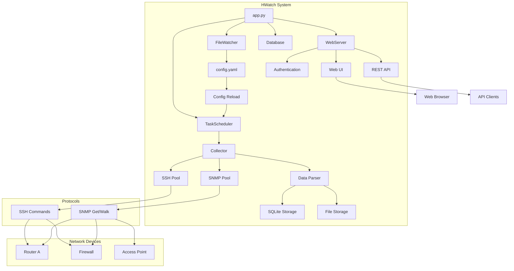
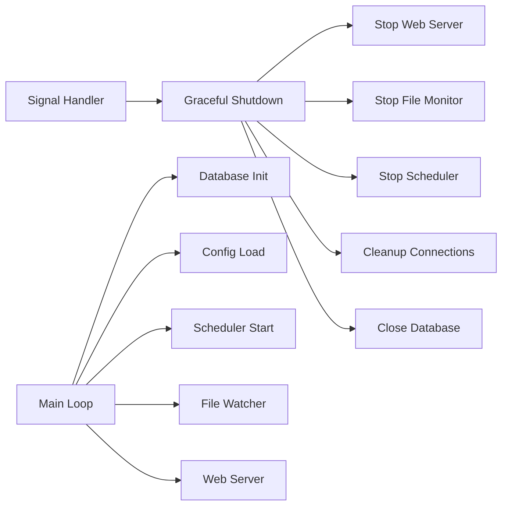
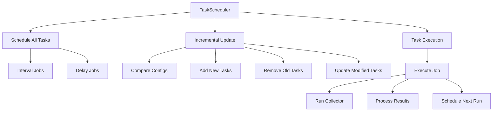
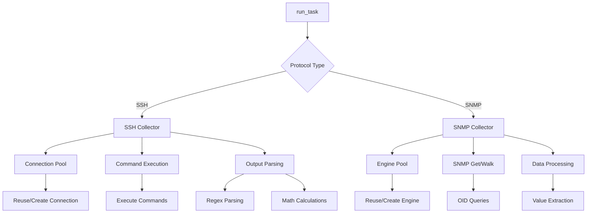
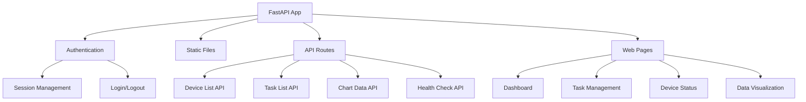
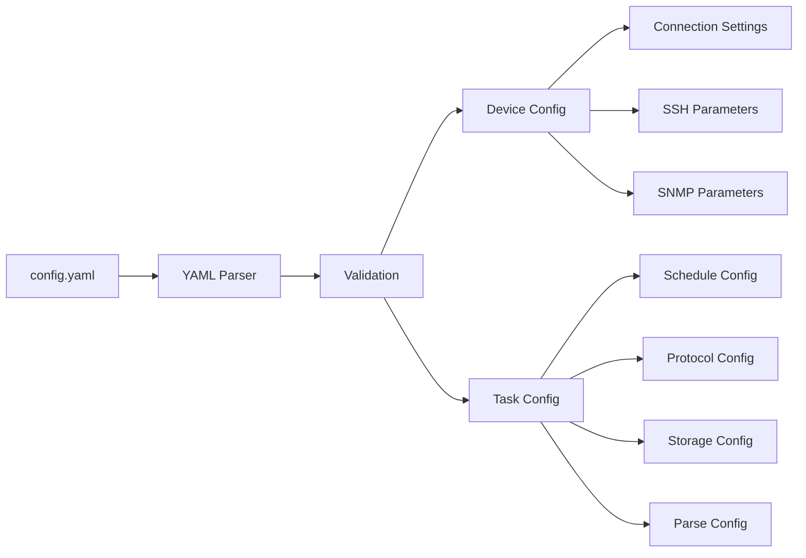
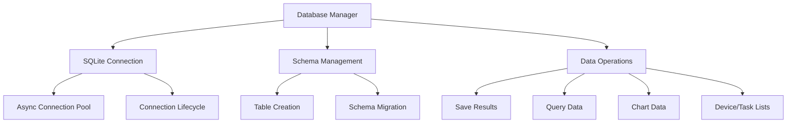

# HWatch - Network Device Monitoring System

[](https://python.org)
[](https://fastapi.tiangolo.com)
[](https://sqlite.org)
[](https://docker.com)

HWatch is a lightweight, high-performance network device monitoring system built with Python. It supports data collection via SSH and SNMP protocols, providing real-time monitoring, data storage, and web-based visualization.

## 🏗️ System Architecture



## 🛠️ Technology Stack

### Core Framework
- **Python 3.13+**: Main programming language
- **FastAPI 0.116+**: Modern, fast web framework for building APIs
- **Uvicorn**: ASGI server for FastAPI applications
- **AsyncIO**: Asynchronous programming support

### Database & Storage
- **SQLite 3**: Lightweight relational database for structured data
- **Aiosqlite**: Async SQLite driver
- **File System**: Plain text log storage option

### Network Protocols
- **AsyncSSH 2.21+**: SSH client for command execution
- **PySNMP 7.1+**: SNMP client for device monitoring
- **Connection Pooling**: Optimized connection management

### Task Scheduling
- **APScheduler 3.11+**: Advanced Python Scheduler
- **Interval/Delay Modes**: Flexible scheduling strategies
- **Hot Reload**: Dynamic configuration updates

### Web Interface
- **Jinja2 3.1+**: Template engine for dynamic HTML
- **ECharts 5.4+**: Interactive data visualization library
- **ACE Editor**: Code editor for YAML configuration
- **Custom CSS**: Responsive design with custom styling
- **Session-based Authentication**: Secure user management

### Configuration & Logging
- **PyYAML 6.0+**: YAML configuration parser
- **Loguru 0.7+**: Advanced logging system
- **Watchdog 6.0+**: File system monitoring

### Development & Deployment
- **UV**: Fast Python package manager
- **Docker**: Containerization support
- **Docker Compose**: Multi-container orchestration
- **Alpine Linux**: Lightweight container base

## 📊 Module Architecture

### 1. Application Entry (`app.py`)


**Key Features:**
- **Graceful Shutdown**: Proper signal handling with ordered component shutdown
- **Configuration Management**: Hot-reload configuration without restart
- **Component Orchestration**: Manages all system components lifecycle
- **Error Handling**: Comprehensive error recovery and logging

### 2. Task Scheduler (`core/scheduler.py`)


**Key Features:**
- **Dynamic Scheduling**: Add/remove/modify tasks without restart
- **Multiple Modes**: Support for interval and delay scheduling
- **Configuration Tracking**: Compare task configurations for incremental updates
- **Execution Limits**: Control task execution frequency and lifetime

### 3. Data Collector (`core/collector.py`)


**Key Features:**
- **Connection Pooling**: Efficient SSH/SNMP connection management
- **Protocol Support**: SSH command execution and SNMP data collection
- **Data Parsing**: Advanced regex parsing with mathematical operations
- **Error Recovery**: Retry mechanisms and connection health monitoring

### 4. Web Server (`core/web_server.py`)


**Key Features:**
- **RESTful APIs**: Comprehensive API endpoints for data access
- **Interactive Dashboard**: Real-time monitoring and visualization
- **Authentication**: Session-based security with configurable timeouts
- **Responsive Design**: Mobile-friendly web interface

### 5. Configuration System (`core/config_loader.py`)


**Key Features:**
- **YAML Configuration**: Human-readable configuration format
- **Hot Reload**: Monitor and reload configuration changes
- **Validation**: Comprehensive configuration validation
- **Type Safety**: Strongly typed configuration objects

### 6. Database Layer (`core/database.py`)


**Key Features:**
- **Async Operations**: Non-blocking database operations
- **Auto Schema**: Automatic table creation and management
- **Data Aggregation**: Efficient data retrieval for charts and reports
- **Connection Management**: Proper connection lifecycle handling

## 🚀 Quick Start

### Prerequisites
- Python 3.13 or higher
- Network devices with SSH/SNMP access
- Basic understanding of network protocols

### Installation Methods

#### Method 1: Using UV (Recommended)
```bash
# Clone the repository
git clone <repository-url>
cd hwatch

# Install dependencies with UV
uv sync

# Copy and configure settings
cp config_init.yaml config.yaml
# Edit config.yaml according to your environment

# Start the application
uv run python app.py
```

#### Method 2: Using Docker
```bash
# Clone the repository
git clone <repository-url>
cd hwatch

# Build and run with Docker Compose
docker-compose up -d

# Or build manually for single platform
docker build -t hwatch .
docker run -p 8080:8080 -v $(pwd)/config.yaml:/app/config.yaml hwatch

# Or build for multiple platforms using buildx
docker buildx build --no-cache --platform linux/amd64,linux/arm64 \
  -t registry.cn-hangzhou.aliyuncs.com/apuer/hwatch:0.1.0 \
  -t registry.cn-hangzhou.aliyuncs.com/apuer/hwatch:latest --load .
```

#### Method 3: Traditional Python
```bash
# Clone the repository
git clone <repository-url>
cd hwatch

# Create virtual environment
python -m venv .venv
source .venv/bin/activate  # On Windows: .venv\Scripts\activate

# Install dependencies
pip install -r requirements.txt

# Configure and start
cp config_init.yaml config.yaml
python app.py
```

### Access the Application
- **Web Interface**: http://localhost:8080
- **Default Credentials**: admin / 123456
- **API Documentation**: http://localhost:8080/docs

## ⚙️ Configuration Guide (config.yaml)

### Device Configuration (devices)

Each device contains basic information and connection configuration:

```yaml
devices:
- name: "Router_A"              # Device identifier, must be unique
  ip: "192.168.1.100"           # Device IP address
  connection:                   # Connection configuration
    ssh:                        # SSH connection settings
      username: "admin"          # SSH username
      password: "admin123"       # SSH password
      port: 22                  # SSH port, default 22
      timeout: 10               # Connection timeout (seconds)
      retry: 3                  # Number of retry attempts
    snmp:                       # SNMP connection settings
      community: "public"        # SNMP community string
      port: 161                 # SNMP port, default 161
      timeout: 10               # Timeout (seconds)
      retry: 3                  # Number of retry attempts
```

### Task Configuration (tasks)

#### Basic Configuration Fields
```yaml
tasks:
- alias: "task_alias"           # Unique task identifier
  enabled: true                 # Whether to enable the task
  protocol: "ssh"               # Protocol type: ssh or snmp
  targets:                      # Target device list
  - "Router_A"
  - "Fortinet_60"
  storage: "sqlite"             # Storage method: sqlite, file, or null
```

#### Scheduling Configuration (schedule)
```yaml
schedule:
  frequency: 0                  # Execution count limit, 0 means unlimited
  mode: "interval"              # Scheduling mode: interval or delay
  seconds: 60                   # Execution interval (seconds)
```

**Scheduling Mode Explanation:**
- `interval`: Fixed interval execution, next execution scheduled immediately after current execution starts
- `delay`: Delayed execution, next execution scheduled after waiting specified time following completion

#### SSH Task Configuration

**Single Command Execution:**
```yaml
- alias: "get_router_version"
  enabled: true
  protocol: "ssh"
  command: 
  - "show version"
  targets: ["Router_A"]
  schedule:
    frequency: 1                # Execute only once
  storage: "sqlite"
```

**Multiple Command Execution:**
```yaml
- alias: "system_check"
  enabled: true
  protocol: "ssh"
  command: 
  - "get system status"
  - "get system arp"
  targets: ["Fortinet_60"]
  schedule:
    frequency: 20
    mode: "delay"
    seconds: 120
  storage: "file"
```

**SSH Task with Data Parsing:**
```yaml
- alias: "parse_system_info"
  enabled: true
  protocol: "ssh"
  command: 
  - "get system status"
  parse:
    regex: "(?s)BIOS version:\\s*(\\d+).*?Branch point:\\s*(\\d+)"
    calculate:
    - "/1000000"                # First value divided by 1000000
    - "*10"                     # Second value multiplied by 10
  labels:
  - "BIOS_Version"
  - "Branch_Point"
  targets: ["Fortinet_60"]
  schedule:
    frequency: 0
    mode: "delay"
    seconds: 120
  storage: "sqlite"
```

#### SNMP Task Configuration

**SNMP Get (Single Value Retrieval):**
```yaml
- alias: "memory_usage"
  enabled: true
  protocol: "snmp"
  type: "snmpget"
  oid: "1.3.6.1.4.1.12356.101.4.1.4.0"
  labels: 
  - "fgSysMemUsage"
  targets: ["Fortinet_60"]
  schedule:
    frequency: 0
    mode: "interval"
    seconds: 5
  storage: "sqlite"
```

**SNMP Walk (Multiple Value Retrieval):**
```yaml
- alias: "processor_usage"
  enabled: true
  protocol: "snmp"
  type: "snmpwalk"
  oid: "1.3.6.1.4.1.12356.101.4.4.2.1.2"
  labels:
  - "fgProcessorUsage.1"
  - "fgProcessorUsage.2"
  - "fgProcessorUsage.3"
  - "fgProcessorUsage.4"
  targets: ["Fortinet_60"]
  schedule:
    frequency: 0
    mode: "interval"
    seconds: 5
  storage: "sqlite"
```

### Data Parsing Configuration (parse)

#### Regular Expression Parsing
```yaml
parse:
  regex: "(?s)BIOS version:\\s*(\\d+).*?Branch point:\\s*(\\d+)"
  calculate:
  - "/1000000"                  # First value divided by 1000000
  - "*10"                      # Second value multiplied by 10
```

**Regular Expression Tips:**
- Use `(?s)` to enable multiline mode, allowing `.` to match newline characters
- Use `\\s*` to match possible whitespace characters
- Use `.*?` for non-greedy matching
- The number of capture groups `()` must match the number of `labels`

#### Mathematical Operations (calculate)
Supported operators:
- `"+number"`: Addition operation, e.g., `"+100"`
- `"-number"`: Subtraction operation, e.g., `"-50"`
- `"*number"`: Multiplication operation, e.g., `"*1024"`
- `"/number"`: Division operation, e.g., `"/1000"`

**Use Cases:**
- Unit conversion: Bytes to KB (`"/1024"`)
- Percentage to decimal: (`"/100"`)
- Value normalization: Large value scaling (`"/1000000"`)

### Complete Example Based on Actual Configuration

The following is a complete example based on the project's actual configuration file:

```yaml
devices:
- name: "Router_A"
  ip: "192.168.1.100"
  connection:
    ssh:
      username: "admin"
      password: "admin123"
      port: 22
      timeout: 10
      retry: 3
    snmp:
      community: "public"
      port: 161
      timeout: 10
      retry: 3

- name: "Fortinet_60"
  ip: "192.168.2.1"
  connection:
    ssh:
      username: "admin"
      password: "ChengduMicro@2025"
      port: 22
      timeout: 2
      retry: 0
    snmp:
      community: "awatch"
      port: 161
      timeout: 2
      retry: 0

tasks:
# SSH Task - System information collection with parsing
- alias: "run_show_command"
  enabled: true
  protocol: "ssh"
  command: 
  - "get system status"
  - "get system arp"
  parse:
    regex: "(?s)BIOS version:\\s*(\\d+).*?Branch point:\\s*(\\d+)"
    calculate:
    - "/1000000"  # BIOS version value normalization
    - "*10"       # Branch point amplified by 10
  labels:
  - "BIOS_Version"
  - "Branch_Point"
  targets: ["Fortinet_60"]
  schedule:
    frequency: 20
    mode: "delay"
    seconds: 120
  storage: "file"

# SNMP Task - CPU usage monitoring
- alias: "fgProcessorUsage_per"
  enabled: true
  protocol: "snmp"
  type: "snmpwalk"
  oid: "1.3.6.1.4.1.12356.101.4.4.2.1.2"
  labels:
  - "fgProcessorUsage.1"
  - "fgProcessorUsage.2"
  - "fgProcessorUsage.3"
  - "fgProcessorUsage.4"
  targets: ["Fortinet_60"]
  schedule:
    frequency: 0
    mode: "interval"
    seconds: 5
  storage: "sqlite"

# SNMP Task - Memory usage monitoring
- alias: "fgSysMemUsage"
  enabled: true
  protocol: "snmp"
  type: "snmpget"
  oid: "1.3.6.1.4.1.12356.101.4.1.4.0"
  labels: 
  - "fgSysMemUsage"
  targets: ["Fortinet_60"]
  schedule:
    frequency: 0
    mode: "interval"
    seconds: 5
  storage: "sqlite"

# SSH Task - One-time execution
- alias: "get_router_a_version"
  enabled: false
  protocol: "ssh"
  command: 
  - "show version"
  targets: ["Router_A"]
  schedule:
    frequency: 1  # Execute only once
  storage: "sqlite"

# SSH Task - Operational command (no result storage)
- alias: "clear_router_a_counters"
  enabled: false
  protocol: "ssh"
  command: 
  - "clear counters"
  targets: ["Router_A"]
  schedule:
    frequency: 1
  storage: null  # No result storage
```

## 📊 Web Interface Features

### Dashboard
- Real-time device status monitoring
- Interactive charts and graphs
- Task execution statistics
- System health indicators

### Task Management
- View all configured tasks
- Monitor task execution status
- Access execution logs and results
- Real-time configuration updates

### Data Visualization
- Time-series charts for numerical data
- Customizable chart colors and styles
- Data export capabilities
- Historical data analysis

### Device Management
- Device connectivity status
- Connection pool statistics
- Protocol-specific information
- Performance metrics

## 🔧 API Documentation

### Health Check
```http
GET /api/healthz
```
Returns system health status.

### Device Information
```http
GET /api/devices
```
Returns list of configured devices.

### Task Information
```http
GET /api/tasks
```
Returns list of configured tasks.

### Chart Data
```http
GET /api/chart_data/{task_alias}
```
Returns chart data for specific task.

## 🐳 Docker Deployment

### Using Docker Compose
```yaml
version: '3.8'
services:
  hwatch:
    build: .
    ports:
      - "8080:8080"
    volumes:
      - ./config.yaml:/app/config.yaml
      - ./log:/app/log
      - ./outfile:/app/outfile
    environment:
      - WEB_USERNAME=admin
      - WEB_PASSWORD=yourpassword
      - LOG_LEVEL=INFO
```

### Environment Variables
- `WEB_USERNAME`: Web interface username (default: admin)
- `WEB_PASSWORD`: Web interface password (default: 123456)
- `LOG_LEVEL`: Logging level (DEBUG, INFO, WARNING, ERROR, CRITICAL)

## 🔒 Security Considerations

### Authentication
- Session-based authentication with secure tokens
- Configurable session timeout (default: 2 hours)
- Protection against XSS and CSRF attacks

### Network Security
- SSH connection pooling with automatic cleanup
- SNMP community string protection
- Connection timeout and retry mechanisms

### Data Protection
- SQLite database with proper permissions
- Log file rotation and cleanup
- Sensitive information masking in logs

## 🚀 Performance Optimization

### Connection Pooling
- SSH connections are pooled and reused
- SNMP engines are cached for performance
- Automatic cleanup of inactive connections

### Asynchronous Operations
- Non-blocking task execution
- Concurrent device monitoring
- Efficient resource utilization

### Memory Management
- SQLite for efficient data storage
- Connection pool size limits
- Automatic garbage collection

## 🔧 Troubleshooting

### Common Issues

#### Connection Problems
```bash
# Check device connectivity
ping 192.168.1.100

# Test SSH access
ssh admin@192.168.1.100

# Test SNMP access
snmpget -v2c -c public 192.168.1.100 1.3.6.1.2.1.1.1.0
```

#### Configuration Errors
```bash
# Validate YAML syntax
python -c "import yaml; yaml.safe_load(open('config.yaml'))"

# Check application logs
tail -f log/app.log
```

#### Performance Issues
```bash
# Monitor resource usage
top -p $(pgrep -f "python app.py")

# Check database size
ls -lh hwatch.db

# Monitor connection pools
curl http://localhost:8080/api/healthz
```

### Log Levels
- **DEBUG**: Detailed debugging information
- **INFO**: General operational messages
- **WARNING**: Warning messages for attention
- **ERROR**: Error conditions
- **CRITICAL**: Critical error conditions

## 📈 Monitoring and Maintenance

### Regular Maintenance
1. Monitor log file sizes and rotate as needed
2. Check database growth and optimize if necessary
3. Update device credentials and configurations
4. Review and update task schedules
5. Monitor system resource usage

### Health Monitoring
- Use the built-in health check endpoint
- Monitor application logs for errors
- Set up alerts for critical failures
- Regular backup of configuration and data

## 🤝 Contributing

1. Fork the repository
2. Create a feature branch
3. Make your changes
4. Add tests if applicable
5. Submit a pull request

### Development Setup
```bash
# Clone and setup development environment
git clone <repository-url>
cd hwatch
uv sync --dev

# Run tests
uv run pytest

# Code formatting
uv run ruff format
uv run ruff check
```

## 📝 License

This project is licensed under the MIT License - see the LICENSE file for details.

## 🆘 Support

For support and questions:
- Create an issue on GitHub
- Check the troubleshooting section
- Review the API documentation
- Consult the configuration examples

---

*HWatch - Lightweight Network Device Monitoring Made Simple*