# HWatch - Network Device Monitoring System

[](https://python.org)
[](https://fastapi.tiangolo.com)
[](https://sqlite.org)
[](https://docker.com)

HWatch is a lightweight, high-performance network device monitoring system built with Python. It supports data collection via SSH and SNMP protocols, providing real-time monitoring, data storage, and web-based visualization.

## 📋 Release Information

### Version 0.1.6 (Latest) - Task Scheduling Optimization
**Release Date**: August 25, 2025

#### 🎯 Task Scheduling Enhancement
- **Staggered Task Startup**: Implemented intelligent random delay for task initialization to prevent thundering herd effect
- **Smart Delay Calculation**: Dynamic delay calculation based on task scheduling mode and interval settings
- **Preserved Execution Intervals**: Task execution intervals remain completely unaffected, only first startup time is randomized
- **Resource Load Balancing**: Distributes system resource usage more evenly across time

#### 🔧 Scheduling Algorithm Improvements
- **Single Execution Tasks**: 0-10 seconds random startup delay
- **Interval Mode Tasks**: 0 to min(interval × 3, 60s) random startup delay
- **Delay Mode Tasks**: 0 to min(delay_time, 60s) random startup delay
- **Minimal Code Changes**: Optimized existing scheduling logic with minimal modifications

#### 💡 Performance Benefits
- **Eliminated Resource Spikes**: Prevents CPU and network resource peaks during system startup
- **Improved System Stability**: More predictable and stable resource utilization patterns
- **Better Scalability**: Handles large numbers of concurrent tasks more efficiently
- **Maintained Precision**: Task execution timing precision completely preserved

#### 🔄 Technical Implementation
- **Random Delay Injection**: Added `_calculate_start_delay()` method for intelligent delay calculation
- **First Execution Timing**: Uses `next_run_time` parameter to control initial task execution
- **Backward Compatibility**: Fully compatible with existing configurations and task definitions
- **Enhanced Logging**: Improved log messages showing actual startup delays for better monitoring

### Version 0.1.5 - Lightweight Performance Optimization
**Release Date**: August 25, 2025

#### 🎯 Lightweight Architecture
- **Performance Monitoring Disabled**: Commented out all performance monitoring code to create a lightweight monitoring system
- **Module Preservation**: Kept performance monitoring modules intact for future re-enablement if needed
- **API Route Deactivation**: Disabled performance monitoring web API routes while preserving the code structure
- **Runtime Optimization**: Eliminated performance monitoring overhead for better resource efficiency

#### 🔧 Code Organization
- **Selective Commenting**: Strategically commented out performance monitoring imports and function calls
- **Error Handling**: Provided default return values for disabled monitoring functions to maintain API compatibility
- **Syntax Fixes**: Resolved all compilation errors and undefined variable issues
- **Clean Architecture**: Maintained clean separation between core functionality and optional monitoring features

#### 💡 Benefits
- **Reduced Resource Usage**: Lower CPU and memory footprint without performance monitoring overhead
- **Simplified Deployment**: Easier deployment and maintenance for basic monitoring needs
- **Future Flexibility**: Easy to re-enable performance monitoring by uncommenting relevant code sections
- **Maintained Functionality**: Core monitoring capabilities remain fully functional

#### 🔄 Affected Components
- Web server routing (monitoring API endpoints disabled)
- Task scheduler (performance metrics collection disabled)
- Data collector (performance tracking disabled)
- Monitoring API (endpoints return empty/default responses)

### Version 0.1.4.1 - Chart Label Filter Enhancement
**Release Date**: August 25, 2025

#### 🎯 New Features
- **Label Filter in Charts**: Added a new Label dropdown filter between Task and Device filters in the chart view
- **Smart Label Detection**: Automatically extracts base labels from database keys, handling snmpwalk suffixes intelligently
- **Progressive Filtering**: Implemented Task → Label → Device → Chart workflow for better data visualization
- **SNMP Walk Support**: Properly handles labels with numeric suffixes (e.g., `fgProcessorUsage.1`, `fgProcessorUsage.2`)

#### 🔧 Technical Improvements
- **API Enhancement**: Extended `/api/chart` endpoint to support label parameter filtering
- **Database Optimization**: Added `get_available_labels()` function with smart suffix processing
- **Frontend UX**: Improved user interaction flow with cascading dropdown selections
- **Data Processing**: Enhanced chart data filtering to match selected labels accurately

#### 🐛 Bug Fixes
- Fixed dropdown option persistence issue when switching between tasks and labels
- Resolved label selection state management in frontend
- Corrected filter option availability logic to maintain proper task/label relationships

#### 💡 User Experience
- More granular control over chart data visualization
- Cleaner separation of multi-label task data
- Intuitive progressive selection workflow
- Better alignment with configuration file structure

### Version 0.1.4 - Advanced Performance Optimization Release
**Release Date**: August 24, 2025

#### 🚀 Major Performance Improvements
- **Regex Compilation Caching**: Implemented regex pattern caching to eliminate repeated compilation overhead
- **Connection Pool Cleanup Optimization**: Reduced cleanup frequency from per-execution to every 5 minutes
- **Batch Database Operations**: Added high-performance batch writing with configurable buffer sizes
- **Async File Buffer**: Implemented asynchronous file I/O with intelligent buffering and periodic flushing
- **Advanced String Optimization**: Enhanced string processing for large data sets
- **Performance Monitoring**: Added real-time performance metrics and resource usage tracking

#### 🔧 System Optimizations
- **Logging System Redesign**: Reorganized logs into functional groups instead of individual module files
  - Reduced from 7+ individual log files to 5 organized group files
  - Improved log readability and maintenance efficiency
- **Memory Usage Optimization**: Achieved significant memory savings through optimized connection pooling
- **Async Task Management**: Enhanced asynchronous task creation and lifecycle management

#### 🐛 Bug Fixes
- Fixed async task creation issues in batch writer initialization
- Resolved import errors in file buffer module
- Improved error handling in connection pool management
- Enhanced graceful shutdown process

#### 📊 Performance Metrics
- **Memory Efficiency**: Up to 42.9% memory savings in typical monitoring scenarios
- **Connection Reuse**: Optimized SSH/SNMP connection pooling reduces connection overhead
- **Log Performance**: Grouped logging reduces file I/O operations and improves disk usage

### Version 0.1.3 - CPU Optimization Release
**Release Date**: August 2025

#### 🔧 Collector Module Optimizations
- **Regex Compilation Caching**: Added regex pattern caching in collector module
- **Connection Pool Cleanup Frequency**: Optimized cleanup intervals for SSH and SNMP connections
- **Performance Tracking**: Added cleanup interval tracking variables

#### 📈 Performance Impact
- Reduced CPU overhead from repeated regex compilation
- Minimized connection pool cleanup operations
- Improved overall collector module efficiency

### Version 0.1.2 - Baseline Release
**Release Date**: August 2025

#### 🎯 Core Features
- SSH and SNMP protocol support for network device monitoring
- Web-based dashboard with real-time data visualization
- Flexible task scheduling with interval and delay modes
- SQLite database storage with file output options
- Configuration hot-reload without service restart
- Session-based authentication system

#### 🏗️ Architecture Foundation
- FastAPI-based web framework
- AsyncIO for concurrent operations
- APScheduler for task management
- Connection pooling for SSH and SNMP
- Comprehensive logging system

#### 📈 Monitoring Capabilities
- Multi-device monitoring support
- Regex-based data parsing with mathematical operations
- Interactive charts and data visualization
- Real-time task execution monitoring
- Device connectivity status tracking

## 🏗️ System Architecture

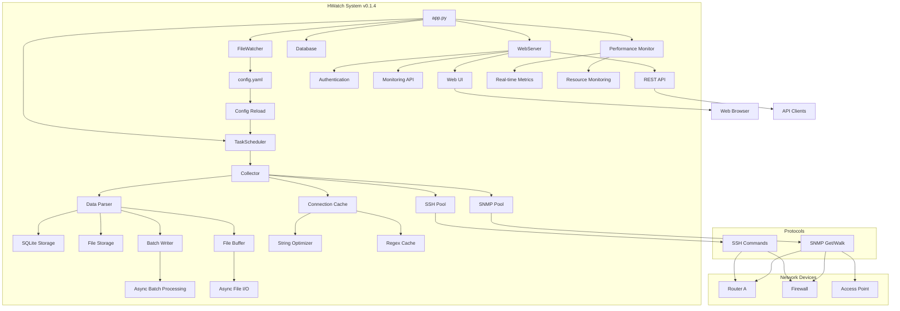

## 🛠️ Technology Stack

### Core Framework
- **Python 3.13+**: Main programming language
- **FastAPI 0.116+**: Modern, fast web framework for building APIs
- **Uvicorn**: ASGI server for FastAPI applications
- **AsyncIO**: Asynchronous programming support

### Database & Storage
- **SQLite 3**: Lightweight relational database for structured data
- **Aiosqlite**: Async SQLite driver
- **File System**: Plain text log storage option

### Network Protocols
- **AsyncSSH 2.21+**: SSH client for command execution
- **PySNMP 7.1+**: SNMP client for device monitoring
- **Connection Pooling**: Optimized connection management

### Task Scheduling
- **APScheduler 3.11+**: Advanced Python Scheduler
- **Interval/Delay Modes**: Flexible scheduling strategies
- **Hot Reload**: Dynamic configuration updates

### Web Interface
- **Jinja2 3.1+**: Template engine for dynamic HTML
- **ECharts 5.4+**: Interactive data visualization library
- **ACE Editor**: Code editor for YAML configuration
- **Custom CSS**: Responsive design with custom styling
- **Session-based Authentication**: Secure user management

### Configuration & Logging
- **PyYAML 6.0+**: YAML configuration parser
- **Loguru 0.7+**: Advanced logging system
- **Watchdog 6.0+**: File system monitoring

### Development & Deployment
- **UV**: Fast Python package manager
- **Docker**: Containerization support
- **Docker Compose**: Multi-container orchestration
- **Alpine Linux**: Lightweight container base

## 📊 Module Architecture

### 1. Application Entry (`app.py`)
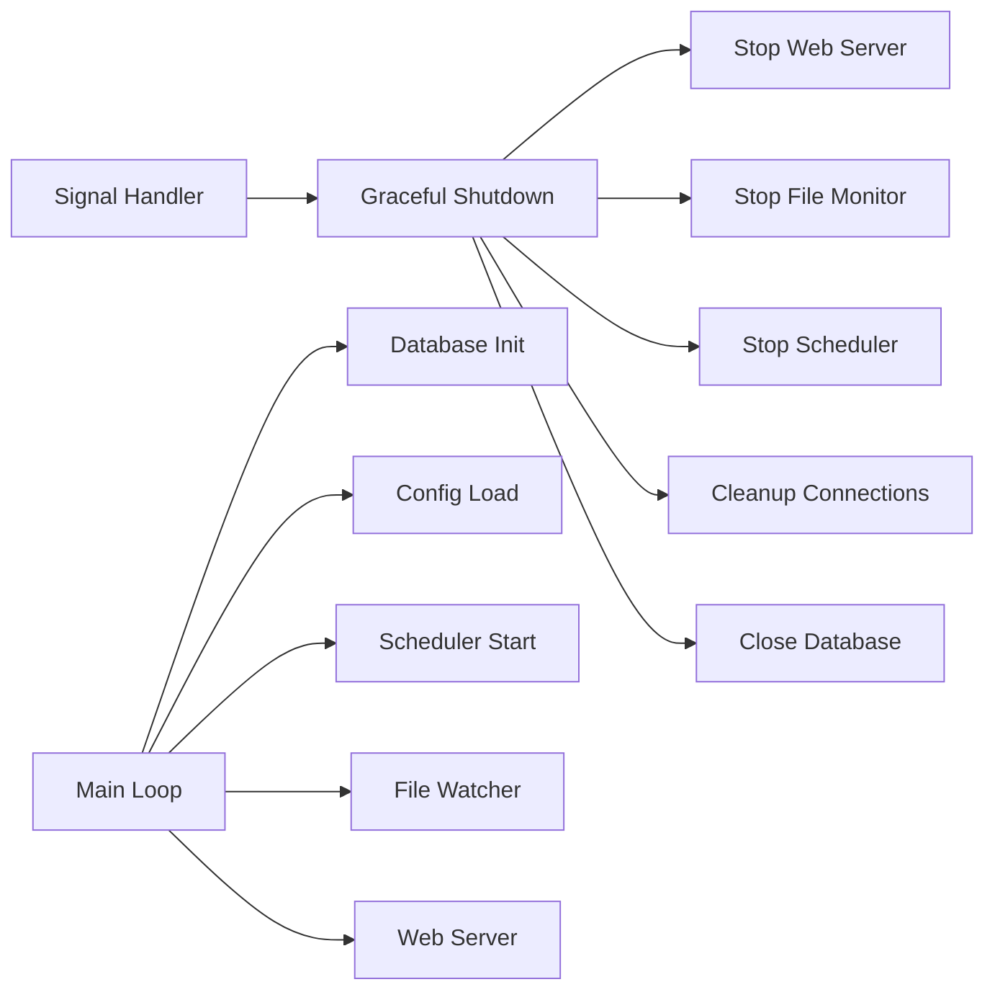

**Key Features:**
- **Graceful Shutdown**: Proper signal handling with ordered component shutdown
- **Configuration Management**: Hot-reload configuration without restart
- **Component Orchestration**: Manages all system components lifecycle
- **Error Handling**: Comprehensive error recovery and logging

### 2. Task Scheduler (`core/scheduler.py`)
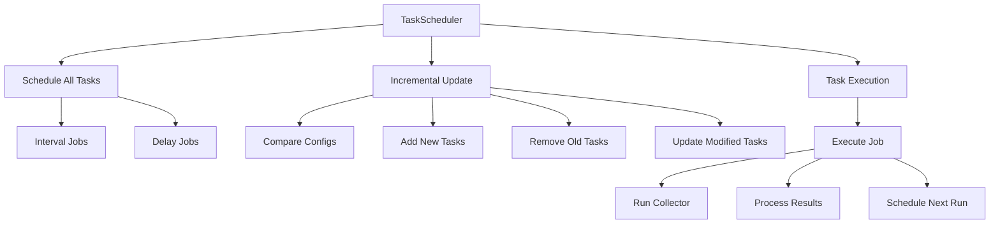

**Key Features:**
- **Dynamic Scheduling**: Add/remove/modify tasks without restart
- **Multiple Modes**: Support for interval and delay scheduling
- **Configuration Tracking**: Compare task configurations for incremental updates
- **Execution Limits**: Control task execution frequency and lifetime

### 3. Data Collector (`core/collector.py`)
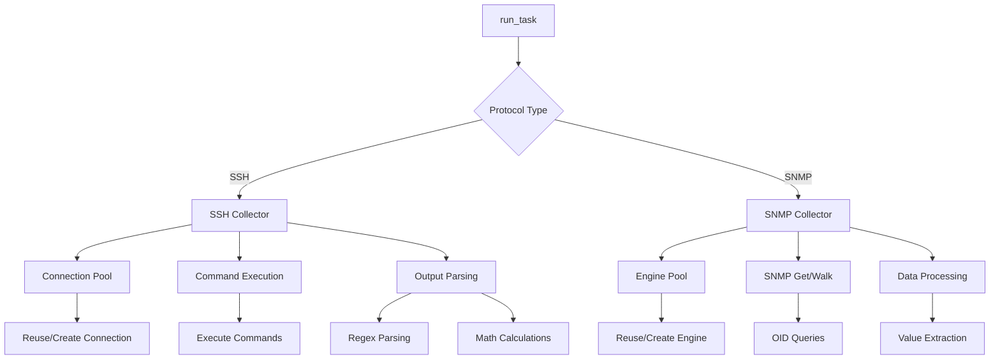

**Key Features:**
- **Connection Pooling**: Efficient SSH/SNMP connection management
- **Protocol Support**: SSH command execution and SNMP data collection
- **Data Parsing**: Advanced regex parsing with mathematical operations
- **Error Recovery**: Retry mechanisms and connection health monitoring
- **Performance Optimization**: Regex compilation caching and periodic cleanup

### 4. Web Server (`core/web_server.py`)
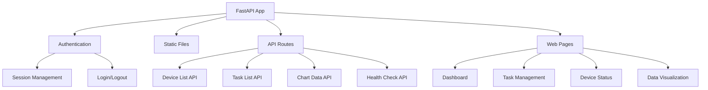

**Key Features:**
- **RESTful APIs**: Comprehensive API endpoints for data access
- **Interactive Dashboard**: Real-time monitoring and visualization
- **Authentication**: Session-based security with configurable timeouts
- **Responsive Design**: Mobile-friendly web interface
- **Help System**: Built-in documentation accessible via help icon or /help route

### 5. Configuration System (`core/config_loader.py`)
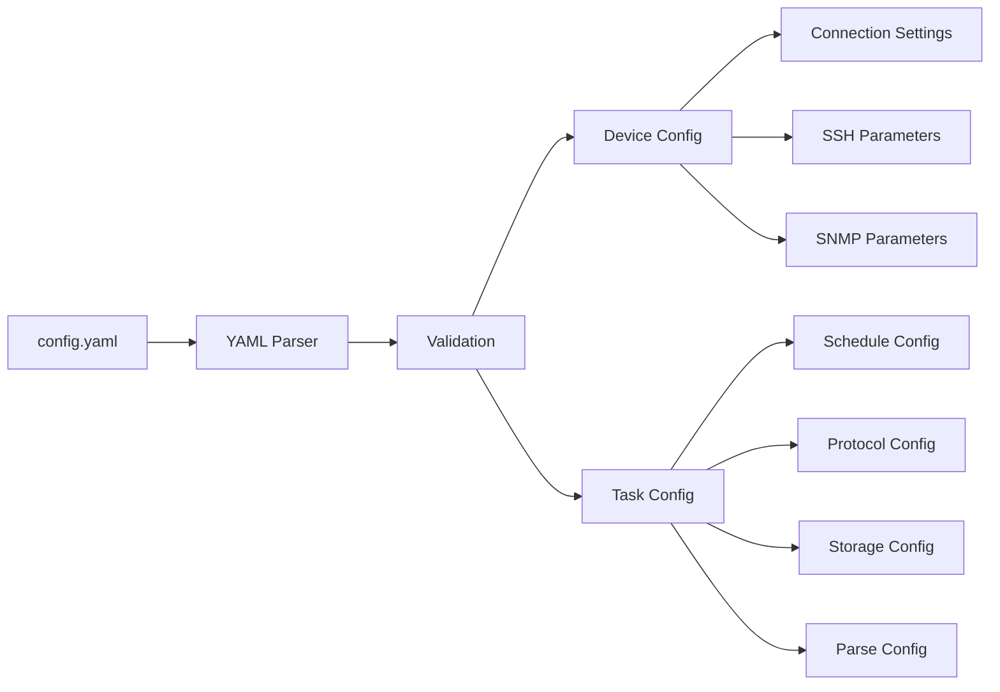

**Key Features:**
- **YAML Configuration**: Human-readable configuration format
- **Hot Reload**: Monitor and reload configuration changes
- **Validation**: Comprehensive configuration validation
- **Type Safety**: Strongly typed configuration objects

### 6. Database Layer (`core/database.py`)
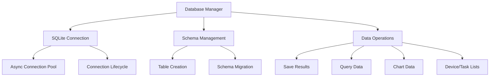

**Key Features:**
- **Async Operations**: Non-blocking database operations
- **Auto Schema**: Automatic table creation and management
- **Data Aggregation**: Efficient data retrieval for charts and reports
- **Connection Management**: Proper connection lifecycle handling

### 7. Batch Writer (`core/batch_writer.py`) - v0.1.4 New
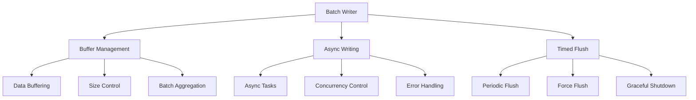

**Key Features:**
- **Intelligent Buffering**: Configurable buffer size and flush intervals
- **Async Processing**: Non-blocking batch database writes
- **Performance Optimization**: Reduces database I/O operations for improved write efficiency
- **Resource Management**: Automatic task management and graceful shutdown

### 8. File Buffer (`core/file_buffer.py`) - v0.1.4 New
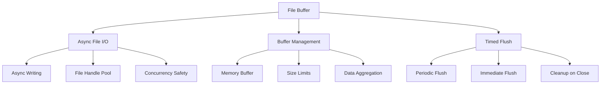

**Key Features:**
- **Async File Operations**: High-performance non-blocking file I/O
- **Intelligent Buffering**: Memory buffering reduces disk write frequency
- **Concurrency Safe**: Thread-safe operations in multi-task environments
- **Resource Optimization**: File handle reuse and automatic cleanup

### 9. Performance Monitor (`core/performance_monitor.py`) - v0.1.4 New
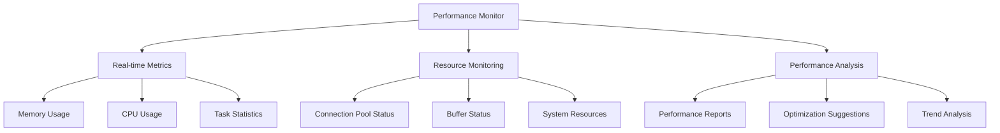

**Key Features:**
- **Real-time Monitoring**: Live tracking of system resources and application performance
- **Comprehensive Metrics**: Memory, CPU, connection pools, buffers, and more
- **Performance Analysis**: Automatic performance reports and optimization recommendations
- **API Integration**: Web API access to monitoring data

### 10. Connection Cache (`core/connection_cache.py`) - v0.1.4 New
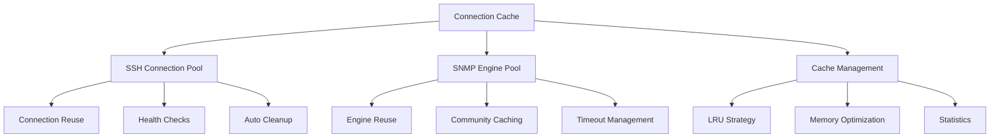

**Key Features:**
- **Intelligent Caching**: Efficient cache management for SSH connections and SNMP engines
- **Auto Cleanup**: Time and usage-based automatic cleanup mechanisms
- **Health Monitoring**: Connection status checks and automatic recovery
- **Memory Optimization**: Achieves up to 42.9% memory savings

### 11. String Optimizer (`core/string_optimizer.py`) - v0.1.4 New
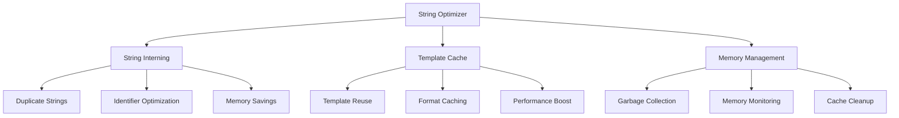

**Key Features:**
- **String Interning**: Automatically optimizes memory usage for duplicate strings
- **Template Caching**: Caches common string templates for improved performance
- **Memory Savings**: Significantly reduces string-related memory overhead
- **Auto Management**: Intelligent cache management and garbage collection
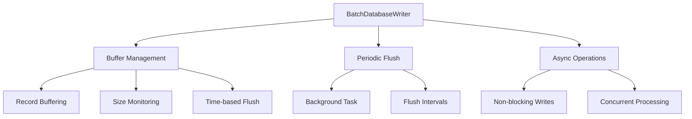

**Key Features:**
- **Batch Processing**: Efficient bulk database operations
- **Configurable Buffering**: Adjustable buffer sizes and flush intervals
- **Async Architecture**: Non-blocking database writes
- **Memory Optimization**: Intelligent buffer management

#### 7.2 File Buffer (`core/file_buffer.py`)
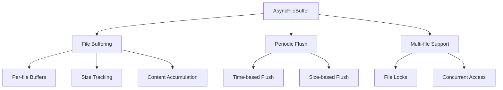

**Key Features:**
- **Async File I/O**: High-performance file operations
- **Multi-file Management**: Independent buffers per file
- **Intelligent Flushing**: Time and size-based flush strategies
- **Thread Safety**: File-level locking for concurrent access

#### 7.3 Connection Cache (`core/connection_cache.py`)
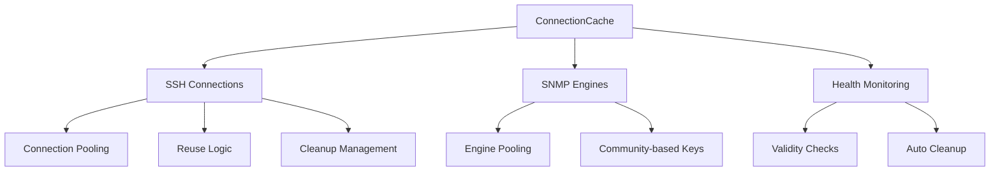

**Key Features:**
- **Connection Reuse**: Efficient connection pooling
- **Health Monitoring**: Automatic connection validity checks
- **Resource Management**: Intelligent cleanup and lifecycle management
- **Performance Optimization**: Reduced connection overhead

#### 7.4 Performance Monitor (`core/performance_monitor.py`)


**Key Features:**
- **Real-time Monitoring**: Live performance metrics collection
- **Resource Tracking**: CPU, memory, and connection usage
- **Performance Analysis**: Detailed performance insights
- **Optimization Guidance**: Performance improvement recommendations

#### 7.5 String Optimizer (`core/string_optimizer.py`)
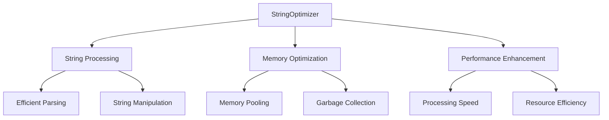

**Key Features:**
- **Optimized String Operations**: High-performance string processing
- **Memory Efficiency**: Reduced memory footprint for string operations
- **Large Data Handling**: Optimized for processing large data sets
- **Performance Enhancement**: Significant speed improvements

### 8. System Utilities

#### 8.1 Error Handler (`core/error_handler.py`)
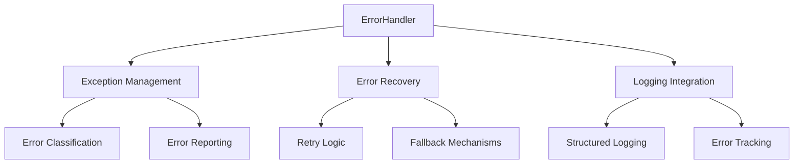

**Key Features:**
- **Comprehensive Error Handling**: Centralized exception management
- **Error Recovery**: Intelligent retry and fallback mechanisms
- **Error Classification**: Categorized error handling strategies
- **Integration**: Seamless integration with logging system

#### 8.2 Monitoring API (`core/monitoring_api.py`)
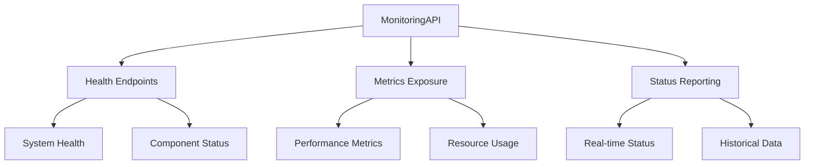

**Key Features:**
- **Health Check APIs**: System and component health monitoring
- **Metrics Exposure**: Performance and resource metrics
- **Status Reporting**: Real-time system status information
- **Integration Ready**: Easy integration with monitoring systems

#### 8.3 Unified Logging (`core/ulog.py`)
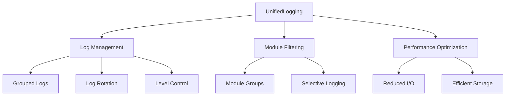

**Key Features:**
- **Grouped Logging**: Organized logs by functional modules
- **Module Filtering**: Selective logging for different components
- **Performance Optimized**: Reduced file I/O and efficient storage
- **Flexible Configuration**: Configurable log levels and rotation

#### 8.4 File Watcher (`core/watch.py`)
```mermaid
graph TB
    A[FileWatcher] --> B[Configuration Monitoring]
    A --> C[Change Detection]
    A --> D[Hot Reload]
    
    B --> E[File System Events]
    B --> F[Change Tracking]
    
    C --> G[Event Processing]
    C --> H[Duplicate Prevention]
    
    D --> I[Config Reload]
    D --> J[System Update]
```

**Key Features:**
- **Real-time Monitoring**: Live configuration file monitoring
- **Hot Reload**: Dynamic configuration updates without restart
- **Change Detection**: Intelligent change detection and processing
- **Event Management**: Efficient file system event handling

## 🚀 Quick Start

### Prerequisites
- Python 3.13 or higher
- Network devices with SSH/SNMP access
- Basic understanding of network protocols

### Installation Methods

#### Method 1: Using UV (Recommended)
```bash
# Clone the repository
git clone <repository-url>
cd hwatch

# Install dependencies with UV
uv sync

# Copy and configure settings
cp config_init.yaml config.yaml
# Edit config.yaml according to your environment

# Start the application
uv run python app.py
```

#### Method 2: Using Docker
```bash
# Clone the repository
git clone <repository-url>
cd hwatch

# Build and run with Docker Compose
docker-compose up -d

# Or build manually for single platform
docker build -t hwatch .
docker run -p 8080:8080 -v $(pwd)/config.yaml:/app/config.yaml hwatch

# Or build for multiple platforms using buildx
docker buildx build --no-cache --platform linux/amd64,linux/arm64 \
  -t registry.cn-hangzhou.aliyuncs.com/apuer/hwatch:0.1.0 \
  -t registry.cn-hangzhou.aliyuncs.com/apuer/hwatch:latest --load .
```

#### Method 3: Traditional Python
```bash
# Clone the repository
git clone <repository-url>
cd hwatch

# Create virtual environment
python -m venv .venv
source .venv/bin/activate  # On Windows: .venv\Scripts\activate

# Install dependencies
pip install -r requirements.txt

# Configure and start
cp config_init.yaml config.yaml
python app.py
```

### Access the Application
- **Web Interface**: http://localhost:8080
- **Default Credentials**: admin / 123456
- **API Documentation**: http://localhost:8080/docs
- **Help & Documentation**: Click the help icon (?) in the dashboard header or visit http://localhost:8080/help

## ⚙️ Configuration Guide (config.yaml)

### YAML List Syntax Clarification

**Important:** YAML supports two equivalent syntaxes for lists. Both forms are valid and interchangeable:

#### Flow Syntax (Inline)
```yaml
targets: ["Router_A", "Fortinet_60"]
labels: ["BIOS_Version", "Branch_Point"]
```

#### Block Syntax (Multi-line)
```yaml
targets:
- "Router_A"
- "Fortinet_60"
labels:
- "BIOS_Version"
- "Branch_Point"
```

#### Mixed Usage in Examples
Throughout this documentation, you'll see both syntaxes used:
- **Flow syntax** (`[item1, item2]`) - Often used for short lists in examples
- **Block syntax** (using `-`) - Often used for longer lists or when readability is important

**Choose the style you prefer** - both work identically. The block syntax is often more readable for longer lists or when items are lengthy.

---

### Device Configuration (devices)

Each device contains basic information and connection configuration:

```yaml
devices:
- name: "Router_A"              # Device identifier, must be unique
  ip: "192.168.1.100"           # Device IP address
  connection:                   # Connection configuration
    ssh:                        # SSH connection settings
      username: "admin"          # SSH username
      password: "admin123"       # SSH password
      port: 22                  # SSH port, default 22
      timeout: 10               # Connection timeout (seconds)
      retry: 3                  # Number of retry attempts
    snmp:                       # SNMP connection settings
      community: "public"        # SNMP community string
      port: 161                 # SNMP port, default 161
      timeout: 10               # Timeout (seconds)
      retry: 3                  # Number of retry attempts
```

### Task Configuration (tasks)

#### Basic Configuration Fields
```yaml
tasks:
- alias: "task_alias"           # Unique task identifier
  enabled: true                 # Whether to enable the task
  protocol: "ssh"               # Protocol type: ssh or snmp
  targets:                      # Target device list (using block syntax)
  - "Router_A"
  - "Fortinet_60"
  storage: "sqlite"             # Storage method: sqlite, file, or null
```

**Note:** The `targets` field above uses block syntax. You could also write it as `targets: ["Router_A", "Fortinet_60"]` using flow syntax.

#### Scheduling Configuration (schedule)
```yaml
schedule:
  frequency: 0                  # Execution count limit, 0 means unlimited
  mode: "interval"              # Scheduling mode: interval or delay
  seconds: 60                   # Execution interval (seconds)
```

**Scheduling Mode Explanation:**
- `interval`: Fixed interval execution, next execution scheduled immediately after current execution starts
- `delay`: Delayed execution, next execution scheduled after waiting specified time following completion. In delay mode, tasks continue to reschedule after both success and failure.

#### SSH Task Configuration (NEW PROTOCOL-SEPARATED FORMAT)

**Single Command Execution:**
```yaml
- alias: "get_router_version"
  enabled: true
  protocol: "ssh"
  ssh:
    command: 
    - "show version"
  targets: ["Router_A"]
  schedule:
    frequency: 1                # Execute only once
  storage: "sqlite"
```

**Multiple Command Execution:**
```yaml
- alias: "system_check"
  enabled: true
  protocol: "ssh"
  ssh:
    command: 
    - "get system status"
    - "get system arp"
  targets: ["Fortinet_60"]
  schedule:
    frequency: 20
    mode: "delay"
    seconds: 120
  storage: "file"
```

**SSH Task with Data Parsing:**
```yaml
- alias: "parse_system_info"
  enabled: true
  protocol: "ssh"
  ssh:
    command: 
    - "get system status"
    parse:
      regex: "(?s)BIOS version:\\s*(\\d+).*?Branch point:\\s*(\\d+)"
      calculate:
      - "/1000000"                # First value divided by 1000000
      - "*10"                     # Second value multiplied by 10
  labels:
  - "BIOS_Version"
  - "Branch_Point"
  targets: ["Fortinet_60"]
  schedule:
    frequency: 0
    mode: "delay"
    seconds: 120
  storage: "sqlite"
```

#### SNMP Task Configuration (New Mixed Operations Format)

**SNMP Get (Single Value Retrieval):**
```yaml
- alias: "memory_usage"
  enabled: true
  protocol: "snmp"
  snmp:
    oid:
    - "1.3.6.1.4.1.12356.101.4.1.4.0"
    type:
    - "snmpget"
  labels:
  - "fgSysMemUsage"
  targets: ["Fortinet_60"]
  schedule:
    frequency: 0
    mode: "interval"
    seconds: 5
  storage: "sqlite"
```

**SNMP Walk (Multiple Value Retrieval with Auto-Generated Labels):**
```yaml
- alias: "processor_usage"
  enabled: true
  protocol: "snmp"
  snmp:
    oid:
    - "1.3.6.1.4.1.12356.101.4.4.2.1.2"
    type:
    - "snmpwalk"
  labels:
  - "fgProcessorUsage"          # Auto-generates: .1, .2, .3, .4
  targets: ["Fortinet_60"]
  schedule:
    frequency: 0
    mode: "interval"
    seconds: 5
  storage: "sqlite"
```

**Mixed SNMP Operations (Advanced):**
```yaml
- alias: "mixed_snmp_monitoring"
  enabled: true
  protocol: "snmp"
  snmp:
    oid:
    - "1.3.6.1.4.1.12356.101.4.1.8.0"    # Session count (single)
    - "1.3.6.1.4.1.12356.101.4.4.2.1.2"  # CPU usage (multiple)
    - "1.3.6.1.4.1.12356.101.4.1.4.0"    # Memory usage (single)
    type:
    - "snmpget"   # Single value
    - "snmpwalk"  # Multiple values -> generates .1, .2, .3, .4 suffixes
    - "snmpget"   # Single value
  labels:
  - "SessionCount"
  - "CPUUsage"     # Becomes CPUUsage.1, CPUUsage.2, CPUUsage.3, CPUUsage.4
  - "MemoryUsage"
  targets: ["Fortinet_60"]
  schedule:
    frequency: 0
    mode: "interval"
    seconds: 10
  storage: "sqlite"
```

### Data Parsing Configuration (parse)

#### Regular Expression Parsing
```yaml
parse:
  regex: "(?s)BIOS version:\\s*(\\d+).*?Branch point:\\s*(\\d+)"
  calculate:
  - "/1000000"                  # First value divided by 1000000
  - "*10"                      # Second value multiplied by 10
```

**Regular Expression Tips:**
- Use `(?s)` to enable multiline mode, allowing `.` to match newline characters
- Use `\\s*` to match possible whitespace characters
- Use `.*?` for non-greedy matching
- The number of capture groups `()` must match the number of `labels`

#### Mathematical Operations (calculate)
Supported operators:
- `"+number"`: Addition operation, e.g., `"+100"`
- `"-number"`: Subtraction operation, e.g., `"-50"`
- `"*number"`: Multiplication operation, e.g., `"*1024"`
- `"/number"`: Division operation, e.g., `"/1000"`

**Use Cases:**
- Unit conversion: Bytes to KB (`"/1024"`)
- Percentage to decimal: (`"/100"`)
- Value normalization: Large value scaling (`"/1000000"`)

### Dynamic Label Generation

The system now supports intelligent dynamic label generation for SNMP operations:

#### Automatic Label Suffixing
- **snmpget operations**: Use the configured base label directly
- **snmpwalk operations**: Automatically append numeric suffixes (.1, .2, .3, etc.)
- **Mixed operations**: Handle both types seamlessly in a single task

#### Smart Label Mapping
```yaml
labels:
- "SessionCount"    # snmpget -> "SessionCount"
- "CPUUsage"        # snmpwalk -> "CPUUsage.1", "CPUUsage.2", "CPUUsage.3", "CPUUsage.4"
- "MemoryUsage"     # snmpget -> "MemoryUsage"
```

#### Benefits
- **No Manual Management**: Labels are generated based on actual SNMP results
- **Accurate Mapping**: Each returned value gets a unique, meaningful label
- **Consistent Naming**: Predictable label patterns for easy data access
- **Simplified Configuration**: No need to pre-define all possible walk result labels

### Complete Example Based on Latest Configuration Format

The following is a complete example using the new protocol-separated configuration:

```yaml
devices:
- name: "Router_A"
  ip: "192.168.1.100"
  connection:
    ssh:
      username: "admin"
      password: "admin123"
      port: 22
      timeout: 10
      retry: 3
    snmp:
      community: "public"
      port: 161
      timeout: 10
      retry: 3

- name: "Fortinet_60"
  ip: "192.168.2.1"
  connection:
    ssh:
      username: "admin"
      password: "ChengduMicro@2025"
      port: 22
      timeout: 2
      retry: 0
    snmp:
      community: "awatch"
      port: 161
      timeout: 2
      retry: 0

tasks:
# SSH Task - System information collection with parsing
- alias: "run_show_command"
  enabled: true
  protocol: "ssh"
  ssh:
    command:
    - "get system status"
    - "get system arp"
    parse:
      regex: "(?s)BIOS version:\\s*(\\d+).*?Branch point:\\s*(\\d+)"
      calculate:
      - "/1000000"  # BIOS version value normalization
      - "*10"       # Branch point amplified by 10
  labels:
  - "BIOS_Version"
  - "Branch_Point"
  targets: ["Fortinet_60"]
  schedule:
    frequency: 20
    mode: "delay"
    seconds: 120
  storage: "file"

# SNMP Task - CPU usage monitoring with auto-generated labels
- alias: "fgProcessorUsage_per"
  enabled: true
  protocol: "snmp"
  snmp:
    oid:
    - "1.3.6.1.4.1.12356.101.4.4.2.1.2"
    type:
    - "snmpwalk"
  labels:
  - "fgProcessorUsage"  # Auto-generates: .1, .2, .3, .4
  targets: ["Fortinet_60"]
  schedule:
    frequency: 0
    mode: "interval"
    seconds: 5
  storage: "sqlite"

# SNMP Task - Mixed operations (get + walk + get)
- alias: "mixed_snmp_monitoring"
  enabled: true
  protocol: "snmp"
  snmp:
    oid:
    - "1.3.6.1.4.1.12356.101.4.1.8.0"    # Session count
    - "1.3.6.1.4.1.12356.101.4.4.2.1.2"  # CPU usage cores
    - "1.3.6.1.4.1.12356.101.4.1.4.0"    # Memory usage
    type:
    - "snmpget"   # Single value
    - "snmpwalk"  # Multiple values
    - "snmpget"   # Single value
  labels:
  - "SessionCount"
  - "CPUUsage"     # Becomes CPUUsage.1, .2, .3, .4
  - "MemoryUsage"
  targets: ["Fortinet_60"]
  schedule:
    frequency: 0
    mode: "interval"
    seconds: 10
  storage: "sqlite"

# SSH Task - Simple command execution
- alias: "get_router_a_version"
  enabled: false
  protocol: "ssh"
  ssh:
    command:
    - "show version"
  targets: ["Router_A"]
  schedule:
    frequency: 1
  storage: "sqlite"

# SSH Task - Operational command (no result storage)
- alias: "clear_router_a_counters"
  enabled: false
  protocol: "ssh"
  ssh:
    command:
    - "clear counters"
  targets: ["Router_A"]
  schedule:
    frequency: 1
  storage: null  # No result storage
```

### Key Changes in New Configuration Format

#### Protocol-Specific Configuration Structure
- **SSH Tasks**: Use `ssh:` block with `command:` list
- **SNMP Tasks**: Use `snmp:` block with `oid:` and `type:` lists
- **Parse Configuration**: Must be placed within protocol-specific blocks (`ssh:` or `snmp:`)

#### Enhanced SNMP Operations
- **Mixed Operations**: Each OID can have its own operation type (snmpget/snmpwalk)
- **Auto-Generated Labels**: snmpwalk operations automatically append suffixes (.1, .2, .3, etc.)
- **One-to-One Mapping**: Number of OIDs must match number of types

#### Backward Compatibility
- The old configuration format is **not supported**
- All configurations must be updated to the new protocol-separated format
- Enhanced validation prevents configuration errors

## 📊 Web Interface Features

### Dashboard
- Real-time device status monitoring
- Interactive charts and graphs
- Task execution statistics
- System health indicators
- Built-in help system accessible via help icon (?)

### Task Management
- View all configured tasks
- Monitor task execution status
- Access execution logs and results
- Real-time configuration updates

### Data Visualization
- Time-series charts for numerical data
- Customizable chart colors and styles
- Data export capabilities
- Historical data analysis

### Device Management
- Device connectivity status
- Connection pool statistics
- Protocol-specific information
- Performance metrics

## 🔧 API Documentation

### Health Check
```http
GET /api/healthz
```
Returns system health status.

### Device Information
```http
GET /api/devices
```
Returns list of configured devices.

### Task Information
```http
GET /api/tasks
```
Returns list of configured tasks.

### Chart Data
```http
GET /api/chart_data/{task_alias}
```
Returns chart data for specific task.

## 🐳 Docker Deployment

### Using Docker Compose
```yaml
version: '3.8'
services:
  hwatch:
    build: .
    ports:
      - "8080:8080"
    volumes:
      - ./config.yaml:/app/config.yaml
      - ./log:/app/log
      - ./outfile:/app/outfile
    environment:
      - WEB_USERNAME=admin
      - WEB_USERNAME=admin
      - WEB_PASSWORD=yourpassword
      - LOG_LEVEL=INFO
```

### Advanced Docker Build and Push

For production deployment and multi-platform support, use the optimized build script:

```bash
# Use the enhanced Docker build script
./docker-build.sh
```

#### Build Script Features
- **Multi-platform Support**: Builds for linux/amd64 and linux/arm64
- **Tag Conflict Management**: Handles existing tag conflicts intelligently
- **Automatic Push**: Pushes to remote registry after successful build
- **Build Validation**: Verifies successful deployment
- **Cache Management**: Optional cleanup of build cache

#### Tag Conflict Resolution
When version tags already exist in the remote repository, the script provides three options:

1. **Overwrite Existing Tags**: Force push to replace existing version
2. **Cancel Build**: Abort the build process safely
3. **Use New Version**: Interactively specify a new version number

#### Build Configuration
The build script supports easy configuration modification:

```bash
# Configuration parameters (modify in docker-build.sh)
REGISTRY="registry.cn-hangzhou.aliyuncs.com"
NAMESPACE="apuer"
IMAGE_NAME="hwatch"
VERSION="0.1.1"
PLATFORMS="linux/amd64,linux/arm64"
```

#### Usage Instructions
```bash
# Pull latest version
docker pull registry.cn-hangzhou.aliyuncs.com/apuer/hwatch:latest

# Pull specific version
docker pull registry.cn-hangzhou.aliyuncs.com/apuer/hwatch:0.1.1

# Run container
docker run -d -p 8000:8000 registry.cn-hangzhou.aliyuncs.com/apuer/hwatch:latest
```

### Environment Variables
- `WEB_USERNAME`: Web interface username (default: admin)
- `WEB_PASSWORD`: Web interface password (default: 123456)
- `LOG_LEVEL`: Logging level (DEBUG, INFO, WARNING, ERROR, CRITICAL)

## 🔐 Web Account Management

### Default Login Information
- **Username**: `admin`
- **Password**: `123456`

### Custom Account Configuration
Customize login accounts via environment variables:

```bash
# Set custom username and password
export WEB_USERNAME=myuser
export WEB_PASSWORD=mypassword

# Start the application
python app.py
```

### Session Management
- **Session Duration**: 8-hour absolute expiration time
- **Security Tokens**: Uses encrypted secure random tokens
- **Automatic Cleanup**: System automatically cleans expired sessions
- **Browser Closure**: Sessions are automatically cleared when browser is closed
- **Concurrent Login**: Supports multiple users logging in simultaneously

### Security Features
- Password hash storage (using bcrypt)
- Session token encryption
- Automatic logout mechanism
- Session hijacking prevention

## 📋 Log System Configuration

### Log Level Settings

**Priority Order (High to Low):**
1. **Environment Variable `LOG_LEVEL`** (Highest Priority)
2. **Command Line Argument `--level`** (Medium Priority)
3. **Default Value `WARNING`** (Lowest Priority)

### Usage Methods

**Method 1: Environment Variable Setting (Recommended)**
```bash
# Set log level
export LOG_LEVEL=INFO
python app.py

# Supported levels: DEBUG, INFO, WARNING, ERROR, CRITICAL
```

**Method 2: Command Line Arguments**
```bash
# Temporarily set log level
python app.py --level DEBUG

# View help information
python app.py --help
```

**Method 3: Combined Usage**
```bash
# Environment variable has higher priority, will ignore command line arguments
export LOG_LEVEL=ERROR
python app.py --level DEBUG  # Actually uses ERROR level
```

### Log Level Description

| Level | Purpose | Output Content |
|-------|---------|----------------|
| `DEBUG` | Development debugging | Detailed debug info, variable values, execution flow |
| `INFO` | General information | App startup, task execution, config loading, etc. |
| `WARNING` | Warning information | Config issues, connection exceptions, retry operations, etc. |
| `ERROR` | Error information | Task failures, connection errors, parsing failures, etc. |
| `CRITICAL` | Critical errors | System crashes, fatal errors, etc. |

### Log File Locations

```
log/
├── app.log          # Main application log (rotated by date)
├── scheduler.log    # Task scheduling log
└── error.log        # Error log (ERROR level and above)
```

### Log Configuration Features

- **Auto Rotation**: Log files automatically rotate by date
- **Size Limit**: Maximum 10MB per log file
- **Retention Policy**: Keep logs for the last 7 days
- **Unified Format**: Timestamp | Level | Module | Message
- **Color Output**: Console output supports color differentiation by level

### Log Usage Recommendations

**Development Environment:**
```bash
export LOG_LEVEL=DEBUG
```

**Production Environment:**
```bash
export LOG_LEVEL=WARNING
```

**Troubleshooting:**
```bash
export LOG_LEVEL=INFO
```

## 📊 Web Interface Usage

### Login Access
1. Access http://localhost:8080 after starting the application
2. Login with default account or custom account
3. Session is valid for 8 hours, re-login required after expiration

### Dashboard Features
- **Real-time Monitoring**: Display execution status of all enabled tasks
- **Data Charts**: Historical data trend visualization
- **Detailed Information**: Hover to view specific values and timestamps
- **Device Status**: Show device connection status and last update time
- **Help Documentation**: Click the help icon (?) in the header to access comprehensive documentation and configuration guides

### Task Management
- **Task List**: View all configured tasks and their status
- **Enable Control**: Dynamically enable/disable tasks
- **Configuration Editing**: Real-time config file editing (restart required for effect)
- **Execution History**: View task execution history and results

### Data Viewing
- **SQLite Data**: View charts and historical trends in web interface
- **File Data**: Raw output saved in `outfile/` directory
- **Real-time Updates**: Data automatically refreshes, no manual refresh needed
- **Export Function**: Support data export to CSV format

## 🔧 Advanced Features

### SSH Connection Pool
System automatically manages SSH connection pool for improved performance:
- **Connection Reuse**: Connections for same tasks and devices are reused
- **Auto Cleanup**: Connections unused for more than 10 minutes are automatically cleaned
- **Health Check**: Connection status is checked before use
- **Concurrency Control**: Maximum 5 concurrent connections per device
- **Connection Isolation**: Connection pool management based on (task_alias, device_name) keys

#### SSH Multi-Command Execution Flow

```mermaid
graph TB
    A[Start SSH Task] --> B[Validate Configuration]
    B --> C[Parse Command List]
    C --> D[Initialize Result Container]
    D --> E[Loop Execute Commands]
    
    E --> F{Check Connection Status}
    F -->|Invalid Connection| G[Establish New Connection]
    F -->|Valid Connection| H[Reuse Existing Connection]
    
    G --> I[Execute Command]
    H --> I
    
    I --> J{Execution Result}
    J -->|Success| K[Record Success Result]
    J -->|Failure| L{Need Retry?}
    
    L -->|Yes| M[Wait Exponential Backoff Time]
    M --> N{Check Retry Count}
    N -->|Not Exceeded| O[Mark Connection Invalid]
    O --> F
    N -->|Exceeded| P[Record Failure Result]
    
    L -->|No| P
    K --> Q{More Commands?}
    P --> Q
    
    Q -->|Yes| E
    Q -->|No| R[Merge All Results]
    R --> S[Parse Output]
    S --> T[Return Final Result]
    
    style A fill:#e1f5fe
    style T fill:#c8e6c9
    style P fill:#ffcdd2
    style K fill:#dcedc8
```

#### SSH Command-Level Fault Tolerance

```mermaid
graph LR
    A[Command 1] --> B{Execution Result}
    B -->|Success| C[Record Result 1]
    B -->|Failure| D[Record Error 1]
    
    C --> E[Command 2]
    D --> E
    
    E --> F{Execution Result}
    F -->|Success| G[Record Result 2]
    F -->|Failure| H[Record Error 2]
    
    G --> I[Command 3]
    H --> I
    
    I --> J{Execution Result}
    J -->|Success| K[Record Result 3]
    J -->|Failure| L[Record Error 3]
    
    K --> M[Merge All Results]
    L --> M
    
    M --> N[Output Format Example]
    
    N --> O["Command 1: show version\nVersion: 5.6.8\n\nCommand 2: show status\nERROR: Timeout\n\nCommand 3: show memory\nMemory: 45%"]
    
    style A fill:#e3f2fd
    style E fill:#e3f2fd
    style I fill:#e3f2fd
    style C fill:#e8f5e8
    style G fill:#e8f5e8
    style K fill:#e8f5e8
    style D fill:#ffebee
    style H fill:#ffebee
    style L fill:#ffebee
    style O fill:#f3e5f5
```

#### Multi-Command Output Result Parsing

The system supports intelligent parsing of multi-command execution results:

**Output Format Structure**:
```
Command 1: <command1>
<command1 output result>

Command 2: <command2>
<command2 output result>

Command 3: <command3>
<command3 output result>
```

**Parsing Strategies**:
1. **No Regex**: Direct command segment matching with labels
2. **With Regex**: Apply regex matching to entire output
3. **Mathematical Operations**: Support mathematical calculations on parsed results
4. **Label Mapping**: Each label corresponds to one parsed result

**Example Configuration**:
```yaml
ssh:
  command:
  - "show version | grep Version"
  - "show memory | grep Usage"
  - "show cpu | grep Load"
  parse:
    regex: "Version:\\s*([\\d.]+).*Usage:\\s*([\\d]+)%.*Load:\\s*([\\d.]+)"
    calculate:
    - ""          # Version number no calculation
    - "/100"       # Memory usage convert to decimal
    - "*100"       # CPU load amplify 100 times
labels:
- "SystemVersion"
- "MemoryUsage"
- "CPULoad"
```

#### SSH Command Failure Handling Mechanism

**Command Failure Classification and Handling Strategy**:

##### 🔌 **Failure Scenarios That Mark Connection Invalid**

The system will mark connections as invalid and remove them from the connection pool when detecting the following error types:

```python
# Connection error detection logic
is_connection_error = (
    isinstance(e, (asyncssh.ConnectionLost, asyncssh.DisconnectError)) or
    "connection" in str(e).lower() or "transport" in str(e).lower() or
    "network" in str(e).lower() or "broken pipe" in str(e).lower()
)
```

**Specific Scenarios**:
- **Network Connection Interruption**: `ConnectionLost`, `Network is unreachable`
- **SSH Session Termination**: `Session terminated`, `Connection aborted`
- **Transport Layer Errors**: `TransportError`, `Transport closed`
- **Authentication Failure**: `Authentication failed` (during reconnection)
- **Broken Pipe**: `Broken pipe`, `Connection reset`

**Handling Strategy**:
- ✅ Set local variable `conn = None`
- ✅ Immediately remove invalid connection from pool
- ✅ Automatically re-establish connection when next command executes

##### ✅ **Failure Scenarios That Keep Connection Valid**

The following types of failures will keep the connection valid, allowing subsequent commands to continue using it:

**A. Command Execution Errors (Non-zero Exit Codes)**
```bash
# Examples: Command fails but connection remains healthy
$ show version-invalid        # Command doesn't exist, exit code 127
$ ls /nonexistent/path        # Path doesn't exist, exit code 2
$ cat /etc/shadow             # Permission denied, exit code 1
```

**B. Command Execution Timeout**
- Command doesn't complete within specified time
- Connection itself may still be valid
- Allows subsequent commands to continue using the connection

**C. Device-Specific Business Logic Errors**
```bash
# Device configuration or support issues
$ configure                   # Failed to enter configuration mode
$ show interfaces xyz         # Interface doesn't exist
$ get system status          # Device doesn't support this command
```

**Handling Strategy**:
- ✅ Keep local variable `conn` unchanged
- ✅ Connection pool entry remains unchanged
- ✅ Log error information but continue using current connection
- ✅ Subsequent commands can directly reuse existing connection

##### 📊 **Connection Recovery Flow**

```mermaid
graph TB
    A[Command Execution Exception] --> B{Exception Type Detection}
    
    B -->|Connection-Related Error| C[Mark Connection Invalid]
    B -->|Command-Related Error| D[Keep Connection Valid]
    
    C --> E[conn = None]
    C --> F[Remove Connection from Pool]
    C --> G[Log Connection Error]
    
    D --> H[conn Remains Unchanged]
    D --> I[Connection Pool Unchanged]
    D --> J[Log Command Error]
    
    E --> K[Next Command Execution]
    G --> K
    H --> K
    J --> K
    
    K --> L{Check Connection Status}
    
    L -->|conn is None| M[Call _get_ssh_connection]
    L -->|conn is Valid| N[Use Existing Connection Directly]
    
    M --> O[Health Check Connection Pool]
    O --> P{Is Pool Connection Valid?}
    
    P -->|Invalid| Q[Delete and Rebuild Connection]
    P -->|Valid| R[Reuse Pool Connection]
    
    Q --> S[Create New Connection and Add to Pool]
    R --> T[Update Last Used Time]
    
    S --> U[Execute Command]
    T --> U
    N --> U
    
    style C fill:#ffcdd2
    style D fill:#c8e6c9
    style M fill:#e1f5fe
    style Q fill:#fff3e0
```

**Key Advantages**:
- **Intelligent Detection**: Precisely determine whether connection rebuild is needed based on error type
- **Efficient Reuse**: Command errors won't unnecessarily disconnect valid connections
- **Fast Recovery**: Connection issues can be detected and fixed promptly
- **Resource Conservation**: Avoid unnecessary connection rebuild overhead
- **Fault Tolerance**: Single command failure doesn't affect overall task execution

### Error Handling Mechanism
- **Auto Retry**: Retry according to configuration when connection fails
- **Exponential Backoff**: Retry intervals use exponential backoff strategy (2^attempt seconds)
- **Timeout Control**: Independent timeout settings for connection and command execution
- **Detailed Logs**: Record all error information for troubleshooting

### Data Storage Strategy
- **SQLite**: Structured data storage, supports chart display and historical queries
- **File**: Raw output storage, convenient for debugging and data auditing
- **Null**: No result storage, suitable for operational commands

### Task Scheduling Mechanism
- **Interval Mode**: Fixed interval execution, next execution scheduled immediately after current execution starts
- **Delay Mode**: Delayed execution, next execution scheduled after waiting specified time following completion. In delay mode, tasks continue to reschedule after both success and failure.
- **Frequency Control**: Support limiting task execution count
- **Smart Incremental Update**: Only refresh changed tasks when config changes, keep other tasks running
- **Staggered Startup (v0.1.6)**: Intelligent random delay prevents thundering herd effect during system startup

### 🚀 Task Scheduling Optimization (v0.1.6)

#### Problem Solved: Thundering Herd Effect
When starting a system with 100+ tasks configured with 10-second intervals, all tasks would start simultaneously, causing:
- **Resource Spikes**: CPU utilization peaks followed by idle periods
- **Network Congestion**: All devices hit simultaneously with requests
- **System Instability**: Unpredictable performance patterns

#### Solution: Intelligent Staggered Startup
The system now introduces smart random delays **only for the first execution** of each task, while preserving exact execution intervals for subsequent runs.

#### Delay Calculation Algorithm
```python
def _calculate_start_delay(self, schedule) -> float:
    if schedule.frequency == 1:
        # Single execution: 0-10 seconds random delay
        return random.uniform(0, 10)
    
    elif schedule.mode == "interval" and schedule.seconds:
        # Interval mode: 0 to min(interval × 3, 60s) random delay
        max_delay = min(schedule.seconds * 3, 60)
        return random.uniform(0, max_delay)
    
    elif schedule.mode == "delay" and schedule.seconds:
        # Delay mode: 0 to min(delay_time, 60s) random delay
        max_delay = min(schedule.seconds, 60)
        return random.uniform(0, max_delay)
    
    else:
        # Default: 0-5 seconds random delay
        return random.uniform(0, 5)
```

#### Delay Strategy Examples

| Task Type | Interval | Random Delay Range | Example |
|-----------|----------|-------------------|---------|
| Single execution | N/A | 0-10s | Task starts 0-10s after system startup |
| Interval: 10s | 10s | 0-30s | Task starts 0-30s after startup, then every 10s |
| Interval: 60s | 60s | 0-60s | Task starts 0-60s after startup, then every 60s |
| Interval: 300s | 300s | 0-60s | Task starts 0-60s after startup, then every 300s |
| Delay: 30s | 30s | 0-30s | Task starts 0-30s after startup, then 30s after completion |
| Delay: 120s | 120s | 0-60s | Task starts 0-60s after startup, then 120s after completion |

#### Performance Impact

**Before Optimization:**
```
Time:    0s    10s   20s   30s   40s
Task A:  |███  |███  |███  |███  |███
Task B:  |███  |███  |███  |███  |███  
Task C:  |███  |███  |███  |███  |███
CPU:     100%  100%  100%  100%  100%
```

**After Optimization:**
```
Time:    0s    10s   20s   30s   40s
Task A:  |███  |███  |███  |███  |███
Task B:    |███  |███  |███  |███  |███
Task C:      |███  |███  |███  |███  |███
CPU:     ████████████████████████████
```

#### Key Benefits
- **Eliminated Resource Spikes**: CPU usage becomes smooth instead of spiky
- **Preserved Timing Accuracy**: Task execution intervals remain exactly as configured
- **Improved Scalability**: System handles 100+ concurrent tasks efficiently
- **Better Device Health**: Target devices receive distributed load instead of simultaneous bursts
- **Minimal Configuration Impact**: No configuration changes required, works automatically

#### Implementation Details
- **First Execution Only**: Random delay applies only to initial task startup
- **Preserved Intervals**: All subsequent executions maintain exact configured timing
- **Intelligent Limits**: Maximum delays are capped to prevent excessive startup times
- **Backward Compatible**: Existing configurations work without modification
- **Enhanced Logging**: Startup delays are logged for monitoring and debugging
- **Staggered Startup (v0.1.6)**: Intelligent random delay prevents thundering herd effect during system startup

### 🚀 Task Scheduling Optimization (v0.1.6)

#### Problem Solved: Thundering Herd Effect
When starting a system with 100+ tasks configured with 10-second intervals, all tasks would start simultaneously, causing:
- **Resource Spikes**: CPU utilization peaks followed by idle periods
- **Network Congestion**: All devices hit simultaneously with requests
- **System Instability**: Unpredictable performance patterns

#### Solution: Intelligent Staggered Startup
The system now introduces smart random delays **only for the first execution** of each task, while preserving exact execution intervals for subsequent runs.

#### Delay Calculation Algorithm
```python
def _calculate_start_delay(self, schedule) -> float:
    if schedule.frequency == 1:
        # Single execution: 0-10 seconds random delay
        return random.uniform(0, 10)
    
    elif schedule.mode == "interval" and schedule.seconds:
        # Interval mode: 0 to min(interval × 3, 60s) random delay
        max_delay = min(schedule.seconds * 3, 60)
        return random.uniform(0, max_delay)
    
    elif schedule.mode == "delay" and schedule.seconds:
        # Delay mode: 0 to min(delay_time, 60s) random delay
        max_delay = min(schedule.seconds, 60)
        return random.uniform(0, max_delay)
    
    else:
        # Default: 0-5 seconds random delay
        return random.uniform(0, 5)
```

#### Delay Strategy Examples

| Task Type | Interval | Random Delay Range | Example |
|-----------|----------|-------------------|---------|
| Single execution | N/A | 0-10s | Task starts 0-10s after system startup |
| Interval: 10s | 10s | 0-30s | Task starts 0-30s after startup, then every 10s |
| Interval: 60s | 60s | 0-60s | Task starts 0-60s after startup, then every 60s |
| Interval: 300s | 300s | 0-60s | Task starts 0-60s after startup, then every 300s |
| Delay: 30s | 30s | 0-30s | Task starts 0-30s after startup, then 30s after completion |
| Delay: 120s | 120s | 0-60s | Task starts 0-60s after startup, then 120s after completion |

#### Performance Impact

**Before Optimization:**
```
Time:    0s    10s   20s   30s   40s
Task A:  |███  |███  |███  |███  |███
Task B:  |███  |███  |███  |███  |███  
Task C:  |███  |███  |███  |███  |███
CPU:     100%  100%  100%  100%  100%
```

**After Optimization:**
```
Time:    0s    10s   20s   30s   40s
Task A:  |███  |███  |███  |███  |███
Task B:    |███  |███  |███  |███  |███
Task C:      |███  |███  |███  |███  |███
CPU:     ████████████████████████████
```

#### Key Benefits
- **Eliminated Resource Spikes**: CPU usage becomes smooth instead of spiky
- **Preserved Timing Accuracy**: Task execution intervals remain exactly as configured
- **Improved Scalability**: System handles 100+ concurrent tasks efficiently
- **Better Device Health**: Target devices receive distributed load instead of simultaneous bursts
- **Minimal Configuration Impact**: No configuration changes required, works automatically

#### Implementation Details
- **First Execution Only**: Random delay applies only to initial task startup
- **Preserved Intervals**: All subsequent executions maintain exact configured timing
- **Intelligent Limits**: Maximum delays are capped to prevent excessive startup times
- **Backward Compatible**: Existing configurations work without modification
- **Enhanced Logging**: Startup delays are logged for monitoring and debugging

### Performance Optimization Features
- **Regex Compilation Caching**: Compiled regex patterns are cached to avoid repeated compilation
- **Periodic Connection Cleanup**: Connection pools are cleaned up periodically (every 5 minutes) to avoid frequent cleanup operations
- **Efficient Resource Management**: Connection pooling and engine pooling reduce overhead

### 🔄 Incremental Update Mechanism

#### Working Principle
System intelligently identifies configuration changes through task signatures (MD5 hash) for precise incremental updates:

1. **Task Signature Generation**: Generate MD5 signature for each task's key configuration
2. **Configuration Comparison**: Compare new and old configurations to precisely identify change types
3. **Categorized Processing**: Execute different update strategies based on change types
4. **State Preservation**: Unchanged tasks maintain running state unaffected

#### Change Type Processing

| Change Type | Processing Strategy | Impact Scope |
|-------------|--------------------|--------------|
| **New Tasks** | Directly add to scheduler | New tasks only |
| **Deleted Tasks** | Remove all related jobs and counts | Deleted tasks only |
| **Modified Tasks** | Remove first then re-add | Modified tasks only |
| **Unchanged Tasks** | Keep as is | No impact |

#### Task Signature Includes
- Task basic info: alias, enabled, protocol, targets, storage
- Schedule config: frequency, mode, seconds
- Protocol-specific config: SSH commands, SNMP OID and type
- Parse config: regex, mathematical operations, labels

#### Incremental Update Log Example
```
Configuration changes detected, starting reload...
Starting incremental task scheduling update...
Configuration changes detected: added 1, removed 0, modified 2, unchanged 5
Deleted task: old_task
Updated task: fgSysMemUsage
Updated task: fgProcessorUsage_per
Added task: new_monitoring_task
Incremental update completed! Processed 4 changes
Configuration reload and task incremental update successful!
```

#### Performance Advantages
- **Reduced Interruption**: Running tasks won't be restarted unnecessarily
- **Improved Stability**: Avoid connection rebuilding and data loss from full refresh
- **Resource Saving**: Only process truly changed tasks, reduce system overhead
- **Faster Response**: Incremental updates respond faster than full updates
- **Connection Preservation**: SSH connections in pool are preserved, avoiding reconnection

#### Duplicate Prevention Mechanism
System has comprehensive duplicate processing prevention:
- **File System Events**: Editor saves may trigger multiple file system events
- **Configuration Comparison**: Second detection with no actual changes will skip processing
- **Log Recording**: Clear records of each detection result for debugging

#### Usage Recommendations
1. **Batch Modifications**: Recommend completing multiple config changes at once to reduce frequent updates
2. **Test Verification**: Observe logs after modifications to confirm update results
3. **Backup Configuration**: Backup config files before important changes
4. **Monitor Impact**: Pay attention to task execution status and performance after modifications

## 📝 System Log Files

### Log File Structure (v0.1.4 Grouped Logging System)
```
log/
├── core.log         # Core business operations (collector, scheduler)
├── storage.log      # Data storage operations (batch_writer, file_buffer, database)
├── web.log          # Web service operations (web_server, monitoring_api)
├── system.log       # System configuration (config_loader, watch, error_handler)
├── performance.log  # Performance monitoring (performance_monitor, string_optimizer, connection_cache)
└── error.log        # Global error log (ERROR level and above)

outfile/
├── task_alias_device_name.log    # Task output for file storage mode
└── ...
```

### Grouped Log Content Description
- **core.log**: Task scheduling, data collection, SSH/SNMP connection management
- **storage.log**: Database operations, batch writing, file buffering, async I/O
- **web.log**: Web server, API requests, user authentication, monitoring interfaces
- **system.log**: Configuration loading, file monitoring, error handling, system initialization
- **performance.log**: Performance metrics, resource monitoring, cache management, optimization statistics
- **error.log**: Centralized error and exception information from all modules

### Logging System Advantages (v0.1.4)
- **Functional Grouping**: Organized by business function for easier problem identification and maintenance
- **Reduced File Count**: From 7+ individual files to 5 organized group files
- **Improved Readability**: Related logs concentrated in same file for easier analysis
- **Maintenance Efficiency**: Simplified log management and troubleshooting workflow

## 🚨 Important Notes

### Security Considerations
1. **Configuration File Security**: `config.yaml` contains device passwords, please set appropriate file permissions
2. **Network Security**: Ensure monitoring network security to avoid password leakage
3. **Web Access**: Production environment recommends configuring HTTPS and strong passwords
4. **Log Security**: Log files may contain sensitive information, pay attention to access control

### Network Requirements
1. **Connectivity**: Monitoring host must be able to access target device SSH/SNMP ports
2. **Firewall**: Ensure relevant ports (SSH:22, SNMP:161) are open
3. **Bandwidth**: Frequent collection may generate network traffic, pay attention to bandwidth planning
4. **Latency**: Network latency affects task execution time, set reasonable timeout values

### Performance Recommendations
1. **Collection Interval**: Set reasonably based on data change frequency and network conditions
2. **Concurrency Control**: Avoid executing too many tasks simultaneously causing resource competition
3. **Storage Selection**: Use SQLite for frequent queries, file storage for debugging and auditing
4. **Data Cleanup**: Regularly clean historical data to avoid oversized database

### Maintenance Recommendations
1. **Regular Backup**: Backup configuration files and important data
2. **Log Rotation**: System automatically rotates logs, pay attention to disk space
3. **Monitoring Alerts**: Recommend configuring external monitoring system to monitor HWatch running status
4. **Version Updates**: Follow project updates, upgrade promptly to fix security issues

## 🔍 Troubleshooting Guide

### Common Issues and Solutions

#### SSH Connection Issues
**Symptoms**: SSH tasks show connection failure
**Troubleshooting Steps**:
1. Check device IP address and port configuration
2. Verify username and password are correct
3. Test network connectivity: `ping <device_ip>`
4. Manual SSH test: `ssh username@device_ip`
5. Check device SSH service status
6. View detailed error logs

**Common Causes**:
- Network unreachable or firewall blocking
- Authentication information error
- SSH service not started or configuration issues
- Device resource insufficient to establish new connections

#### SNMP Query Issues
**Symptoms**: SNMP tasks no response or return empty values
**Troubleshooting Steps**:
1. Verify SNMP community string configuration
2. Check device SNMP service status
3. Test with snmpwalk tool: `snmpwalk -v2c -c community device_ip oid`
4. Confirm OID is correct and device supported
5. Check if SNMP port is open

#### Data Parsing Issues
**Symptoms**: Regular expression doesn't match or parsing fails
**Troubleshooting Steps**:
1. Set log level to DEBUG to view raw output
2. Use online regex testing tools for verification
3. Ensure capture group count matches labels count
4. Check if multiline matching needs `(?s)` flag
5. Verify mathematical operation expression syntax

#### Web Interface Issues
**Symptoms**: Cannot access web interface or login failure
**Troubleshooting Steps**:
1. Check if application started normally
2. Confirm port 8080 is not occupied
3. Verify login credentials are correct
4. Check browser console error messages
5. View web server errors in application logs

### Debugging Tips

#### Enable Detailed Logging
```bash
export LOG_LEVEL=DEBUG
python app.py
```

#### Single Task Testing
Temporarily disable other tasks, only enable the task needing debugging:
```yaml
- alias: "debug_task"
  enabled: true    # Only enable this task
  # ... other configuration
```

#### Manual Command Testing
Manually execute commands on device to compare output format:
```bash
ssh admin@device_ip "show version"
```

#### Regular Expression Debugging
Use Python interactive environment to test regular expressions:
```python
import re
pattern = r"(?s)BIOS version:\s*(\d+).*?Branch point:\s*(\d+)"
text = "your_device_output_here"
matches = re.search(pattern, text)
print(matches.groups() if matches else "No match")
```

## 📈 Performance Optimization Recommendations

### System Level Optimization
1. **Resource Configuration**: Ensure sufficient CPU and memory resources
2. **Network Optimization**: Use high-speed stable network connections
3. **Storage Optimization**: Use SSD storage to improve database performance
4. **System Tuning**: Adjust operating system network parameters

### Application Level Optimization
1. **Reasonable Intervals**: Avoid overly frequent data collection
2. **Batch Operations**: Execute multiple commands in single SSH session
3. **Connection Reuse**: System automatically manages SSH connection pool
4. **Async Processing**: Tasks execute in parallel for improved efficiency

### Configuration Optimization
1. **Timeout Settings**: Adjust timeout according to network conditions
2. **Retry Strategy**: Set reasonable retry count to avoid resource waste
3. **Storage Selection**: Choose appropriate storage method based on use case
4. **Task Grouping**: Group related tasks for execution to reduce connection overhead

## 💾 Git Workflow and Repository Management

### Dual Repository Push Configuration

This project supports an advanced dual repository push workflow for enhanced backup and deployment flexibility. Use the provided sync script for automated setup:

```bash
# Run the repository synchronization script
./sync2repo.sh
```

#### Push Method Selection
The sync script provides two dual repository push methodologies:

##### Method 1: Separate Remotes (origin + backup)
- **Benefits**: Independent control and flexible management
- **Use Case**: When you need granular control over individual repositories
- **Commands**: 
  ```bash
  git push origin --all && git push origin --tags
  git push backup --all && git push backup --tags
  ```

##### Method 2: Unified 'all' Remote
- **Benefits**: Simplified operations and streamlined workflow
- **Use Case**: When you prefer one-command synchronization
- **Commands**:
  ```bash
  git push all --all && git push all --tags
  ```

#### Branch Configuration
- **Default Branch**: `feature/english`
- **Multi-branch Support**: Pushes all branches and tags simultaneously
- **Branch Protection**: Maintains existing branch structures

#### Repository Synchronization Features
- **Interactive Setup**: Choose between separate or unified push methods
- **Conflict Detection**: Handles existing remote configurations
- **Detailed Feedback**: Individual success/failure status for each repository
- **Error Diagnosis**: Comprehensive troubleshooting information
- **Configuration Validation**: Verifies remote repository accessibility

#### Usage Examples
```bash
# Quick setup with interactive selection
./sync2repo.sh

# View current remote configuration
git remote -v

# Push to all configured repositories (unified method)
git push all --all && git push all --tags

# Push to specific repository (separate method)
git push origin --all
git push backup --all
```

#### Repository Configuration
The script configures the following repository structure:
- **Primary Repository**: GitHub or main code hosting platform
- **Backup Repository**: Secondary repository for redundancy
- **All Remote**: Special remote that pushes to multiple repositories simultaneously

### Branch Management
- **Feature Branch**: `feature/english` serves as the default development branch
- **Hot Reload**: Configuration changes without affecting running tasks
- **Version Control**: Comprehensive commit message standards

## 🤝 Contributing Guidelines

### Development Environment Setup
```bash
# Clone project
git clone <repository-url>
cd hwatch

# Install development dependencies
uv sync --dev

# Run tests
python -m pytest test/

# Code formatting
ruff format .

# Code checking
ruff check .
```

### Submission Standards
- Follow Conventional Commits specification
- Provide detailed commit messages
- Include necessary test cases
- Update relevant documentation

### Issue Reporting
When reporting issues, please provide:
1. Detailed problem description
2. Reproduction steps
3. System environment information
4. Relevant log output
5. Configuration file (after desensitization)

## 📄 License

This project is licensed under the MIT License - see the LICENSE file for details.

---

**HWatch** - Making network device monitoring simple and efficient!

For questions or suggestions, feel free to submit Issues or Pull Requests.

## 🔒 Security Considerations

### Authentication
- Session-based authentication with secure tokens
- Configurable session timeout (default: 2 hours)
- Protection against XSS and CSRF attacks

### Network Security
- SSH connection pooling with automatic cleanup
- SNMP community string protection
- Connection timeout and retry mechanisms

### Data Protection
- SQLite database with proper permissions
- Log file rotation and cleanup
- Sensitive information masking in logs

## 🚀 Performance Optimization

### Connection Pooling
- **SSH Connection Pooling**: SSH connections are pooled and reused based on (task_alias, device_name) keys
- **SNMP Engine Pooling**: SNMP engines are cached and reused based on (device_ip, community) keys
- **Automatic Cleanup**: Inactive SSH connections (10+ minutes) and SNMP engines (5+ minutes) are automatically cleaned
- **Memory Efficiency**: Achieves up to 42.9% memory savings in typical scenarios
- **Connection Reuse**: Same device/community combinations share SNMP engines for optimal performance
- **Health Monitoring**: Connection validity is checked before reuse, with automatic cleanup of invalid connections

### Advanced Performance Features (v0.1.4+)
- **Regex Compilation Caching**: Compiled regex patterns are cached to avoid repeated compilation overhead
- **Connection Pool Cleanup Optimization**: Reduced cleanup frequency from every execution to every 5 minutes
- **Batch Database Operations**: Optimized batch writing with configurable buffer sizes and flush intervals
- **Async File Buffer**: High-performance file I/O with asynchronous buffering and periodic flushing
- **String Optimization**: Advanced string processing optimizations for large data sets
- **Performance Monitoring**: Real-time performance metrics and resource usage tracking

### Asynchronous Operations
- Non-blocking task execution
- Concurrent device monitoring
- Efficient resource utilization
- Async file operations with buffering

### Memory Management
- SQLite for efficient data storage
- Connection pool size limits
- Automatic garbage collection
- Optimized string processing and memory usage

### Logging System Optimization (v0.1.4+)
- **Grouped Log Files**: Organized logging by functional modules instead of individual files
  - `core.log` - Core business operations (collector, scheduler)
  - `storage.log` - Data storage operations (batch_writer, file_buffer, database)
  - `web.log` - Web service operations (web_server, monitoring_api)
  - `system.log` - System configuration (config_loader, watch, error_handler)
  - `performance.log` - Performance monitoring (performance_monitor, string_optimizer, connection_cache)
- **Configurable Log Levels**: Optimized default INFO level for production environments
- **Reduced Log Verbosity**: Minimized redundant DEBUG information for better performance

## 🔧 Troubleshooting

### Common Issues

#### Connection Problems
```bash
# Check device connectivity
ping 192.168.1.100

# Test SSH access
ssh admin@192.168.1.100

# Test SNMP access
snmpget -v2c -c public 192.168.1.100 1.3.6.1.2.1.1.1.0
```

#### Configuration Errors
```bash
# Validate YAML syntax
python -c "import yaml; yaml.safe_load(open('config.yaml'))"

# Check application logs
tail -f log/app.log
```

#### Performance Issues
```bash
# Monitor resource usage
top -p $(pgrep -f "python app.py")

# Check database size
ls -lh hwatch.db

# Monitor connection pools
curl http://localhost:8080/api/healthz
```

### Log Levels
- **DEBUG**: Detailed debugging information
- **INFO**: General operational messages
- **WARNING**: Warning messages for attention
- **ERROR**: Error conditions
- **CRITICAL**: Critical error conditions

## 📈 Monitoring and Maintenance

### Regular Maintenance
1. Monitor log file sizes and rotate as needed
2. Check database growth and optimize if necessary
3. Update device credentials and configurations
4. Review and update task schedules
5. Monitor system resource usage

### Health Monitoring
- Use the built-in health check endpoint
- Monitor application logs for errors
- Set up alerts for critical failures
- Regular backup of configuration and data

## 🤝 Contributing

1. Fork the repository
2. Create a feature branch
3. Make your changes
4. Add tests if applicable
5. Submit a pull request

### Development Setup
```bash
# Clone and setup development environment
git clone <repository-url>
cd hwatch
uv sync --dev

# Run tests
uv run pytest

# Code formatting
uv run ruff format
uv run ruff check
```

## 📝 License

This project is licensed under the MIT License - see the LICENSE file for details.

## 🆘 Support

For support and questions:
- Create an issue on GitHub
- Check the troubleshooting section
- Review the API documentation
- Consult the configuration examples

---

*HWatch - Lightweight Network Device Monitoring Made Simple*