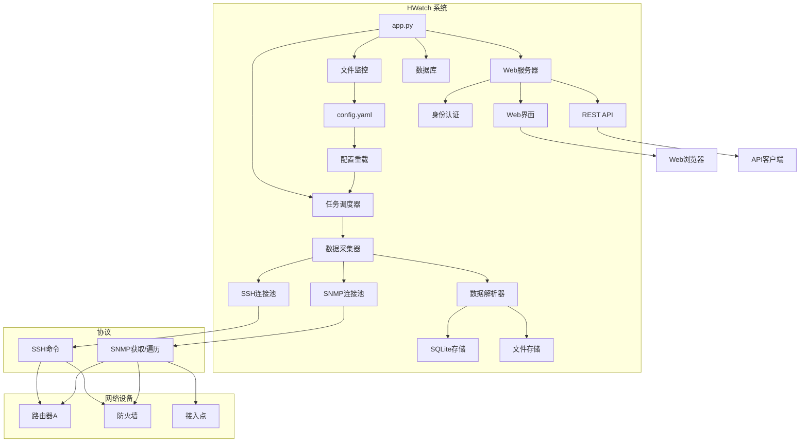
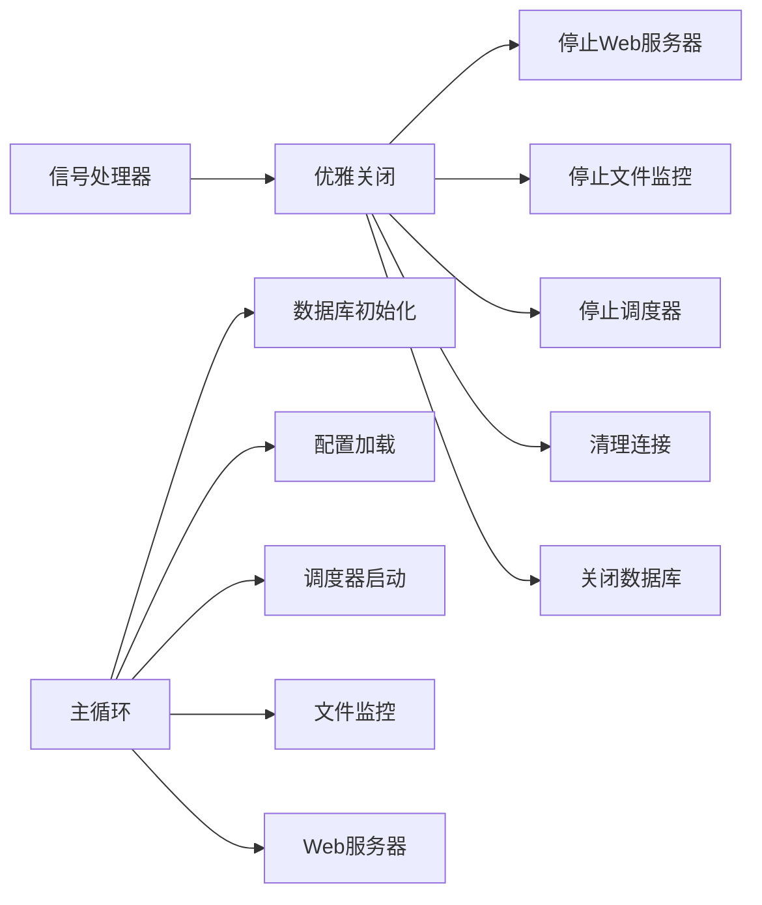
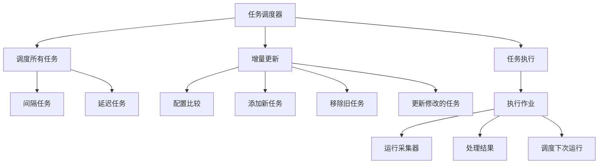
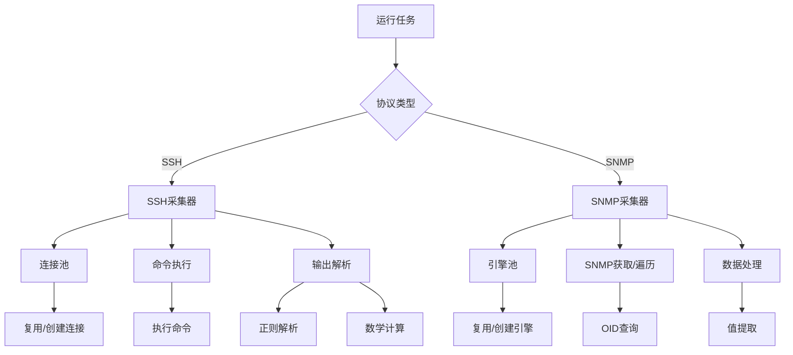
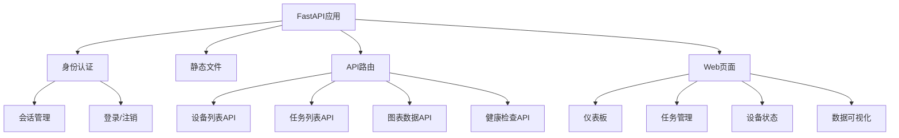
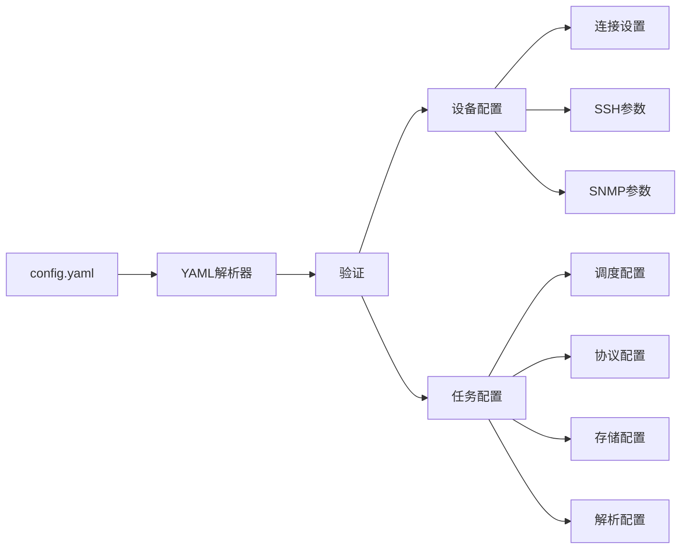
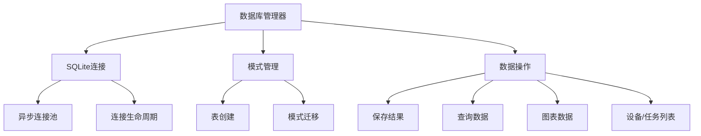
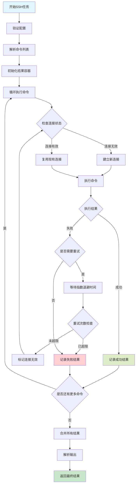
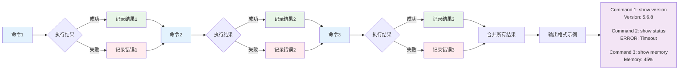
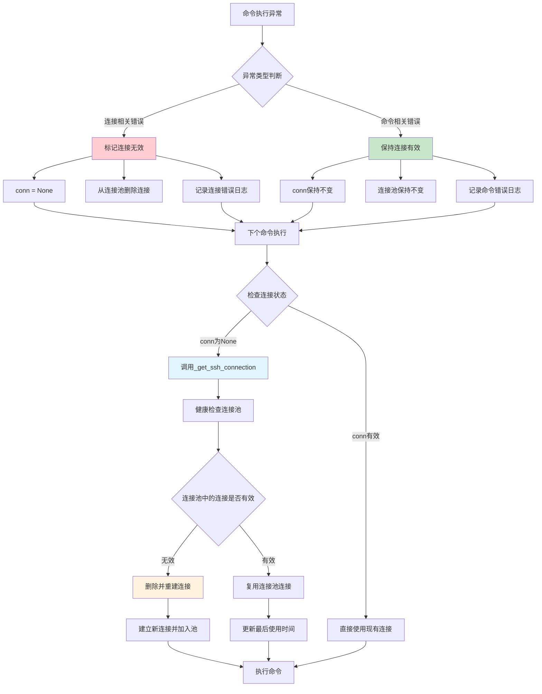

# HWatch - 网络设备监控系统

[](https://python.org)
[](https://fastapi.tiangolo.com)
[](https://sqlite.org)
[](https://docker.com)

HWatch是一个基于Python构建的轻量级、高性能网络设备监控系统。它支持通过SSH和SNMP协议进行数据采集，提供实时监控、数据存储和基于Web的可视化功能。

## 🏗️ 系统架构



## 🛠️ 技术栈

### 核心框架
- **Python 3.13+**: 主要编程语言
- **FastAPI 0.116+**: 现代、高性能的Web框架
- **Uvicorn**: FastAPI应用的ASGI服务器
- **AsyncIO**: 异步编程支持

### 数据库与存储
- **SQLite 3**: 轻量级关系数据库，用于结构化数据存储
- **Aiosqlite**: 异步SQLite驱动
- **文件系统**: 纯文本日志存储选项

### 网络协议
- **AsyncSSH 2.21+**: SSH客户端，用于命令执行
- **PySNMP 7.1+**: SNMP客户端，用于设备监控
- **连接池**: 优化的连接管理

### 任务调度
- **APScheduler 3.11+**: 高级Python调度器
- **间隔/延迟模式**: 灵活的调度策略
- **热重载**: 动态配置更新

### Web界面
- **Jinja2 3.1+**: 动态HTML模板引擎
- **ECharts 5.4+**: 交互式数据可视化库
- **ACE Editor**: YAML配置代码编辑器
- **自定义CSS**: 响应式设计和自定义样式
- **基于会话的认证**: 安全的用户管理

### 配置与日志
- **PyYAML 6.0+**: YAML配置解析器
- **Loguru 0.7+**: 高级日志系统
- **Watchdog 6.0+**: 文件系统监控

### 开发与部署
- **UV**: 快速Python包管理器
- **Docker**: 容器化支持
- **Docker Compose**: 多容器编排
- **Alpine Linux**: 轻量级容器基础镜像

## 📊 模块架构

### 1. 应用程序入口 (`app.py`)


**主要特性:**
- **优雅关闭**: 正确的信号处理和有序的组件关闭
- **配置管理**: 无需重启的热重载配置
- **组件编排**: 管理所有系统组件的生命周期
- **错误处理**: 全面的错误恢复和日志记录

### 2. 任务调度器 (`core/scheduler.py`)


**主要特性:**
- **动态调度**: 无需重启即可添加/删除/修改任务
- **多种模式**: 支持间隔和延迟调度
- **配置跟踪**: 比较任务配置以进行增量更新
- **执行限制**: 控制任务执行频率和生命周期

### 3. 数据采集器 (`core/collector.py`)


**主要特性:**
- **连接池**: 高效的SSH/SNMP连接管理
- **协议支持**: SSH命令执行和SNMP数据采集
- **数据解析**: 高级正则解析和数学运算
- **错误恢复**: 重试机制和连接健康监控

### 4. Web服务器 (`core/web_server.py`)


**主要特性:**
- **RESTful API**: 全面的API端点用于数据访问
- **交互式仪表板**: 实时监控和可视化
- **身份认证**: 基于会话的安全机制，可配置超时
- **响应式设计**: 移动友好的Web界面

### 5. 配置系统 (`core/config_loader.py`)


**主要特性:**
- **YAML配置**: 人类可读的配置格式
- **热重载**: 监控和重载配置变更
- **验证**: 全面的配置验证
- **类型安全**: 强类型配置对象

### 6. 数据库层 (`core/database.py`)


**主要特性:**
- **异步操作**: 非阻塞数据库操作
- **自动模式**: 自动表创建和管理
- **数据聚合**: 高效的图表和报告数据检索
- **连接管理**: 正确的连接生命周期处理

## 🚀 快速开始

### 前置要求
- Python 3.13或更高版本
- 支持SSH/SNMP访问的网络设备
- 基本的网络协议理解

### 安装方法

#### 方法1: 使用UV (推荐)
```bash
# 克隆仓库
git clone <repository-url>
cd hwatch

# 使用UV安装依赖
uv sync

# 复制并配置设置
cp config_init.yaml config.yaml
# 根据您的环境编辑config.yaml

# 启动应用程序
uv run python app.py
```

#### 方法2: 使用Docker
```bash
# 克隆仓库
git clone <repository-url>
cd hwatch

# 使用Docker Compose构建和运行
docker-compose up -d

# 或手动构建单平台
docker build -t hwatch .
docker run -p 8080:8080 -v $(pwd)/config.yaml:/app/config.yaml hwatch

# 或使用buildx构建多平台镜像
docker buildx build --no-cache --platform linux/amd64,linux/arm64 \
  -t registry.cn-hangzhou.aliyuncs.com/apuer/hwatch:0.1.0 \
  -t registry.cn-hangzhou.aliyuncs.com/apuer/hwatch:latest --load .
```

#### 方法3: 传统Python
```bash
# 克隆仓库
git clone <repository-url>
cd hwatch

# 创建虚拟环境
python -m venv .venv
source .venv/bin/activate  # Windows: .venv\Scripts\activate

# 安装依赖
pip install -r requirements.txt

# 配置并启动
cp config_init.yaml config.yaml
python app.py
```

### 访问应用程序
- **Web界面**: http://localhost:8080
- **默认凭据**: admin / 123456
- **API文档**: http://localhost:8080/docs
- **帮助文档**: 点击仪表板标题中的帮助图标 (?) 或访问 http://localhost:8080/help

## ⚙️ 配置指南 (config.yaml)

### YAML列表语法说明

**重要提示：** YAML支持两种等效的列表语法形式。两种形式都是有效的，可以互换使用：

#### 流式语法（内联式）
```yaml
targets: ["Router_A", "Fortinet_60"]
labels: ["BIOS_Version", "Branch_Point"]
```

#### 块式语法（多行式）
```yaml
targets:
- "Router_A"
- "Fortinet_60"
labels:
- "BIOS_Version"
- "Branch_Point"
```

#### 文档中的混合使用示例
在本文档中，您会看到两种语法都有使用：
- **流式语法** (`[item1, item2]`) - 在示例中经常用于短列表
- **块式语法** (使用 `-`) - 经常用于较长列表或当可读性很重要时

**选择您喜欢的风格** - 两者功能完全相同。对于较长的列表或当项目内容较长时，块式语法通常更具可读性。

---

### 设备配置 (devices)

每个设备包含基本信息和连接配置：

```yaml
devices:
- name: "Router_A"              # 设备标识符，必须唯一
  ip: "192.168.1.100"           # 设备IP地址
  connection:                   # 连接配置
    ssh:                        # SSH连接配置
      username: "admin"          # SSH用户名
      password: "admin123"       # SSH密码
      port: 22                  # SSH端口，默认22
      timeout: 10               # 连接超时时间(秒)
      retry: 3                  # 重试次数
    snmp:                       # SNMP连接配置
      community: "public"        # SNMP团体名
      port: 161                 # SNMP端口，默认161
      timeout: 10               # 超时时间(秒)
      retry: 3                  # 重试次数
```

### 任务配置 (tasks)

#### 基础配置字段
```yaml
tasks:
- alias: "任务别名"              # 任务唯一标识符
  enabled: true                 # 是否启用任务
  protocol: "ssh"               # 协议类型: ssh 或 snmp
  targets:                      # 目标设备列表（使用块式语法）
  - "Router_A"
  - "Fortinet_60"
  storage: "sqlite"             # 存储方式: sqlite, file, 或 null
```

**注意：** 上面的 `targets` 字段使用了块式语法。您也可以使用流式语法写成 `targets: ["Router_A", "Fortinet_60"]`。

#### 调度配置 (schedule)
```yaml
schedule:
  frequency: 0                  # 执行次数限制，0表示无限制
  mode: "interval"              # 调度模式: interval 或 delay
  seconds: 60                   # 执行间隔(秒)
```

**调度模式说明：**
- `interval`: 固定间隔执行，任务完成后立即安排下次执行
- `delay`: 延迟执行，任务完成后等待指定时间再执行下次

#### SSH任务配置

**单命令任务:**
```yaml
- alias: "get_router_version"
  enabled: true
  protocol: "ssh"
  command: 
  - "show version"              # 单个命令
  targets: ["Router_A"]
  schedule:
    frequency: 1                # 仅执行一次
  storage: "sqlite"
```

**多命令任务:**
```yaml
- alias: "system_check"
  enabled: true
  protocol: "ssh"
  command: 
  - "get system status"         # 多个命令按顺序执行
  - "get system arp"
  targets: ["Fortinet_60"]
  schedule:
    frequency: 20
    mode: "delay"               # 完成后等待
    seconds: 120
  storage: "file"
```

**带数据解析的SSH任务:**
```yaml
- alias: "parse_system_info"
  enabled: true
  protocol: "ssh"
  command: 
  - "get system status"
  parse:
    regex: "(?s)BIOS version:\\s*(\\d+).*?Branch point:\\s*(\\d+)"
    calculate:
    - "/1000000"                # 第一个捕获组除以1000000
    - "*10"                     # 第二个捕获组乘以10
  labels:
  - "BIOS_Version"             # 解析值的标签
  - "Branch_Point"
  targets: ["Fortinet_60"]
  schedule:
    frequency: 0
    mode: "delay"
    seconds: 120
  storage: "sqlite"
```

#### SNMP任务配置（新混合操作格式）

**SNMP Get (单值获取):**
```yaml
- alias: "memory_usage"
  enabled: true
  protocol: "snmp"
  snmp:
    oid:
    - "1.3.6.1.4.1.12356.101.4.1.4.0"
    type:
    - "snmpget"
  labels:
  - "fgSysMemUsage"             # 检索值的标签
  targets: ["Fortinet_60"]
  schedule:
    frequency: 0
    mode: "interval"            # 固定间隔执行
    seconds: 5
  storage: "sqlite"
```

**SNMP Walk (多值获取，自动生成标签):**
```yaml
- alias: "processor_usage"
  enabled: true
  protocol: "snmp"
  snmp:
    oid:
    - "1.3.6.1.4.1.12356.101.4.4.2.1.2"
    type:
    - "snmpwalk"              # 遍历OID树
  labels:
  - "fgProcessorUsage"        # 自动生成: .1, .2, .3, .4
  targets: ["Fortinet_60"]
  schedule:
    frequency: 0
    mode: "interval"
    seconds: 5
  storage: "sqlite"
```

**混合SNMP操作（高级功能）:**
```yaml
- alias: "mixed_snmp_monitoring"
  enabled: true
  protocol: "snmp"
  snmp:
    oid:
    - "1.3.6.1.4.1.12356.101.4.1.8.0"    # 会话数量（单值）
    - "1.3.6.1.4.1.12356.101.4.4.2.1.2"  # CPU使用率（多值）
    - "1.3.6.1.4.1.12356.101.4.1.4.0"    # 内存使用率（单值）
    type:
    - "snmpget"   # 单值
    - "snmpwalk"  # 多值 -> 生成 .1, .2, .3, .4 后缀
    - "snmpget"   # 单值
  labels:
  - "SessionCount"
  - "CPUUsage"     # 变成 CPUUsage.1, CPUUsage.2, CPUUsage.3, CPUUsage.4
  - "MemoryUsage"
  targets: ["Fortinet_60"]
  schedule:
    frequency: 0
    mode: "interval"
    seconds: 10
  storage: "sqlite"
```

### 高级配置

#### 数据解析 (parse)
用于SSH任务从命令输出中提取特定数据：

```yaml
parse:
  regex: "(?s)BIOS version:\\s*(\\d+).*?Branch point:\\s*(\\d+)"
  calculate:                    # 可选的数学运算
  - "/1000000"                  # 按顺序应用于捕获组的运算
  - "*10"
  - "+100"
  - "-50"
```

**支持的数学运算:**
- `"/数字"`: 除法
- `"*数字"`: 乘法  
- `"+数字"`: 加法
- `"-数字"`: 减法

### 动态标签生成

系统现在支持针对SNMP操作的智能动态标签生成：

#### 自动标签后缀
- **snmpget操作**: 直接使用配置的基础标签
- **snmpwalk操作**: 自动添加数字后缀(.1, .2, .3等)
- **混合操作**: 在单个任务中无缝处理两种类型

#### 智能标签映射
```yaml
labels:
- "SessionCount"    # snmpget -> "SessionCount"
- "CPUUsage"        # snmpwalk -> "CPUUsage.1", "CPUUsage.2", "CPUUsage.3", "CPUUsage.4"
- "MemoryUsage"     # snmpget -> "MemoryUsage"
```

#### 优势
- **无手动管理**: 根据实际SNMP结果生成标签
- **精确映射**: 每个返回值都获得唯一、有意义的标签
- **一致命名**: 可预测的标签模式，便于数据访问
- **简化配置**: 无需预先定义所有可能的walk结果标签

#### 调度模式

**间隔模式 (`mode: "interval"`):**
- 任务以固定间隔执行
- 下次执行在当前执行开始后立即安排
- 适用于常规监控任务

**延迟模式 (`mode: "delay"`):**
- 任务在完成后延迟执行
- 下次执行在当前执行完成后安排
- 适用于需要时间完成后再运行的任务

#### 存储选项

**SQLite存储 (`storage: "sqlite"`):**
- SQLite数据库中的结构化数据存储
- 启用基于Web的图表可视化
- 可查询的数据用于分析
- 自动表创建和管理

**文件存储 (`storage: "file"`):**
- 纯文本输出保存到`outfile/`目录
- 包含完整的执行上下文和时间戳
- 适用于日志分析和调试
- 文件命名为`{task_alias}_{device_name}.log`

**无存储 (`storage: null`):**
- 执行任务但不存储结果
- 适用于配置命令或一次性操作
- 减少存储开销

#### 标签配置
定义数据值的名称：

```yaml
labels:
- "CPU_Usage"                  # 用于单个值或第一个解析组
- "Memory_Usage"               # 用于第二个解析组
- "Disk_Usage"                 # 用于第三个解析组
```

### 基于最新配置格式的完整示例

以下是使用新协议分离配置的完整示例：

```yaml
devices:
- name: "Router_A"
  ip: "192.168.1.100"
  connection:
    ssh:
      username: "admin"
      password: "admin123"
      port: 22
      timeout: 10
      retry: 3
    snmp:
      community: "public"
      port: 161
      timeout: 10
      retry: 3

- name: "Fortinet_60"
  ip: "192.168.2.1"
  connection:
    ssh:
      username: "admin"
      password: "ChengduMicro@2025"
      port: 22
      timeout: 2
      retry: 0
    snmp:
      community: "awatch"
      port: 161
      timeout: 2
      retry: 0

tasks:
# SSH任务 - 系统信息采集带解析
- alias: "run_show_command"
  enabled: true
  protocol: "ssh"
  ssh:
    command:
    - "get system status"
    - "get system arp"
    parse:
      regex: "(?s)BIOS version:\\s*(\\d+).*?Branch point:\\s*(\\d+)"
      calculate:
      - "/1000000"  # BIOS版本数值标准化
      - "*10"       # Branch point放大10倍
  labels:
  - "BIOS_Version"
  - "Branch_Point"
  targets: ["Fortinet_60"]
  schedule:
    frequency: 20
    mode: "delay"
    seconds: 120
  storage: "file"

# SNMP任务 - CPU使用率监控，自动生成标签
- alias: "fgProcessorUsage_per"
  enabled: true
  protocol: "snmp"
  snmp:
    oid:
    - "1.3.6.1.4.1.12356.101.4.4.2.1.2"
    type:
    - "snmpwalk"
  labels:
  - "fgProcessorUsage"  # 自动生成: .1, .2, .3, .4
  targets: ["Fortinet_60"]
  schedule:
    frequency: 0
    mode: "interval"
    seconds: 5
  storage: "sqlite"

# SNMP任务 - 混合操作 (get + walk + get)
- alias: "mixed_snmp_monitoring"
  enabled: true
  protocol: "snmp"
  snmp:
    oid:
    - "1.3.6.1.4.1.12356.101.4.1.8.0"    # 会话数量
    - "1.3.6.1.4.1.12356.101.4.4.2.1.2"  # CPU使用率核心
    - "1.3.6.1.4.1.12356.101.4.1.4.0"    # 内存使用率
    type:
    - "snmpget"   # 单值
    - "snmpwalk"  # 多值
    - "snmpget"   # 单值
  labels:
  - "SessionCount"
  - "CPUUsage"     # 变成 CPUUsage.1, .2, .3, .4
  - "MemoryUsage"
  targets: ["Fortinet_60"]
  schedule:
    frequency: 0
    mode: "interval"
    seconds: 10
  storage: "sqlite"

# SSH任务 - 简单命令执行
- alias: "get_router_a_version"
  enabled: false
  protocol: "ssh"
  ssh:
    command:
    - "show version"
  targets: ["Router_A"]
  schedule:
    frequency: 1
  storage: "sqlite"
```

### 新配置格式的关键变化

#### 协议特定配置结构
- **SSH任务**: 使用 `ssh:` 块，包含 `command:` 列表
- **SNMP任务**: 使用 `snmp:` 块，包含 `oid:` 和 `type:` 列表
- **解析配置**: 可以放置在 `ssh:` 或 `snmp:` 块中

#### 增强的SNMP操作
- **混合操作**: 每个OID可以有自己的操作类型（snmpget/snmpwalk）
- **自动生成标签**: snmpwalk操作自动添加后缀（.1, .2, .3等）
- **一对一映射**: OID数量必须与类型数量匹配

#### 向后兼容性
- 旧配置格式**不再支持**
- 所有配置必须更新为新的协议分离格式
- 增强的验证防止配置错误
  labels:
  - "fgProcessorUsage.1"
  - "fgProcessorUsage.2"
  - "fgProcessorUsage.3"
  - "fgProcessorUsage.4"
  targets: ["Fortinet_60"]
  schedule:
    frequency: 0
    mode: "interval"
    seconds: 5
  storage: "sqlite"

# SNMP任务 - 内存使用率监控
- alias: "fgSysMemUsage"
  enabled: true
  protocol: "snmp"
  type: "snmpget"
  oid: "1.3.6.1.4.1.12356.101.4.1.4.0"
  labels: 
  - "fgSysMemUsage"
  targets: ["Fortinet_60"]
  schedule:
    frequency: 0
    mode: "interval"
    seconds: 5
  storage: "sqlite"

# SSH任务 - 一次性执行
- alias: "get_router_a_version"
  enabled: false
  protocol: "ssh"
  command: 
  - "show version"
  targets: ["Router_A"]
  schedule:
    frequency: 1  # 仅执行一次
  storage: "sqlite"

# SSH任务 - 操作型命令(不存储结果)
- alias: "clear_router_a_counters"
  enabled: false
  protocol: "ssh"
  command: 
  - "clear counters"
  targets: ["Router_A"]
  schedule:
    frequency: 1
  storage: null  # 不存储结果
```

## 📊 Web界面功能

### 仪表板
- 实时设备状态监控
- 交互式图表和图形
- 任务执行统计
- 系统健康指标

### 任务管理
- 查看所有配置的任务
- 监控任务执行状态
- 访问执行日志和结果
- 实时配置更新

### 数据可视化
- 数值数据的时间序列图表
- 可定制的图表颜色和样式
- 数据导出功能
- 历史数据分析

### 设备管理
- 设备连接状态
- 连接池统计
- 协议特定信息
- 性能指标

## 🔧 API文档

### 健康检查
```http
GET /api/healthz
```
返回系统健康状态。

### 设备信息
```http
GET /api/devices
```
返回配置的设备列表。

### 任务信息
```http
GET /api/tasks
```
返回配置的任务列表。

### 图表数据
```http
GET /api/chart_data/{task_alias}
```
返回特定任务的图表数据。

## 🐳 Docker部署

### 使用Docker Compose
```yaml
version: '3.8'
services:
  hwatch:
    build: .
    ports:
      - "8080:8080"
    volumes:
      - ./config.yaml:/app/config.yaml
      - ./log:/app/log
      - ./outfile:/app/outfile
    environment:
      - WEB_USERNAME=admin
      - WEB_PASSWORD=yourpassword
      - LOG_LEVEL=INFO
```

### 高级Docker构建和推送

对于生产部署和多平台支持，使用优化的构建脚本：

```bash
# 使用增强Docker构建脚本
./docker-build.sh
```

#### 构建脚本特性
- **多平台支持**: 为linux/amd64和linux/arm64构建
- **标签冲突管理**: 智能处理现有标签冲突
- **自动推送**: 构建成功后自动推送到远程仓库
- **构建验证**: 验证部署成功
- **缓存管理**: 可选的构建缓存清理

#### 标签冲突解决
当远程仓库中已存在版本标签时，脚本提供三个选项：

1. **覆盖现有标签**: 强制推送替换现有版本
2. **取消构建**: 安全中止构建过程
3. **使用新版本**: 交互式指定新的版本号

#### 构建配置
构建脚本支持简单的配置修改：

```bash
# 配置参数（在docker-build.sh中修改）
REGISTRY="registry.cn-hangzhou.aliyuncs.com"
NAMESPACE="apuer"
IMAGE_NAME="hwatch"
VERSION="0.1.1"
PLATFORMS="linux/amd64,linux/arm64"
```

#### 使用说明
```bash
# 拉取最新版本
docker pull registry.cn-hangzhou.aliyuncs.com/apuer/hwatch:latest

# 拉取指定版本
docker pull registry.cn-hangzhou.aliyuncs.com/apuer/hwatch:0.1.1

# 运行容器
docker run -d -p 8000:8000 registry.cn-hangzhou.aliyuncs.com/apuer/hwatch:latest
```

### 环境变量
- `WEB_USERNAME`: Web界面用户名 (默认: admin)
- `WEB_PASSWORD`: Web界面密码 (默认: 123456)
- `LOG_LEVEL`: 日志级别 (DEBUG, INFO, WARNING, ERROR, CRITICAL)

## 🔐 Web账户管理

### 默认登录信息
- **用户名**: `admin`
- **密码**: `123456`

### 自定义账户配置
通过环境变量自定义登录账户：

```bash
# 设置自定义用户名和密码
export WEB_USERNAME=myuser
export WEB_PASSWORD=mypassword

# 启动应用
python app.py
```

### 会话管理机制
- **会话时长**: 8小时绝对过期时间
- **安全令牌**: 使用加密安全的随机令牌
- **自动清理**: 系统自动清理过期会话
- **浏览器关闭**: 会话在浏览器关闭时自动清除
- **并发登录**: 支持多用户同时登录

### 安全特性
- 密码哈希存储（使用bcrypt）
- 会话令牌加密
- 自动登出机制
- 防止会话劫持

## 📋 日志系统配置

### 日志级别设置

**优先级顺序（从高到低）：**
1. **环境变量 `LOG_LEVEL`**（最高优先级）
2. **命令行参数 `--level`**（中等优先级）
3. **默认值 `WARNING`**（最低优先级）

### 使用方式

**方式1：环境变量设置（推荐）**
```bash
# 设置日志级别
export LOG_LEVEL=INFO
python app.py

# 支持的级别：DEBUG, INFO, WARNING, ERROR, CRITICAL
```

**方式2：命令行参数**
```bash
# 临时设置日志级别
python app.py --level DEBUG

# 查看帮助信息
python app.py --help
```

**方式3：组合使用**
```bash
# 环境变量优先级更高，会忽略命令行参数
export LOG_LEVEL=ERROR
python app.py --level DEBUG  # 实际使用ERROR级别
```

### 日志级别说明

| 级别 | 用途 | 输出内容 |
|------|------|----------|
| `DEBUG` | 开发调试 | 详细的调试信息、变量值、执行流程 |
| `INFO` | 一般信息 | 应用启动、任务执行、配置加载等 |
| `WARNING` | 警告信息 | 配置问题、连接异常、重试操作等 |
| `ERROR` | 错误信息 | 任务失败、连接错误、解析失败等 |
| `CRITICAL` | 严重错误 | 系统崩溃、致命错误等 |

### 日志文件位置

```
log/
├── app.log          # 应用主日志（按日期轮转）
├── scheduler.log    # 任务调度日志
└── error.log        # 错误日志（ERROR级别及以上）
```

### 日志配置特性

- **自动轮转**: 日志文件按日期自动轮转
- **大小限制**: 单个日志文件最大10MB
- **保留策略**: 保留最近7天的日志文件
- **格式统一**: 时间戳 | 级别 | 模块 | 消息内容
- **彩色输出**: 控制台输出支持颜色区分级别

### 日志使用建议

**开发环境：**
```bash
export LOG_LEVEL=DEBUG
```

**生产环境：**
```bash
export LOG_LEVEL=WARNING
```

**故障排查：**
```bash
export LOG_LEVEL=INFO
```

## 📊 Web界面使用

### 登录访问
1. 启动应用后访问 http://localhost:8080
2. 使用默认账户或自定义账户登录
3. 会话有效期8小时，到期需重新登录

### 仪表板功能
- **实时监控**: 显示所有启用任务的执行状态
- **数据图表**: 历史数据趋势可视化展示
- **详细信息**: 鼠标悬停查看具体数值和时间
- **设备状态**: 显示设备连接状态和最后更新时间
- **帮助文档**: 点击页面标题右侧的帮助图标 (?) 可访问完整的文档和配置指南

### 任务管理
- **任务列表**: 查看所有配置的任务及其状态
- **启用控制**: 动态启用/禁用任务
- **配置编辑**: 实时编辑配置文件（需重启生效）
- **执行历史**: 查看任务执行历史和结果

### 数据查看
- **SQLite数据**: 在Web界面查看图表和历史趋势
- **文件数据**: 原始输出保存在 `outfile/` 目录
- **实时更新**: 数据自动刷新，无需手动刷新页面
- **导出功能**: 支持数据导出为CSV格式

## 🔧 高级功能

### SSH连接池
系统自动管理SSH连接池，提高性能：
- **连接复用**: 相同任务和设备的连接会被复用
- **自动清理**: 超过10分钟未使用的连接会被自动清理
- **健康检查**: 使用前会检查连接状态
- **并发控制**: 每个设备最多维护5个并发连接
- **连接隔离**: 基于(task_alias, device_name)键进行连接池管理

#### SSH多命令执行流程



#### SSH命令级别容错机制



#### 多命令输出结果解析

系统支持对多命令执行结果进行智能解析：

**输出格式结构**:
```
Command 1: <命令1>
<命令1的输出结果>

Command 2: <命令2>
<命令2的输出结果>

Command 3: <命令3>
<命令3的输出结果>
```

**解析策略**:
1. **无正则表达式**: 直接按命令分段匹配标签
2. **有正则表达式**: 对整个输出进行正则匹配
3. **数学运算**: 支持对解析结果进行数学计算
4. **标签映射**: 每个标签对应一个解析结果

**示例配置**:
```yaml
ssh:
  command:
  - "show version | grep Version"
  - "show memory | grep Usage"
  - "show cpu | grep Load"
  parse:
    regex: "Version:\\s*([\\d.]+).*Usage:\\s*([\\d]+)%.*Load:\\s*([\\d.]+)"
    calculate:
    - ""          # 版本号不计算
    - "/100"       # 内存使用率转换为小数
    - "*100"       # CPU负载放大100倍
labels:
- "SystemVersion"
- "MemoryUsage"
- "CPULoad"
```

#### SSH命令失败处理机制

**命令失败分类和处理策略**：

##### 🔌 **会标记连接无效的失败场景**

系统会在检测到以下类型的错误时标记连接无效并从连接池中删除：

```python
# 连接错误判断逻辑
is_connection_error = (
    isinstance(e, (asyncssh.ConnectionLost, asyncssh.DisconnectError)) or
    "connection" in str(e).lower() or "transport" in str(e).lower() or
    "network" in str(e).lower() or "broken pipe" in str(e).lower()
)
```

**具体场景**：
- **网络连接中断**：`ConnectionLost`, `Network is unreachable`
- **SSH会话终止**：`Session terminated`, `Connection aborted`
- **传输层错误**：`TransportError`, `Transport closed`
- **认证失效**：`Authentication failed` (重新连接时)
- **管道破裂**：`Broken pipe`, `Connection reset`

**处理策略**：
- ✅ 设置局部变量 `conn = None`
- ✅ 立即从连接池删除无效连接
- ✅ 下个命令执行时自动重新建立连接

##### ✅ **不会标记连接无效的失败场景**

以下类型的失败会保持连接有效，允许后续命令继续使用：

**A. 命令执行错误（非零退出码）**
```bash
# 示例：命令失败但连接正常
$ show version-invalid        # 命令不存在，退出码127
$ ls /nonexistent/path        # 路径不存在，退出码2
$ cat /etc/shadow             # 权限不足，退出码1
```

**B. 命令执行超时**
- 命令在指定时间内未完成执行
- 连接本身可能仍然有效
- 允许后续命令继续使用连接

**C. 设备特定的业务逻辑错误**
```bash
# 设备不支持或配置问题
$ configure                   # 进入配置模式失败
$ show interfaces xyz         # 接口不存在
$ get system status          # 设备不支持此命令
```

**处理策略**：
- ✅ 保持局部变量 `conn` 不变
- ✅ 连接池中的连接保持不变
- ✅ 记录错误信息但继续使用当前连接
- ✅ 后续命令可以直接复用现有连接

##### 📊 **连接恢复流程**



**关键优势**：
- **智能判断**：根据错误类型精确判断是否需要重建连接
- **高效复用**：命令错误不会无故断开有效连接
- **快速恢复**：连接问题能够被及时检测和修复
- **资源节约**：避免不必要的连接重建开销
- **容错能力**：单个命令失败不影响整个任务执行

### 错误处理机制
- **自动重试**: 连接失败时按配置进行重试
- **指数退避**: 重试间隔采用指数退避策略（2^attempt秒）
- **超时控制**: 连接和命令执行都有独立的超时设置
- **详细日志**: 记录所有错误信息便于故障排查

### 数据存储策略
- **SQLite**: 结构化数据存储，支持图表展示和历史查询
- **File**: 原始输出存储，便于调试和数据审计
- **Null**: 不存储结果，适用于操作型命令

### 任务调度机制
- **Interval模式**: 固定间隔执行，基于任务开始时间计算下次执行
- **Delay模式**: 延迟执行，任务完成后等待指定时间再执行
- **频次控制**: 支持限制任务执行次数
- **智能增量更新**: 配置文件变更时只刷新变更的任务，保持其他任务运行状态

### 🔄 增量更新机制

#### 工作原理
系统通过任务签名（MD5哈希）智能识别配置变更，实现精确的增量更新：

1. **任务签名生成**: 为每个任务的关键配置生成MD5签名
2. **配置对比**: 新旧配置对比，精确识别变更类型
3. **分类处理**: 根据变更类型执行不同的更新策略
4. **状态保持**: 未变更的任务保持运行状态不受影响

#### 变更类型处理

| 变更类型 | 处理策略 | 影响范围 |
|----------|----------|----------|
| **新增任务** | 直接添加到调度器 | 仅新任务 |
| **删除任务** | 移除所有相关作业和计数 | 仅删除的任务 |
| **修改任务** | 先移除再重新添加 | 仅修改的任务 |
| **未变更任务** | 保持原状 | 无影响 |

#### 任务签名包含的配置
- 任务基本信息：alias、enabled、protocol、targets、storage
- 调度配置：frequency、mode、seconds
- 协议特定配置：SSH命令、SNMP OID和类型
- 解析配置：正则表达式、数学运算、标签

#### 增量更新日志示例
```
检测到配置变更, 开始重载...
开始增量更新任务调度...
检测到配置变更: 新增1个, 删除0个, 修改2个, 未变更5个
已删除任务: old_task
已更新任务: fgSysMemUsage
已更新任务: fgProcessorUsage_per
已添加任务: new_monitoring_task
增量更新完成! 共处理 4 个变更
配置重载和任务增量更新成功!
```

#### 性能优势
- **减少中断**: 运行中的任务不会被无故重启
- **提高稳定性**: 避免全量刷新导致的连接重建和数据丢失
- **节约资源**: 只处理真正变更的任务，减少系统开销
- **更快响应**: 增量更新比全量更新响应更快
- **连接保持**: SSH连接池中的连接得以保持，避免重新建立连接

#### 防重复机制
系统具有完善的防重复处理机制：
- **文件系统事件**: 编辑器保存可能触发多个文件系统事件
- **配置对比**: 第二次检测如无实际变更会跳过处理
- **日志记录**: 清晰记录每次检测结果，便于调试

#### 使用建议
1. **批量修改**: 建议一次性完成多个配置修改，减少频繁更新
2. **测试验证**: 修改后观察日志确认更新结果
3. **备份配置**: 重要变更前备份配置文件
4. **监控影响**: 关注修改后任务的执行状态和性能表现

## 📝 系统日志文件

### 日志文件结构
```
log/
├── app.log              # 应用主日志
├── scheduler.log        # 任务调度专用日志
├── error.log           # 错误级别日志
└── debug.log           # 调试级别日志（仅DEBUG模式）

outfile/
├── task_alias_device_name.log    # 文件存储模式的任务输出
└── ...
```

### 日志内容说明
- **应用启动**: 系统初始化、配置加载、服务启动信息
- **任务执行**: 每个任务的执行状态、耗时、结果统计
- **连接管理**: SSH/SNMP连接的建立、复用、清理过程
- **错误信息**: 连接失败、命令执行失败、解析错误等
- **性能指标**: 任务执行时间、连接池状态、内存使用等

## 🚨 重要注意事项

### 安全考虑
1. **配置文件安全**: `config.yaml`包含设备密码，请设置适当的文件权限
2. **网络安全**: 确保监控网络的安全性，避免密码泄露
3. **Web访问**: 生产环境建议配置HTTPS和强密码
4. **日志安全**: 日志文件可能包含敏感信息，注意访问控制

### 网络要求
1. **连通性**: 监控主机必须能访问目标设备的SSH/SNMP端口
2. **防火墙**: 确保相关端口（SSH:22, SNMP:161）已开放
3. **带宽**: 频繁采集可能产生网络流量，注意带宽规划
4. **延迟**: 网络延迟会影响任务执行时间，合理设置超时值

### 性能建议
1. **采集间隔**: 根据数据变化频率和网络条件合理设置
2. **并发控制**: 避免同时执行过多任务导致资源竞争
3. **存储选择**: 频繁查询用SQLite，调试审计用文件存储
4. **数据清理**: 定期清理历史数据避免数据库过大

### 维护建议
1. **定期备份**: 备份配置文件和重要数据
2. **日志轮转**: 系统会自动轮转日志，注意磁盘空间
3. **监控告警**: 建议配置外部监控系统监控HWatch运行状态
4. **版本更新**: 关注项目更新，及时升级修复安全问题

## 🔍 故障排除指南

### 常见问题及解决方案

#### SSH连接问题
**症状**: SSH任务显示连接失败
**排查步骤**:
1. 检查设备IP地址和端口配置
2. 验证用户名和密码是否正确
3. 测试网络连通性：`ping <device_ip>`
4. 手动SSH测试：`ssh username@device_ip`
5. 检查设备SSH服务状态
6. 查看详细错误日志

**常见原因**:
- 网络不通或防火墙阻断
- 认证信息错误
- SSH服务未启动或配置问题
- 设备资源不足无法建立新连接

#### SNMP查询问题
**症状**: SNMP任务无响应或返回空值
**排查步骤**:
1. 验证SNMP团体名配置
2. 检查设备SNMP服务状态
3. 使用snmpwalk工具测试：`snmpwalk -v2c -c community device_ip oid`
4. 确认OID是否正确和设备支持
5. 检查SNMP端口是否开放

#### 数据解析问题
**症状**: 正则表达式不匹配或解析失败
**排查步骤**:
1. 设置日志级别为DEBUG查看原始输出
2. 使用在线正则表达式测试工具验证
3. 确认捕获组数量与labels数量一致
4. 检查多行匹配是否需要`(?s)`标志
5. 验证数学运算表达式语法

#### Web界面问题
**症状**: 无法访问Web界面或登录失败
**排查步骤**:
1. 检查应用是否正常启动
2. 确认端口8080是否被占用
3. 验证登录凭据是否正确
4. 检查浏览器控制台错误信息
5. 查看应用日志中的Web服务器错误

### 调试技巧

#### 启用详细日志
```bash
export LOG_LEVEL=DEBUG
python app.py
```

#### 单任务测试
临时禁用其他任务，只启用需要调试的任务：
```yaml
- alias: "debug_task"
  enabled: true    # 只启用这个任务
  # ... 其他配置
```

#### 手动命令测试
在设备上手动执行命令，对比输出格式：
```bash
ssh admin@device_ip "show version"
```

#### 正则表达式调试
使用Python交互式环境测试正则表达式：
```python
import re
pattern = r"(?s)BIOS version:\s*(\d+).*?Branch point:\s*(\d+)"
text = "your_device_output_here"
matches = re.search(pattern, text)
print(matches.groups() if matches else "No match")
```

## 📈 性能优化建议

### 系统级优化
1. **资源配置**: 确保足够的CPU和内存资源
2. **网络优化**: 使用高速稳定的网络连接
3. **存储优化**: 使用SSD存储提高数据库性能
4. **系统调优**: 调整操作系统网络参数

### 应用级优化
1. **合理间隔**: 避免过于频繁的数据采集
2. **批量操作**: 在单个SSH会话中执行多个命令
3. **连接复用**: 系统自动管理SSH连接池
4. **异步处理**: 任务并行执行提高效率

### 配置优化
1. **超时设置**: 根据网络条件调整超时时间
2. **重试策略**: 合理设置重试次数避免资源浪费
3. **存储选择**: 根据使用场景选择合适的存储方式
4. **任务分组**: 将相关任务分组执行减少连接开销

## 💾 Git工作流和仓库管理

### 双仓库推送配置

本项目支持高级双仓库推送工作流，为备份和部署提供更大的灵活性。使用提供的同步脚本进行自动设置：

```bash
# 运行仓库同步脚本
./sync2repo.sh
```

#### 推送方式选择
同步脚本提供两种双仓库推送方法：

##### 方式1：独立远程仓库 (origin + backup)
- **优点**: 独立控制和灵活管理
- **适用场景**: 当您需要对单个仓库进行精细控制时
- **命令**: 
  ```bash
  git push origin --all && git push origin --tags
  git push backup --all && git push backup --tags
  ```

##### 方式2：统一 'all' 远程仓库
- **优点**: 简化操作和流线化工作流
- **适用场景**: 当您喜欢一命令同步时
- **命令**:
  ```bash
  git push all --all && git push all --tags
  ```

#### 分支配置
- **默认分支**: `feature/english`
- **多分支支持**: 同时推送所有分支和标签
- **分支保护**: 维护现有分支结构

#### 仓库同步特性
- **交互式设置**: 在独立或统一推送方法之间选择
- **冲突检测**: 处理现有远程配置
- **详细反馈**: 每个仓库的单独成功/失败状态
- **错误诊断**: 全面的故障排除信息
- **配置验证**: 验证远程仓库可访问性

#### 使用示例
```bash
# 快速设置且交互选择
./sync2repo.sh

# 查看当前远程配置
git remote -v

# 推送到所有已配置的仓库（统一方法）
git push all --all && git push all --tags

# 推送到特定仓库（独立方法）
git push origin --all
git push backup --all
```

#### 仓库配置
脚本配置以下仓库结构：
- **主仓库**: GitHub或主要代码托管平台
- **备份仓库**: 用于冗余的辅助仓库
- **All远程**: 同时推送到多个仓库的特殊远程

### 分支管理
- **特性分支**: `feature/english`作为默认开发分支
- **热重载**: 配置更改不影响正在运行的任务
- **版本控制**: 全面的提交信息标准

## 🤝 贡献指南

### 开发环境搭建
```bash
# 克隆项目
git clone <repository-url>
cd hwatch

# 安装开发依赖
uv sync --dev

# 运行测试
python -m pytest test/

# 代码格式化
ruff format .

# 代码检查
ruff check .
```

### 提交规范
- 遵循Conventional Commits规范
- 提供详细的commit message
- 包含必要的测试用例
- 更新相关文档

### Issue报告
报告问题时请提供：
1. 详细的问题描述
2. 复现步骤
3. 系统环境信息
4. 相关日志输出
5. 配置文件（脱敏后）

## 📄 许可证

本项目采用MIT许可证，详见LICENSE文件。

---

**HWatch** - 让网络设备监控变得简单高效！

如有问题或建议，欢迎提交Issue或Pull Request。

## 🔒 安全考虑

### 身份认证
- 基于会话的安全令牌认证
- 可配置的会话超时 (默认: 2小时)
- 防止XSS和CSRF攻击

### 网络安全
- SSH连接池自动清理
- SNMP团体字符串保护
- 连接超时和重试机制

### 数据保护
- 具有适当权限的SQLite数据库
- 日志文件轮转和清理
- 日志中的敏感信息屏蔽

## 🚀 性能优化

### 连接池
- **SSH连接池**: SSH连接基于(任务别名, 设备名称)键进行池化和重用
- **SNMP引擎池**: SNMP引擎基于(设备IP, 团体字符串)键进行缓存和重用
- **自动清理**: 非活动SSH连接(10分钟以上)和SNMP引擎(5分钟以上)自动清理
- **内存效率**: 在典型场景中实现高达42.9%的内存节省
- **连接重用**: 相同设备/团体字符串组合共享SNMP引擎以获得最佳性能
- **健康监控**: 重用前检查连接有效性，自动清理无效连接

### 异步操作
- 非阻塞任务执行
- 并发设备监控
- 高效的资源利用

### 内存管理
- SQLite用于高效数据存储
- 连接池大小限制
- 自动垃圾回收

## 🔧 故障排除

### 常见问题

#### 连接问题
```bash
# 检查设备连通性
ping 192.168.1.100

# 测试SSH访问
ssh admin@192.168.1.100

# 测试SNMP访问
snmpget -v2c -c public 192.168.1.100 1.3.6.1.2.1.1.1.0
```

#### 配置错误
```bash
# 验证YAML语法
python -c "import yaml; yaml.safe_load(open('config.yaml'))"

# 检查应用程序日志
tail -f log/app.log
```

#### 性能问题
```bash
# 监控资源使用
top -p $(pgrep -f "python app.py")

# 检查数据库大小
ls -lh hwatch.db

# 监控连接池
curl http://localhost:8080/api/healthz
```

### 日志级别
- **DEBUG**: 详细调试信息
- **INFO**: 一般操作消息
- **WARNING**: 需要注意的警告消息
- **ERROR**: 错误情况
- **CRITICAL**: 关键错误情况

## 📈 监控和维护

### 定期维护
1. 监控日志文件大小，根据需要进行轮转
2. 检查数据库增长，必要时进行优化
3. 更新设备凭据和配置
4. 审查和更新任务调度
5. 监控系统资源使用

### 健康监控
- 使用内置健康检查端点
- 监控应用程序日志中的错误
- 为关键故障设置警报
- 定期备份配置和数据

## 🤝 贡献

1. Fork仓库
2. 创建功能分支
3. 进行更改
4. 如适用，添加测试
5. 提交拉取请求

### 开发设置
```bash
# 克隆并设置开发环境
git clone <repository-url>
cd hwatch
uv sync --dev

# 运行测试
uv run pytest

# 代码格式化
uv run ruff format
uv run ruff check
```

## 📝 许可证

本项目采用MIT许可证 - 请参阅LICENSE文件了解详情。

## 🆘 支持

如需支持和疑问：
- 在GitHub上创建issue
- 查看故障排除部分
- 查阅API文档
- 参考配置示例

---

*HWatch - 让网络设备监控变得简单*