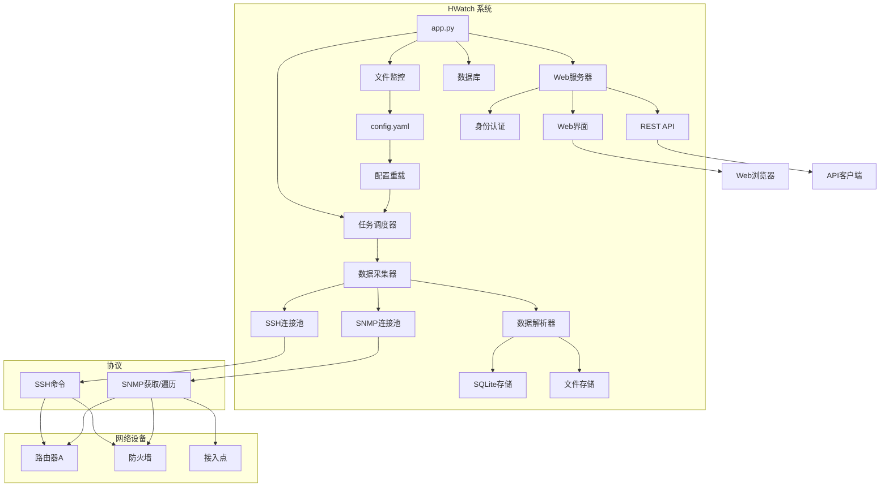
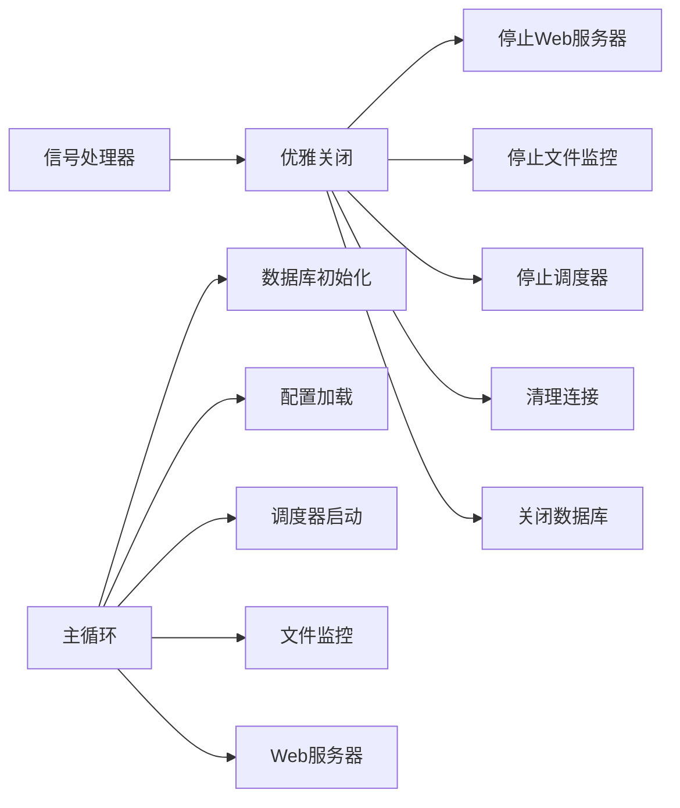
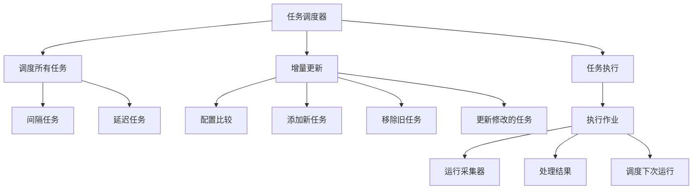
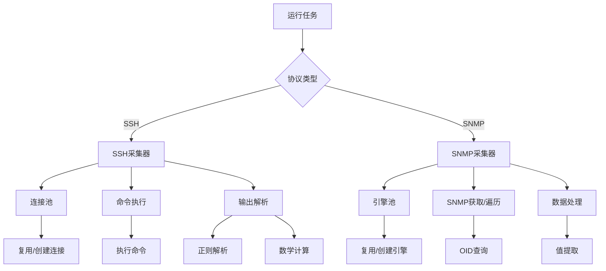
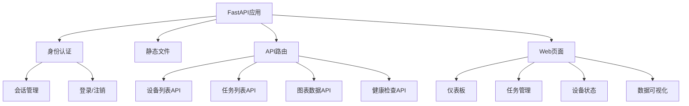
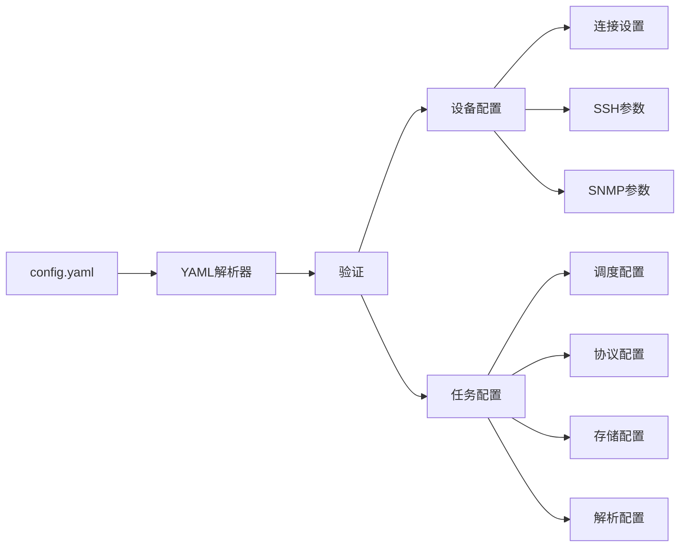
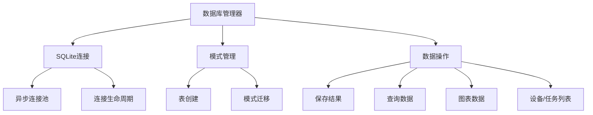

# HWatch - 网络设备监控系统

[](https://python.org)
[](https://fastapi.tiangolo.com)
[](https://sqlite.org)
[](https://docker.com)

HWatch是一个基于Python构建的轻量级、高性能网络设备监控系统。它支持通过SSH和SNMP协议进行数据采集，提供实时监控、数据存储和基于Web的可视化功能。

## 🏗️ 系统架构



## 🛠️ 技术栈

### 核心框架
- **Python 3.13+**: 主要编程语言
- **FastAPI 0.116+**: 现代、高性能的Web框架
- **Uvicorn**: FastAPI应用的ASGI服务器
- **AsyncIO**: 异步编程支持

### 数据库与存储
- **SQLite 3**: 轻量级关系数据库，用于结构化数据存储
- **Aiosqlite**: 异步SQLite驱动
- **文件系统**: 纯文本日志存储选项

### 网络协议
- **AsyncSSH 2.21+**: SSH客户端，用于命令执行
- **PySNMP 7.1+**: SNMP客户端，用于设备监控
- **连接池**: 优化的连接管理

### 任务调度
- **APScheduler 3.11+**: 高级Python调度器
- **间隔/延迟模式**: 灵活的调度策略
- **热重载**: 动态配置更新

### Web界面
- **Jinja2 3.1+**: 动态HTML模板引擎
- **ECharts 5.4+**: 交互式数据可视化库
- **ACE Editor**: YAML配置代码编辑器
- **自定义CSS**: 响应式设计和自定义样式
- **基于会话的认证**: 安全的用户管理

### 配置与日志
- **PyYAML 6.0+**: YAML配置解析器
- **Loguru 0.7+**: 高级日志系统
- **Watchdog 6.0+**: 文件系统监控

### 开发与部署
- **UV**: 快速Python包管理器
- **Docker**: 容器化支持
- **Docker Compose**: 多容器编排
- **Alpine Linux**: 轻量级容器基础镜像

## 📊 模块架构

### 1. 应用程序入口 (`app.py`)


**主要特性:**
- **优雅关闭**: 正确的信号处理和有序的组件关闭
- **配置管理**: 无需重启的热重载配置
- **组件编排**: 管理所有系统组件的生命周期
- **错误处理**: 全面的错误恢复和日志记录

### 2. 任务调度器 (`core/scheduler.py`)


**主要特性:**
- **动态调度**: 无需重启即可添加/删除/修改任务
- **多种模式**: 支持间隔和延迟调度
- **配置跟踪**: 比较任务配置以进行增量更新
- **执行限制**: 控制任务执行频率和生命周期

### 3. 数据采集器 (`core/collector.py`)


**主要特性:**
- **连接池**: 高效的SSH/SNMP连接管理
- **协议支持**: SSH命令执行和SNMP数据采集
- **数据解析**: 高级正则解析和数学运算
- **错误恢复**: 重试机制和连接健康监控

### 4. Web服务器 (`core/web_server.py`)


**主要特性:**
- **RESTful API**: 全面的API端点用于数据访问
- **交互式仪表板**: 实时监控和可视化
- **身份认证**: 基于会话的安全机制，可配置超时
- **响应式设计**: 移动友好的Web界面

### 5. 配置系统 (`core/config_loader.py`)


**主要特性:**
- **YAML配置**: 人类可读的配置格式
- **热重载**: 监控和重载配置变更
- **验证**: 全面的配置验证
- **类型安全**: 强类型配置对象

### 6. 数据库层 (`core/database.py`)


**主要特性:**
- **异步操作**: 非阻塞数据库操作
- **自动模式**: 自动表创建和管理
- **数据聚合**: 高效的图表和报告数据检索
- **连接管理**: 正确的连接生命周期处理

## 🚀 快速开始

### 前置要求
- Python 3.13或更高版本
- 支持SSH/SNMP访问的网络设备
- 基本的网络协议理解

### 安装方法

#### 方法1: 使用UV (推荐)
```bash
# 克隆仓库
git clone <repository-url>
cd hwatch

# 使用UV安装依赖
uv sync

# 复制并配置设置
cp config_init.yaml config.yaml
# 根据您的环境编辑config.yaml

# 启动应用程序
uv run python app.py
```

#### 方法2: 使用Docker
```bash
# 克隆仓库
git clone <repository-url>
cd hwatch

# 使用Docker Compose构建和运行
docker-compose up -d

# 或手动构建单平台
docker build -t hwatch .
docker run -p 8080:8080 -v $(pwd)/config.yaml:/app/config.yaml hwatch

# 或使用buildx构建多平台镜像
docker buildx build --no-cache --platform linux/amd64,linux/arm64 \
  -t registry.cn-hangzhou.aliyuncs.com/apuer/hwatch:0.1.0 \
  -t registry.cn-hangzhou.aliyuncs.com/apuer/hwatch:latest --load .
```

#### 方法3: 传统Python
```bash
# 克隆仓库
git clone <repository-url>
cd hwatch

# 创建虚拟环境
python -m venv .venv
source .venv/bin/activate  # Windows: .venv\Scripts\activate

# 安装依赖
pip install -r requirements.txt

# 配置并启动
cp config_init.yaml config.yaml
python app.py
```

### 访问应用程序
- **Web界面**: http://localhost:8080
- **默认凭据**: admin / 123456
- **API文档**: http://localhost:8080/docs

## ⚙️ 配置指南 (config.yaml)

### 设备配置 (devices)

每个设备包含基本信息和连接配置：

```yaml
devices:
- name: "Router_A"              # 设备标识符，必须唯一
  ip: "192.168.1.100"           # 设备IP地址
  connection:                   # 连接配置
    ssh:                        # SSH连接配置
      username: "admin"          # SSH用户名
      password: "admin123"       # SSH密码
      port: 22                  # SSH端口，默认22
      timeout: 10               # 连接超时时间(秒)
      retry: 3                  # 重试次数
    snmp:                       # SNMP连接配置
      community: "public"        # SNMP团体名
      port: 161                 # SNMP端口，默认161
      timeout: 10               # 超时时间(秒)
      retry: 3                  # 重试次数
```

### 任务配置 (tasks)

#### 基础配置字段
```yaml
tasks:
- alias: "任务别名"              # 任务唯一标识符
  enabled: true                 # 是否启用任务
  protocol: "ssh"               # 协议类型: ssh 或 snmp
  targets:                      # 目标设备列表
  - "Router_A"
  - "Fortinet_60"
  storage: "sqlite"             # 存储方式: sqlite, file, 或 null
```

#### 调度配置 (schedule)
```yaml
schedule:
  frequency: 0                  # 执行次数限制，0表示无限制
  mode: "interval"              # 调度模式: interval 或 delay
  seconds: 60                   # 执行间隔(秒)
```

**调度模式说明：**
- `interval`: 固定间隔执行，任务完成后立即安排下次执行
- `delay`: 延迟执行，任务完成后等待指定时间再执行下次

#### SSH任务配置

**单命令任务:**
```yaml
- alias: "get_router_version"
  enabled: true
  protocol: "ssh"
  command: 
  - "show version"              # 单个命令
  targets: ["Router_A"]
  schedule:
    frequency: 1                # 仅执行一次
  storage: "sqlite"
```

**多命令任务:**
```yaml
- alias: "system_check"
  enabled: true
  protocol: "ssh"
  command: 
  - "get system status"         # 多个命令按顺序执行
  - "get system arp"
  targets: ["Fortinet_60"]
  schedule:
    frequency: 20
    mode: "delay"               # 完成后等待
    seconds: 120
  storage: "file"
```

**带数据解析的SSH任务:**
```yaml
- alias: "parse_system_info"
  enabled: true
  protocol: "ssh"
  command: 
  - "get system status"
  parse:
    regex: "(?s)BIOS version:\\s*(\\d+).*?Branch point:\\s*(\\d+)"
    calculate:
    - "/1000000"                # 第一个捕获组除以1000000
    - "*10"                     # 第二个捕获组乘以10
  labels:
  - "BIOS_Version"             # 解析值的标签
  - "Branch_Point"
  targets: ["Fortinet_60"]
  schedule:
    frequency: 0
    mode: "delay"
    seconds: 120
  storage: "sqlite"
```

#### SNMP任务配置

**SNMP Get (单值获取):**
```yaml
- alias: "memory_usage"
  enabled: true
  protocol: "snmp"
  type: "snmpget"               # SNMP操作类型
  oid: "1.3.6.1.4.1.12356.101.4.1.4.0"
  labels: 
  - "fgSysMemUsage"             # 检索值的标签
  targets: ["Fortinet_60"]
  schedule:
    frequency: 0
    mode: "interval"            # 固定间隔执行
    seconds: 5
  storage: "sqlite"
```

**SNMP Walk (多值获取):**
```yaml
- alias: "processor_usage"
  enabled: true
  protocol: "snmp"
  type: "snmpwalk"              # 遍历OID树
  oid: "1.3.6.1.4.1.12356.101.4.4.2.1.2"
  labels:
  - "fgProcessorUsage.1"        # 每个遍历值的标签
  - "fgProcessorUsage.2"
  - "fgProcessorUsage.3"
  - "fgProcessorUsage.4"
  targets: ["Fortinet_60"]
  schedule:
    frequency: 0
    mode: "interval"
    seconds: 5
  storage: "sqlite"
```

### 高级配置

#### 数据解析 (parse)
用于SSH任务从命令输出中提取特定数据：

```yaml
parse:
  regex: "(?s)BIOS version:\\s*(\\d+).*?Branch point:\\s*(\\d+)"
  calculate:                    # 可选的数学运算
  - "/1000000"                  # 按顺序应用于捕获组的运算
  - "*10"
  - "+100"
  - "-50"
```

**支持的数学运算:**
- `"/数字"`: 除法
- `"*数字"`: 乘法  
- `"+数字"`: 加法
- `"-数字"`: 减法

#### 调度模式

**间隔模式 (`mode: "interval"`):**
- 任务以固定间隔执行
- 下次执行在当前执行开始后立即安排
- 适用于常规监控任务

**延迟模式 (`mode: "delay"`):**
- 任务在完成后延迟执行
- 下次执行在当前执行完成后安排
- 适用于需要时间完成后再运行的任务

#### 存储选项

**SQLite存储 (`storage: "sqlite"`):**
- SQLite数据库中的结构化数据存储
- 启用基于Web的图表可视化
- 可查询的数据用于分析
- 自动表创建和管理

**文件存储 (`storage: "file"`):**
- 纯文本输出保存到`outfile/`目录
- 包含完整的执行上下文和时间戳
- 适用于日志分析和调试
- 文件命名为`{task_alias}_{device_name}.log`

**无存储 (`storage: null`):**
- 执行任务但不存储结果
- 适用于配置命令或一次性操作
- 减少存储开销

#### 标签配置
定义数据值的名称：

```yaml
labels:
- "CPU_Usage"                  # 用于单个值或第一个解析组
- "Memory_Usage"               # 用于第二个解析组
- "Disk_Usage"                 # 用于第三个解析组
```

### 基于实际配置的完整示例

以下是基于项目实际配置文件的完整示例：

```yaml
devices:
- name: "Router_A"
  ip: "192.168.1.100"
  connection:
    ssh:
      username: "admin"
      password: "admin123"
      port: 22
      timeout: 10
      retry: 3
    snmp:
      community: "public"
      port: 161
      timeout: 10
      retry: 3

- name: "Fortinet_60"
  ip: "192.168.2.1"
  connection:
    ssh:
      username: "admin"
      password: "ChengduMicro@2025"
      port: 22
      timeout: 2
      retry: 0
    snmp:
      community: "awatch"
      port: 161
      timeout: 2
      retry: 0

tasks:
# SSH任务 - 系统信息采集带解析
- alias: "run_show_command"
  enabled: true
  protocol: "ssh"
  command: 
  - "get system status"
  - "get system arp"
  parse:
    regex: "(?s)BIOS version:\\s*(\\d+).*?Branch point:\\s*(\\d+)"
    calculate:
    - "/1000000"  # BIOS版本数值标准化
    - "*10"       # Branch point放大10倍
  labels:
  - "BIOS_Version"
  - "Branch_Point"
  targets: ["Fortinet_60"]
  schedule:
    frequency: 20
    mode: "delay"
    seconds: 120
  storage: "file"

# SNMP任务 - CPU使用率监控
- alias: "fgProcessorUsage_per"
  enabled: true
  protocol: "snmp"
  type: "snmpwalk"
  oid: "1.3.6.1.4.1.12356.101.4.4.2.1.2"
  labels:
  - "fgProcessorUsage.1"
  - "fgProcessorUsage.2"
  - "fgProcessorUsage.3"
  - "fgProcessorUsage.4"
  targets: ["Fortinet_60"]
  schedule:
    frequency: 0
    mode: "interval"
    seconds: 5
  storage: "sqlite"

# SNMP任务 - 内存使用率监控
- alias: "fgSysMemUsage"
  enabled: true
  protocol: "snmp"
  type: "snmpget"
  oid: "1.3.6.1.4.1.12356.101.4.1.4.0"
  labels: 
  - "fgSysMemUsage"
  targets: ["Fortinet_60"]
  schedule:
    frequency: 0
    mode: "interval"
    seconds: 5
  storage: "sqlite"

# SSH任务 - 一次性执行
- alias: "get_router_a_version"
  enabled: false
  protocol: "ssh"
  command: 
  - "show version"
  targets: ["Router_A"]
  schedule:
    frequency: 1  # 仅执行一次
  storage: "sqlite"

# SSH任务 - 操作型命令(不存储结果)
- alias: "clear_router_a_counters"
  enabled: false
  protocol: "ssh"
  command: 
  - "clear counters"
  targets: ["Router_A"]
  schedule:
    frequency: 1
  storage: null  # 不存储结果
```

## 📊 Web界面功能

### 仪表板
- 实时设备状态监控
- 交互式图表和图形
- 任务执行统计
- 系统健康指标

### 任务管理
- 查看所有配置的任务
- 监控任务执行状态
- 访问执行日志和结果
- 实时配置更新

### 数据可视化
- 数值数据的时间序列图表
- 可定制的图表颜色和样式
- 数据导出功能
- 历史数据分析

### 设备管理
- 设备连接状态
- 连接池统计
- 协议特定信息
- 性能指标

## 🔧 API文档

### 健康检查
```http
GET /api/healthz
```
返回系统健康状态。

### 设备信息
```http
GET /api/devices
```
返回配置的设备列表。

### 任务信息
```http
GET /api/tasks
```
返回配置的任务列表。

### 图表数据
```http
GET /api/chart_data/{task_alias}
```
返回特定任务的图表数据。

## 🐳 Docker部署

### 使用Docker Compose
```yaml
version: '3.8'
services:
  hwatch:
    build: .
    ports:
      - "8080:8080"
    volumes:
      - ./config.yaml:/app/config.yaml
      - ./log:/app/log
      - ./outfile:/app/outfile
    environment:
      - WEB_USERNAME=admin
      - WEB_PASSWORD=yourpassword
      - LOG_LEVEL=INFO
```

### 环境变量
- `WEB_USERNAME`: Web界面用户名 (默认: admin)
- `WEB_PASSWORD`: Web界面密码 (默认: 123456)
- `LOG_LEVEL`: 日志级别 (DEBUG, INFO, WARNING, ERROR, CRITICAL)

## 🔒 安全考虑

### 身份认证
- 基于会话的安全令牌认证
- 可配置的会话超时 (默认: 2小时)
- 防止XSS和CSRF攻击

### 网络安全
- SSH连接池自动清理
- SNMP团体字符串保护
- 连接超时和重试机制

### 数据保护
- 具有适当权限的SQLite数据库
- 日志文件轮转和清理
- 日志中的敏感信息屏蔽

## 🚀 性能优化

### 连接池
- SSH连接被池化和重用
- SNMP引擎被缓存以提高性能
- 非活动连接的自动清理

### 异步操作
- 非阻塞任务执行
- 并发设备监控
- 高效的资源利用

### 内存管理
- SQLite用于高效数据存储
- 连接池大小限制
- 自动垃圾回收

## 🔧 故障排除

### 常见问题

#### 连接问题
```bash
# 检查设备连通性
ping 192.168.1.100

# 测试SSH访问
ssh admin@192.168.1.100

# 测试SNMP访问
snmpget -v2c -c public 192.168.1.100 1.3.6.1.2.1.1.1.0
```

#### 配置错误
```bash
# 验证YAML语法
python -c "import yaml; yaml.safe_load(open('config.yaml'))"

# 检查应用程序日志
tail -f log/app.log
```

#### 性能问题
```bash
# 监控资源使用
top -p $(pgrep -f "python app.py")

# 检查数据库大小
ls -lh hwatch.db

# 监控连接池
curl http://localhost:8080/api/healthz
```

### 日志级别
- **DEBUG**: 详细调试信息
- **INFO**: 一般操作消息
- **WARNING**: 需要注意的警告消息
- **ERROR**: 错误情况
- **CRITICAL**: 关键错误情况

## 📈 监控和维护

### 定期维护
1. 监控日志文件大小，根据需要进行轮转
2. 检查数据库增长，必要时进行优化
3. 更新设备凭据和配置
4. 审查和更新任务调度
5. 监控系统资源使用

### 健康监控
- 使用内置健康检查端点
- 监控应用程序日志中的错误
- 为关键故障设置警报
- 定期备份配置和数据

## 🤝 贡献

1. Fork仓库
2. 创建功能分支
3. 进行更改
4. 如适用，添加测试
5. 提交拉取请求

### 开发设置
```bash
# 克隆并设置开发环境
git clone <repository-url>
cd hwatch
uv sync --dev

# 运行测试
uv run pytest

# 代码格式化
uv run ruff format
uv run ruff check
```

## 📝 许可证

本项目采用MIT许可证 - 请参阅LICENSE文件了解详情。

## 🆘 支持

如需支持和疑问：
- 在GitHub上创建issue
- 查看故障排除部分
- 查阅API文档
- 参考配置示例

---

*HWatch - 让网络设备监控变得简单*