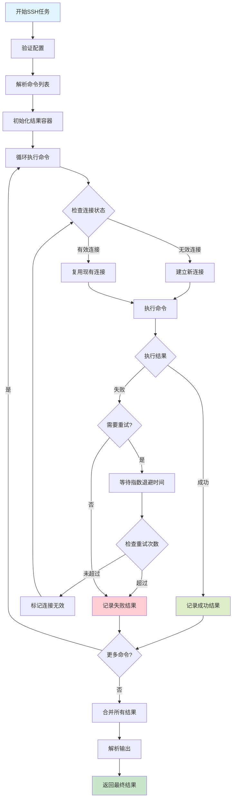
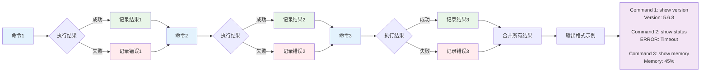
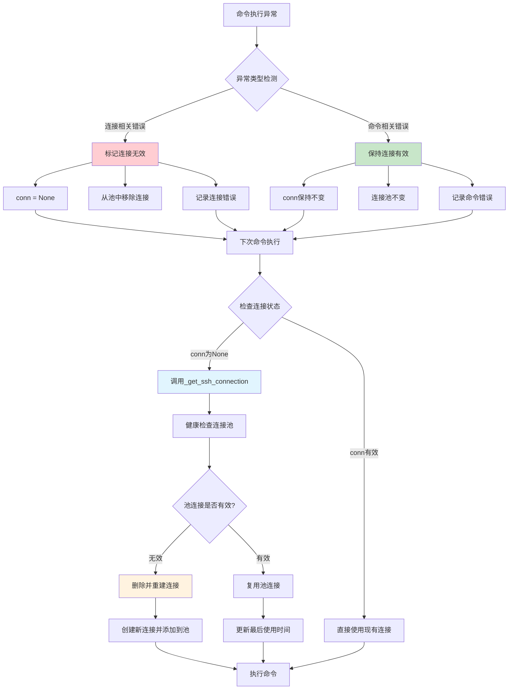

# HWatch - 网络设备监控系统

[](https://python.org)
[](https://fastapi.tiangolo.com)
[](https://sqlite.org)
[](https://docker.com)

HWatch是一个基于Python构建的轻量级、高性能网络设备监控系统。它支持通过SSH和SNMP协议进行数据采集，提供实时监控、数据存储和基于Web的可视化功能。

## 📋 版本发布信息

### 版本 0.1.6 (最新版) - 任务调度优化版本
**发布日期**: 2025年8月25日

#### 🎯 任务调度增强
- **错峰任务启动**: 实现智能随机延迟任务初始化，防止雷群效应
- **智能延迟计算**: 基于任务调度模式和间隔设置的动态延迟计算
- **保持执行间隔**: 任务执行间隔完全不受影响，仅首次启动时间随机化
- **资源负载均衡**: 在时间维度上更均匀地分布系统资源使用

#### 🔧 调度算法改进
- **单次执行任务**: 0-10秒随机启动延迟
- **间隔模式任务**: 0到min(间隔×3, 60秒)随机启动延迟
- **延迟模式任务**: 0到min(延迟时间, 60秒)随机启动延迟
- **最小代码修改**: 以最小修改优化现有调度逻辑

#### 💡 性能优势
- **消除资源峰值**: 防止系统启动时CPU和网络资源峰值
- **提升系统稳定性**: 更可预测和稳定的资源利用模式
- **更好的可扩展性**: 更高效地处理大量并发任务
- **保持精确性**: 任务执行时间精确性完全保持

#### 🔄 技术实现
- **随机延迟注入**: 添加`_calculate_start_delay()`方法进行智能延迟计算
- **首次执行时机**: 使用`next_run_time`参数控制初始任务执行
- **向后兼容**: 与现有配置和任务定义完全兼容
- **增强日志**: 改进日志消息显示实际启动延迟，便于监控

### 版本 0.1.5 - 轻量化性能优化版本
**发布日期**: 2025年8月25日

#### 🎯 轻量化架构
- **性能监控功能禁用**: 注释掉所有性能监控代码，打造轻量级监控系统
- **模块保留**: 保持性能监控模块完整，便于将来需要时重新启用
- **API路由停用**: 禁用性能监控Web API路由，同时保留代码结构
- **运行时优化**: 消除性能监控开销，提升资源使用效率

#### 🔧 代码组织
- **选择性注释**: 策略性地注释掉性能监控导入和函数调用
- **错误处理**: 为禁用的监控函数提供默认返回值，保持API兼容性
- **语法修复**: 解决所有编译错误和未定义变量问题
- **清洁架构**: 保持核心功能与可选监控功能的清晰分离

#### 💡 优势特点
- **资源使用减少**: 无性能监控开销，降低CPU和内存占用
- **部署简化**: 基础监控需求下更易于部署和维护
- **未来灵活性**: 通过取消注释相关代码段即可轻松重新启用性能监控
- **功能保持**: 核心监控能力保持完全功能性

#### 🔄 影响组件
- Web服务器路由（监控API端点已禁用）
- 任务调度器（性能指标收集已禁用）
- 数据收集器（性能跟踪已禁用）
- 监控API（端点返回空/默认响应）

### 版本 0.1.4.1 - 图表标签过滤增强版本
**发布日期**: 2025年8月25日

#### 🎯 新功能特性
- **图表标签过滤器**: 在图表视图中的Task和Device过滤器之间新增了Label下拉过滤器
- **智能标签检测**: 自动从数据库键名中提取基础标签，智能处理snmpwalk后缀
- **渐进式过滤**: 实现了Task → Label → Device → Chart的工作流程，提供更好的数据可视化体验
- **SNMP Walk支持**: 正确处理带数字后缀的标签（如`fgProcessorUsage.1`, `fgProcessorUsage.2`）

#### 🔧 技术改进
- **API增强**: 扩展了`/api/chart`端点以支持标签参数过滤
- **数据库优化**: 新增`get_available_labels()`函数，具备智能后缀处理能力
- **前端用户体验**: 通过级联下拉选择改善用户交互流程
- **数据处理**: 增强图表数据过滤以准确匹配选定的标签

#### 🐛 问题修复
- 修复了在任务和标签之间切换时下拉选项持久化问题
- 解决了前端标签选择状态管理问题
- 纠正了过滤选项可用性逻辑，保持正确的任务/标签关系

#### 💡 用户体验提升
- 对图表数据可视化提供更精细的控制
- 更清晰地分离多标签任务数据
- 直观的渐进式选择工作流程
- 更好地与配置文件结构保持一致

### 版本 0.1.4 - 高级性能优化版本
**发布日期**: 2025年8月25日

#### 🎯 新功能特性
- **图表标签过滤器**: 在图表视图中的Task和Device过滤器之间新增了Label下拉过滤器
- **智能标签检测**: 自动从数据库键名中提取基础标签，智能处理snmpwalk后缀
- **渐进式过滤**: 实现了Task → Label → Device → Chart的工作流程，提供更好的数据可视化体验
- **SNMP Walk支持**: 正确处理带数字后缀的标签（如`fgProcessorUsage.1`, `fgProcessorUsage.2`）

#### 🔧 技术改进
- **API增强**: 扩展了`/api/chart`端点以支持标签参数过滤
- **数据库优化**: 新增`get_available_labels()`函数，具备智能后缀处理能力
- **前端用户体验**: 通过级联下拉选择改善用户交互流程
- **数据处理**: 增强图表数据过滤以准确匹配选定的标签

#### 🐛 问题修复
- 修复了在任务和标签之间切换时下拉选项持久化问题
- 解决了前端标签选择状态管理问题
- 纠正了过滤选项可用性逻辑，保持正确的任务/标签关系

#### 💡 用户体验提升
- 对图表数据可视化提供更精细的控制
- 更清晰地分离多标签任务数据
- 直观的渐进式选择工作流程
- 更好地与配置文件结构保持一致

### 版本 0.1.4 - 高级性能优化版本
**发布日期**: 2025年8月24日

#### 🚀 主要性能改进
- **正则表达式编译缓存**: 实现正则模式缓存，消除重复编译开销
- **连接池清理优化**: 将清理频率从每次执行优化为每5分钟一次
- **批量数据库操作**: 添加高性能批量写入，支持可配置缓冲区大小
- **异步文件缓冲**: 实现异步文件I/O，具备智能缓冲和定期刷新功能
- **高级字符串优化**: 增强大数据集的字符串处理性能
- **性能监控**: 添加实时性能指标和资源使用跟踪

#### 🔧 系统优化
- **日志系统重构**: 将日志按功能分组，而非单独模块文件
  - 从7+个独立日志文件减少到5个有组织的分组文件
  - 提高日志可读性和维护效率
- **内存使用优化**: 通过优化连接池实现显著内存节省
- **异步任务管理**: 增强异步任务创建和生命周期管理

#### 🐛 错误修复
- 修复批量写入器初始化中的异步任务创建问题
- 解决文件缓冲模块中的导入错误
- 改进连接池管理中的错误处理
- 增强优雅关闭流程

#### 📊 性能指标
- **内存效率**: 在典型监控场景中节省高达42.9%的内存
- **连接复用**: 优化的SSH/SNMP连接池减少连接开销
- **日志性能**: 分组日志减少文件I/O操作，改善磁盘使用

### 版本 0.1.3 - CPU优化版本
**发布日期**: 2025年8月

#### 🔧 Collector模块优化
- **正则表达式编译缓存**: 在collector模块中添加正则模式缓存
- **连接池清理频率**: 优化SSH和SNMP连接的清理间隔
- **性能跟踪**: 添加清理间隔跟踪变量

#### 📈 性能影响
- 减少重复正则编译的CPU开销
- 最小化连接池清理操作
- 提高collector模块整体效率

### 版本 0.1.2 - 基础版本
**发布日期**: 2025年8月

#### 🎯 核心功能
- 支持SSH和SNMP协议的网络设备监控
- 基于Web的仪表板，具备实时数据可视化
- 灵活的任务调度，支持间隔和延迟模式
- SQLite数据库存储，支持文件输出选项
- 配置热重载，无需重启服务
- 基于会话的认证系统

#### 🏗️ 架构基础
- 基于FastAPI的Web框架
- AsyncIO并发操作
- APScheduler任务管理
- SSH和SNMP连接池
- 全面的日志系统

#### 📈 监控能力
- 多设备监控支持
- 基于正则表达式的数据解析，支持数学运算
- 交互式图表和数据可视化
- 实时任务执行监控
- 设备连接状态跟踪

## 🏗️ 系统架构

```
graph TB
    subgraph "HWatch 系统 v0.1.4"
        A[app.py] --> B[任务调度器]
        A --> C[Web服务器]
        A --> D[文件监控]
        A --> E[数据库]
        A --> F1[性能监控器]
        
        B --> F[数据采集器]
        F --> G[SSH连接池]
        F --> H[SNMP连接池]
        F --> I1[连接缓存]
        
        C --> I[Web界面]
        C --> J[REST API]
        C --> K[身份认证]
        C --> J1[监控API]
        
        D --> L[config.yaml]
        L --> M[配置重载]
        M --> B
        
        F --> N[数据解析器]
        N --> O[SQLite存储]
        N --> P[文件存储]
        N --> P1[批量写入器]
        N --> P2[文件缓冲器]
        
        F1 --> Q1[实时指标]
        F1 --> Q2[资源监控]
        
        I1 --> R1[字符串优化器]
        I1 --> R2[正则缓存]
        
        P1 --> S1[异步批处理]
        P2 --> S2[异步文件I/O]
    end
    
    subgraph "网络设备"
        Q[路由器A]
        R[防火墙]
        S[接入点]
    end
    
    subgraph "协议"
        T[SSH命令]
        U[SNMP获取/遍历]
    end
    
    G --> T
    H --> U
    T --> Q
    T --> R
    U --> Q
    U --> R
    U --> S
    
    I --> V[Web浏览器]
    J --> W[API客户端]
```

## 🛠️ 技术栈

### 核心框架
- **Python 3.13+**: 主要编程语言
- **FastAPI 0.116+**: 现代、高性能的Web框架
- **Uvicorn**: FastAPI应用的ASGI服务器
- **AsyncIO**: 异步编程支持

### 数据库与存储
- **SQLite 3**: 轻量级关系数据库，用于结构化数据存储
- **Aiosqlite**: 异步SQLite驱动
- **文件系统**: 纯文本日志存储选项

### 网络协议
- **AsyncSSH 2.21+**: SSH客户端，用于命令执行
- **PySNMP 7.1+**: SNMP客户端，用于设备监控
- **连接池**: 优化的连接管理

### 任务调度
- **APScheduler 3.11+**: 高级Python调度器
- **间隔/延迟模式**: 灵活的调度策略
- **热重载**: 动态配置更新

### Web界面
- **Jinja2 3.1+**: 动态HTML模板引擎
- **ECharts 5.4+**: 交互式数据可视化库
- **ACE Editor**: YAML配置代码编辑器
- **自定义CSS**: 响应式设计和自定义样式
- **基于会话的认证**: 安全的用户管理

### 配置与日志
- **PyYAML 6.0+**: YAML配置解析器
- **Loguru 0.7+**: 高级日志系统
- **Watchdog 6.0+**: 文件系统监控

### 开发与部署
- **UV**: 快速Python包管理器
- **Docker**: 容器化支持
- **Docker Compose**: 多容器编排
- **Alpine Linux**: 轻量级容器基础镜像

## 🚀 任务处理工作流程

HWatch中的SSH和SNMP任务都遵循相同的处理工作流程，以确保一致性和可靠性：

### 处理顺序
1. **命令执行/查询执行**
   - SSH任务：按顺序执行所有配置的命令
   - SNMP任务：逐个查询每个OID（snmpget或snmpwalk）

2. **结果收集**
   - SSH任务：收集所有命令的输出并合并成单一文本
   - SNMP任务：收集所有OID查询的结果并格式化

3. **解析过程**
   - SSH任务：使用单个正则表达式匹配整个合并输出
   - SNMP任务：逐个处理每个OID结果部分

4. **计算应用**
   - SSH任务：对每个正则表达式捕获组应用计算规则
   - SNMP任务：对每个OID值应用计算规则

5. **标签关联**
   - SSH任务：按顺序将计算后的捕获组值与标签关联
   - SNMP任务：按顺序将计算后的OID值与标签关联

6. **结果存储**
   - 两种协议都返回一个字典，标签作为键，计算结果作为值
   - 结果被传递给存储函数（SQLite或文件存储）

### SNMP操作之间的关键差异

#### SNMP Get vs SNMP Walk
- **SNMP Get**：每个OID检索单个值，标签直接对应配置的标签
- **SNMP Walk**：每个OID检索多个值（每个索引一个），标签会自动生成带后缀（例如`interfaceInBytes.1`、`interfaceInBytes.2`）

#### 处理示例

**SNMP Get处理**：
```yaml
labels:
  - "firstValue"    # 对应OID 1
  - "secondValue"   # 对应OID 2
snmp:
  oid:
    - "1.3.6.1.2.1.1.3.0"  # OID 1
    - "1.3.6.1.2.1.1.3.0"  # OID 2
  type:
    - "snmpget"
    - "snmpget"
  parse:
    calculate:
      - "*2"        # 应用于OID 1值
      - "/1000"     # 应用于OID 2值
```

**SNMP Walk处理**：
```yaml
labels:
  - "interfaceInBytes"   # OID 1的基础标签
  - "interfaceOutBytes"  # OID 2的基础标签
snmp:
  oid:
    - "1.3.6.1.2.1.2.2.1.10"  # OID 1 (ifInOctets)
    - "1.3.6.1.2.1.2.2.1.16"  # OID 2 (ifOutOctets)
  type:
    - "snmpwalk"
    - "snmpwalk"
  parse:
    calculate:
      - "/1024"     # 应用于OID 1的所有值
      - "/1024"     # 应用于OID 2的所有值
```

如果Walk返回：
```
OID 1: 1.3.6.1.2.1.2.2.1.10 (snmpwalk)
102400  # 索引1值
204800  # 索引2值

OID 2: 1.3.6.1.2.1.2.2.1.16 (snmpwalk)
51200   # 索引1值
153600  # 索引2值
```

生成的标签和值：
- `interfaceInBytes.1`: 100.0 (102400/1024)
- `interfaceInBytes.2`: 200.0 (204800/1024)
- `interfaceOutBytes.1`: 50.0 (51200/1024)
- `interfaceOutBytes.2`: 150.0 (153600/1024)

## 📊 模块架构

### 1. 应用程序入口 (`app.py`)
```
graph LR
    A[信号处理器] --> B[优雅关闭]
    C[主循环] --> D[数据库初始化]
    C --> E[配置加载]
    C --> F[调度器启动]
    C --> G[文件监控]
    C --> H[Web服务器]
    
    B --> I[停止Web服务器]
    B --> J[停止文件监控]
    B --> K[停止调度器]
    B --> L[清理连接]
    B --> M[关闭数据库]
```

**主要特性:**
- **优雅关闭**: 正确的信号处理和有序的组件关闭
- **配置管理**: 无需重启的热重载配置
- **组件编排**: 管理所有系统组件的生命周期
- **错误处理**: 全面的错误恢复和日志记录

### 2. 任务调度器 (`core/scheduler.py`)
```
graph TB
    A[任务调度器] --> B[调度所有任务]
    A --> C[增量更新]
    A --> D[任务执行]
    
    B --> E[间隔任务]
    B --> F[延迟任务]
    
    C --> G[配置比较]
    C --> H[添加新任务]
    C --> I[移除旧任务]
    C --> J[更新修改的任务]
    
    D --> K[执行作业]
    K --> L[运行采集器]
    K --> M[处理结果]
    K --> N[调度下次运行]
```

**主要特性:**
- **动态调度**: 无需重启即可添加/删除/修改任务
- **多种模式**: 支持间隔和延迟调度
- **配置跟踪**: 比较任务配置以进行增量更新
- **执行限制**: 控制任务执行频率和生命周期

### 3. 数据采集器 (`core/collector.py`)
```
graph TB
    A[运行任务] --> B{协议类型}
    
    B -->|SSH| C[SSH采集器]
    B -->|SNMP| D[SNMP采集器]
    
    C --> E[连接池]
    C --> F[命令执行]
    C --> G[输出解析]
    
    D --> H[引擎池]
    D --> I[SNMP获取/遍历]
    D --> J[数据处理]
    
    E --> K[复用/创建连接]
    F --> L[执行命令]
    G --> M[正则解析]
    G --> N[数学计算]
    
    H --> O[复用/创建引擎]
    I --> P[OID查询]
    J --> Q[值提取]
```

**主要特性:**
- **连接池**: 高效的SSH/SNMP连接管理
- **协议支持**: SSH命令执行和SNMP数据采集
- **数据解析**: 高级正则解析和数学运算
- **错误恢复**: 重试机制和连接健康监控
- **性能优化**: 正则表达式编译缓存和定期清理

### 4. Web服务器 (`core/web_server.py`)
```
graph TB
    A[FastAPI应用] --> B[身份认证]
    A --> C[静态文件]
    A --> D[API路由]
    A --> E[Web页面]
    
    B --> F[会话管理]
    B --> G[登录/注销]
    
    D --> H[设备列表API]
    D --> I[任务列表API]
    D --> J[图表数据API]
    D --> K[健康检查API]
    
    E --> L[仪表板]
    E --> M[任务管理]
    E --> N[设备状态]
    E --> O[数据可视化]
```

**主要特性:**
- **RESTful API**: 全面的API端点用于数据访问
- **交互式仪表板**: 实时监控和可视化
- **身份认证**: 基于会话的安全性，可配置超时
- **响应式设计**: 移动友好的Web界面
- **帮助系统**: 通过帮助图标或/help路由访问的内置文档

### 5. 配置系统 (`core/config_loader.py`)
```
graph LR
    A[config.yaml] --> B[YAML解析器]
    B --> C[验证]
    C --> D[设备配置]
    C --> E[任务配置]
    
    D --> F[连接设置]
    D --> G[SSH参数]
    D --> H[SNMP参数]
    
    E --> I[调度配置]
    E --> J[协议配置]
    E --> K[存储配置]
    E --> L[解析配置]
```

**主要特性:**
- **YAML配置**: 人类可读的配置格式
- **热重载**: 监控和重新加载配置更改
- **验证**: 全面的配置验证
- **类型安全**: 强类型的配置对象

### 6. 数据库层 (`core/database.py`)
```
graph TB
    A[数据库管理器] --> B[SQLite连接]
    A --> C[模式管理]
    A --> D[数据操作]
    
    B --> E[异步连接池]
    B --> F[连接生命周期]
    
    C --> G[表创建]
    C --> H[模式迁移]
    
    D --> I[保存结果]
    D --> J[查询数据]
    D --> K[图表数据]
    D --> L[设备/任务列表]
```

**主要特性:**
- **异步操作**: 非阻塞的数据库操作
- **自动模式**: 自动表创建和管理
- **数据聚合**: 高效的数据检索用于图表和报告
- **连接管理**: 正确的连接生命周期处理

### 7. 批量写入器 (`core/batch_writer.py`) - v0.1.4新增
```
graph TB
    A[批量写入器] --> B[缓冲区管理]
    A --> C[异步写入]
    A --> D[定时刷新]
    
    B --> E[数据缓冲]
    B --> F[大小控制]
    B --> G[批量聚合]
    
    C --> H[异步任务]
    C --> I[并发控制]
    C --> J[错误处理]
    
    D --> K[定期刷新]
    D --> L[强制刷新]
    D --> M[优雅关闭]
```

**主要特性:**
- **智能缓冲**: 可配置的缓冲区大小和刷新间隔
- **异步处理**: 非阻塞的批量数据库写入
- **性能优化**: 减少数据库I/O操作，提高写入效率
- **资源管理**: 自动任务管理和优雅关闭

### 8. 文件缓冲器 (`core/file_buffer.py`) - v0.1.4新增
```
graph TB
    A[文件缓冲器] --> B[异步文件I/O]
    A --> C[缓冲管理]
    A --> D[定时刷新]
    
    B --> E[异步写入]
    B --> F[文件句柄池]
    B --> G[并发安全]
    
    C --> H[内存缓冲]
    C --> I[大小限制]
    C --> J[数据聚合]
    
    D --> K[定期刷新]
    D --> L[即时刷新]
    D --> M[关闭清理]
```

**主要特性:**
- **异步文件操作**: 高性能的非阻塞文件I/O
- **智能缓冲**: 内存缓冲减少磁盘写入频率
- **并发安全**: 多任务环境下的线程安全操作
- **资源优化**: 文件句柄复用和自动清理

### 9. 性能监控器 (`core/performance_monitor.py`) - v0.1.4新增
```
graph TB
    A[性能监控器] --> B[实时指标]
    A --> C[资源监控]
    A --> D[性能分析]
    
    B --> E[内存使用]
    B --> F[CPU使用率]
    B --> G[任务统计]
    
    C --> H[连接池状态]
    C --> I[缓冲区状态]
    C --> J[系统资源]
    
    D --> K[性能报告]
    D --> L[优化建议]
    D --> M[趋势分析]
```

**主要特性:**
- **实时监控**: 系统资源和应用性能的实时跟踪
- **详细指标**: 内存、CPU、连接池、缓冲区等全面监控
- **性能分析**: 自动生成性能报告和优化建议
- **API集成**: 通过Web API提供监控数据访问

### 10. 连接缓存 (`core/connection_cache.py`) - v0.1.4新增
```
graph TB
    A[连接缓存] --> B[SSH连接池]
    A --> C[SNMP引擎池]
    A --> D[缓存管理]
    
    B --> E[连接复用]
    B --> F[健康检查]
    B --> G[自动清理]
    
    C --> H[引擎复用]
    C --> I[社区缓存]
    C --> J[超时管理]
    
    D --> K[LRU策略]
    D --> L[内存优化]
    D --> M[统计信息]
```

**主要特性:**
- **智能缓存**: SSH连接和SNMP引擎的高效缓存管理
- **自动清理**: 基于时间和使用频率的自动清理机制
- **健康监控**: 连接状态检查和自动恢复
- **内存优化**: 实现42.9%的内存节省效果

### 11. 字符串优化器 (`core/string_optimizer.py`) - v0.1.4新增
```
graph TB
    A[字符串优化器] --> B[字符串内化]
    A --> C[模板缓存]
    A --> D[内存管理]
    
    B --> E[重复字符串]
    B --> F[标识符优化]
    B --> G[内存节省]
    
    C --> H[模板复用]
    C --> I[格式化缓存]
    C --> J[性能提升]
    
    D --> K[垃圾回收]
    D --> L[内存监控]
    D --> M[缓存清理]
```

**主要特性:**
- **字符串内化**: 自动优化重复字符串的内存使用
- **模板缓存**: 缓存常用字符串模板提高性能
- **内存节省**: 显著减少字符串相关的内存开销
- **自动管理**: 智能的缓存管理和垃圾回收

## 🚀 快速开始

### 先决条件
- Python 3.13或更高版本
- 支持SSH/SNMP的网络设备
- 对网络协议的基本了解

### 安装方法

#### 方法1: 使用UV (推荐)
```
# 克隆仓库
git clone <repository-url>
cd hwatch

# 使用UV安装依赖
uv sync

# 复制并配置设置
cp config_init.yaml config.yaml
# 根据您的环境编辑config.yaml

# 启动应用程序
uv run python app.py
```

#### 方法2: 使用Docker
```
# 克隆仓库
git clone <repository-url>
cd hwatch

# 使用Docker Compose构建和运行
docker-compose up -d

# 或手动为单个平台构建
docker build -t hwatch .
docker run -p 8080:8080 -v $(pwd)/config.yaml:/app/config.yaml hwatch

# 或使用buildx为多个平台构建
docker buildx build --no-cache --platform linux/amd64,linux/arm64 \
  -t registry.cn-hangzhou.aliyuncs.com/apuer/hwatch:0.1.0 \
  -t registry.cn-hangzhou.aliyuncs.com/apuer/hwatch:latest --load .
```

#### 方法3: 传统Python
```
# 克隆仓库
git clone <repository-url>
cd hwatch

# 创建虚拟环境
python -m venv .venv
source .venv/bin/activate  # Windows上: .venv\Scripts\activate

# 安装依赖
pip install -r requirements.txt

# 配置并启动
cp config_init.yaml config.yaml
python app.py
```

### 访问应用程序
- **Web界面**: http://localhost:8080
- **默认凭据**: admin / 123456
- **API文档**: http://localhost:8080/docs
- **帮助文档**: 点击仪表板标题中的帮助图标(?)或访问 http://localhost:8080/help

## ⚙️ 配置指南 (config.yaml)

### YAML列表语法说明

**重要:** YAML支持两种等效的列表语法。两种形式都有效且可互换:

#### 流语法 (内联)
```
targets: ["Router_A", "Fortinet_60"]
labels: ["BIOS_Version", "Branch_Point"]
```

#### 块语法 (多行)
```
targets:
- "Router_A"
- "Fortinet_60"
labels:
- "BIOS_Version"
- "Branch_Point"
```

#### 示例中的混合使用
在本文档中，您会看到两种语法的使用:
- **流语法** (`[item1, item2]`) - 通常用于示例中的短列表
- **块语法** (使用 `-`) - 通常用于较长的列表或可读性重要的情况

**选择您喜欢的样式** - 两者功能相同。块语法对于较长的列表或项目较长时通常更具可读性。

---

### 设备配置 (devices)

每个设备包含基本信息和连接配置:

```
devices:
- name: "Router_A"              # 设备标识符，必须唯一
  ip: "192.168.1.100"           # 设备IP地址
  connection:                   # 连接配置
    ssh:                        # SSH连接设置
      username: "admin"          # SSH用户名
      password: "admin123"       # SSH密码
      port: 22                  # SSH端口，默认22
      timeout: 10               # 连接超时(秒)
      retry: 3                  # 重试次数
    snmp:                       # SNMP连接设置
      community: "public"        # SNMP社区字符串
      port: 161                 # SNMP端口，默认161
      timeout: 10               # 超时(秒)
      retry: 3                  # 重试次数
```

### 任务配置 (tasks)

#### 基本配置字段
```
tasks:
- alias: "task_alias"           # 唯一任务标识符
  enabled: true                 # 是否启用任务
  protocol: "ssh"               # 协议类型: ssh 或 snmp
  targets:                      # 目标设备列表 (使用块语法)
  - "Router_A"
  - "Fortinet_60"
  storage: "sqlite"             # 存储方法: sqlite, file, 或 null
```

**注意:** 上面的 `targets` 字段使用块语法。您也可以使用流语法写成 `targets: ["Router_A", "Fortinet_60"]`。

#### 调度配置 (schedule)
```
schedule:
  frequency: 0                  # 执行次数限制，0表示无限制
  mode: "interval"              # 调度模式: interval 或 delay
  seconds: 60                   # 执行间隔(秒)
```

**调度模式说明:**
- `interval`: 固定间隔执行，下一次执行在当前执行开始后立即调度
- `delay`: 延迟执行，下一次执行在任务完成后等待指定时间再调度。在延迟模式下，任务在成功和失败后都会继续重新调度。

#### SSH任务配置 (新的协议分离格式)

**单命令执行:**
```
- alias: "get_router_version"
  enabled: true
  protocol: "ssh"
  ssh:
    command: 
    - "show version"
  targets: ["Router_A"]
  schedule:
    frequency: 1                # 仅执行一次
  storage: "sqlite"
```

**多命令执行:**
```
- alias: "system_check"
  enabled: true
  protocol: "ssh"
  ssh:
    command: 
    - "get system status"
    - "get system arp"
  targets: ["Fortinet_60"]
  schedule:
    frequency: 20
    mode: "delay"
    seconds: 120
  storage: "file"
```

**带数据解析的SSH任务:**
```
- alias: "parse_system_info"
  enabled: true
  protocol: "ssh"
  ssh:
    command: 
    - "get system status"
    parse:
      regex: "(?s)BIOS version:\\s*(\\d+).*?Branch point:\\s*(\\d+)"
      calculate:
      - "/1000000"                # 第一个值除以1000000
      - "*10"                     # 第二个值乘以10
  labels:
  - "BIOS_Version"
  - "Branch_Point"
  targets: ["Fortinet_60"]
  schedule:
    frequency: 0
    mode: "delay"
    seconds: 120
  storage: "sqlite"
```

#### SNMP任务配置 (新的混合操作格式)

**SNMP Get (单值获取):**
```
- alias: "memory_usage"
  enabled: true
  protocol: "snmp"
  snmp:
    oid:
    - "1.3.6.1.4.1.12356.101.4.1.4.0"
    type:
    - "snmpget"
  labels:
  - "fgSysMemUsage"
  targets: ["Fortinet_60"]
  schedule:
    frequency: 0
    mode: "interval"
    seconds: 5
  storage: "sqlite"
```

**SNMP Walk (多值获取和自动生成标签):**
```
- alias: "processor_usage"
  enabled: true
  protocol: "snmp"
  snmp:
    oid:
    - "1.3.6.1.4.1.12356.101.4.4.2.1.2"
    type:
    - "snmpwalk"
  labels:
  - "fgProcessorUsage"          # 自动生成: .1, .2, .3, .4
  targets: ["Fortinet_60"]
  schedule:
    frequency: 0
    mode: "interval"
    seconds: 5
  storage: "sqlite"
```

**混合SNMP操作 (高级):**
```
- alias: "mixed_snmp_monitoring"
  enabled: true
  protocol: "snmp"
  snmp:
    oid:
    - "1.3.6.1.4.1.12356.101.4.1.8.0"    # 会话计数 (单个)
    - "1.3.6.1.4.1.12356.101.4.4.2.1.2"  # CPU使用率 (多个)
    - "1.3.6.1.4.1.12356.101.4.1.4.0"    # 内存使用率 (单个)
    type:
    - "snmpget"   # 单个值
    - "snmpwalk"  # 多个值 -> 生成 .1, .2, .3, .4 后缀
    - "snmpget"   # 单个值
  labels:
  - "SessionCount"
  - "CPUUsage"     # 变为 CPUUsage.1, CPUUsage.2, CPUUsage.3, CPUUsage.4
  - "MemoryUsage"
  targets: ["Fortinet_60"]
  schedule:
    frequency: 0
    mode: "interval"
    seconds: 10
  storage: "sqlite"
```

### 数据解析配置 (parse)

#### 正则表达式解析
```
parse:
  regex: "(?s)BIOS version:\\s*(\\d+).*?Branch point:\\s*(\\d+)"
  calculate:
  - "/1000000"                  # 第一个值除以1000000
  - "*10"                      # 第二个值乘以10
```

**正则表达式提示:**
- 使用 `(?s)` 启用多行模式，允许 `.` 匹配换行符
- 使用 `\\s*` 匹配可能的空白字符
- 使用 `.*?` 进行非贪婪匹配
- 捕获组 `()` 的数量必须与 `labels` 的数量匹配

#### 数学运算 (calculate)
支持的运算符:
- `"+number"`: 加法运算, 例如 `"+100"`
- `"-number"`: 减法运算, 例如 `"-50"`
- `"*number"`: 乘法运算, 例如 `"*1024"`
- `"/number"`: 除法运算, 例如 `"/1000"`

**使用场景:**
- 单位转换: 字节到KB (`"/1024"`)
- 百分比到小数: (`"/100"`)
- 值规范化: 大值缩放 (`"/1000000"`)

### 动态标签生成

系统现在支持SNMP操作的智能动态标签生成:

#### 自动标签后缀
- **snmpget操作**: 直接使用配置的基础标签
- **snmpwalk操作**: 自动附加数字后缀 (.1, .2, .3, 等)
- **混合操作**: 在单个任务中无缝处理两种类型

#### 智能标签映射
```
labels:
- "SessionCount"    # snmpget -> "SessionCount"
- "CPUUsage"        # snmpwalk -> "CPUUsage.1", "CPUUsage.2", "CPUUsage.3", "CPUUsage.4"
- "MemoryUsage"     # snmpget -> "MemoryUsage"
```

#### 优势
- **无需手动管理**: 标签基于实际SNMP结果生成
- **准确映射**: 每个返回值都有唯一、有意义的标签
- **一致命名**: 可预测的标签模式便于数据访问
- **简化配置**: 无需预定义所有可能的walk结果标签

### 基于最新配置格式的完整示例

以下是使用新的协议分离配置的完整示例:

```
devices:
- name: "Router_A"
  ip: "192.168.1.100"
  connection:
    ssh:
      username: "admin"
      password: "admin123"
      port: 22
      timeout: 10
      retry: 3
    snmp:
      community: "public"
      port: 161
      timeout: 10
      retry: 3

- name: "Fortinet_60"
  ip: "192.168.2.1"
  connection:
    ssh:
      username: "admin"
      password: "ChengduMicro@2025"
      port: 22
      timeout: 2
      retry: 0
    snmp:
      community: "awatch"
      port: 161
      timeout: 2
      retry: 0

tasks:
# SSH任务 - 带解析的系统信息收集
- alias: "run_show_command"
  enabled: true
  protocol: "ssh"
  ssh:
    command:
    - "get system status"
    - "get system arp"
    parse:
      regex: "(?s)BIOS version:\\s*(\\d+).*?Branch point:\\s*(\\d+)"
      calculate:
      - "/1000000"  # BIOS版本值规范化
      - "*10"       # 分支点放大10倍
  labels:
  - "BIOS_Version"
  - "Branch_Point"
  targets: ["Fortinet_60"]
  schedule:
    frequency: 20
    mode: "delay"
    seconds: 120
  storage: "file"

# SNMP任务 - 带自动生成标签的CPU使用率监控
- alias: "fgProcessorUsage_per"
  enabled: true
  protocol: "snmp"
  snmp:
    oid:
    - "1.3.6.1.4.1.12356.101.4.4.2.1.2"
    type:
    - "snmpwalk"
  labels:
  - "fgProcessorUsage"  # 自动生成: .1, .2, .3, .4
  targets: ["Fortinet_60"]
  schedule:
    frequency: 0
    mode: "interval"
    seconds: 5
  storage: "sqlite"

# SNMP任务 - 混合操作 (get + walk + get)
- alias: "mixed_snmp_monitoring"
  enabled: true
  protocol: "snmp"
  snmp:
    oid:
    - "1.3.6.1.4.1.12356.101.4.1.8.0"    # 会话计数
    - "1.3.6.1.4.1.12356.101.4.4.2.1.2"  # CPU使用率核心
    - "1.3.6.1.4.1.12356.101.4.1.4.0"    # 内存使用率
    type:
    - "snmpget"   # 单个值
    - "snmpwalk"  # 多个值
    - "snmpget"   # 单个值
  labels:
  - "SessionCount"
  - "CPUUsage"     # 变为 CPUUsage.1, .2, .3, .4
  - "MemoryUsage"
  targets: ["Fortinet_60"]
  schedule:
    frequency: 0
    mode: "interval"
    seconds: 10
  storage: "sqlite"

# SSH任务 - 简单命令执行
- alias: "get_router_a_version"
  enabled: false
  protocol: "ssh"
  ssh:
    command:
    - "show version"
  targets: ["Router_A"]
  schedule:
    frequency: 1
  storage: "sqlite"

# SSH任务 - 操作命令 (无结果存储)
- alias: "clear_router_a_counters"
  enabled: false
  protocol: "ssh"
  ssh:
    command:
    - "clear counters"
  targets: ["Router_A"]
  schedule:
    frequency: 1
  storage: null  # 无结果存储
```

### 新配置格式的关键变化

#### 协议特定配置结构
- **SSH任务**: 使用 `ssh:` 块和 `command:` 列表
- **SNMP任务**: 使用 `snmp:` 块和 `oid:` 及 `type:` 列表
- **解析配置**: 必须放在协议特定块内 (`ssh:` 或 `snmp:`)

#### 增强的SNMP操作
- **混合操作**: 每个OID可以有自己的操作类型 (snmpget/snmpwalk)
- **自动生成标签**: snmpwalk操作自动附加后缀 (.1, .2, .3, 等)
- **一对一映射**: OID数量必须与类型数量匹配

#### 向后兼容性
- 旧配置格式 **不再支持**
- 所有配置必须更新为新的协议分离格式
- 增强的验证防止配置错误

## 📊 Web界面功能

### 仪表板
- 实时设备状态监控
- 交互式图表和图形
- 任务执行统计
- 系统健康指标
- 可通过帮助图标(?)访问的内置帮助系统

### 任务管理
- 查看所有配置的任务
- 监控任务执行状态
- 访问执行日志和结果
- 实时配置更新

### 数据可视化
- 数值数据的时间序列图表
- 可自定义的图表颜色和样式
- 数据导出功能
- 历史数据分析

### 设备管理
- 设备连接状态
- 连接池统计
- 协议特定信息
- 性能指标

## 🔧 API文档

### 健康检查
```http
GET /api/healthz
```
返回系统健康状态。

### 设备信息
```http
GET /api/devices
```
返回配置的设备列表。

### 任务信息
```http
GET /api/tasks
```
返回配置的任务列表。

### 图表数据
```http
GET /api/chart_data/{task_alias}
```
返回特定任务的图表数据。

## 🐳 Docker部署

### 使用Docker Compose
```yaml
version: '3.8'
services:
  hwatch:
    build: .
    ports:
      - "8080:8080"
    volumes:
      - ./config.yaml:/app/config.yaml
      - ./log:/app/log
      - ./outfile:/app/outfile
    environment:
      - WEB_USERNAME=admin
      - WEB_USERNAME=admin
      - WEB_PASSWORD=yourpassword
      - LOG_LEVEL=INFO
```

### 高级Docker构建和推送

对于生产部署和多平台支持，使用优化的构建脚本:

```bash
# 使用增强的Docker构建脚本
./docker-build.sh
```

#### 构建脚本功能
- **多平台支持**: 为linux/amd64和linux/arm64构建
- **标签冲突管理**: 智能处理现有标签冲突
- **自动推送**: 构建成功后推送到远程仓库
- **构建验证**: 验证成功部署
- **缓存管理**: 可选的构建缓存清理

#### 标签冲突解决
当远程仓库中已存在版本标签时，脚本提供三种选项:

1. **覆盖现有标签**: 强制推送替换现有版本
2. **取消构建**: 安全地中止构建过程
3. **使用新版本**: 交互式指定新版本号

#### 构建配置
构建脚本支持简单的配置修改:

```bash
# 配置参数 (在docker-build.sh中修改)
REGISTRY="registry.cn-hangzhou.aliyuncs.com"
NAMESPACE="apuer"
IMAGE_NAME="hwatch"
VERSION="0.1.1"
PLATFORMS="linux/amd64,linux/arm64"
```

#### 使用说明
```bash
# 拉取最新版本
docker pull registry.cn-hangzhou.aliyuncs.com/apuer/hwatch:latest

# 拉取特定版本
docker pull registry.cn-hangzhou.aliyuncs.com/apuer/hwatch:0.1.1

# 运行容器
docker run -d -p 8000:8000 registry.cn-hangzhou.aliyuncs.com/apuer/hwatch:latest
```

### 环境变量
- `WEB_USERNAME`: Web界面用户名 (默认: admin)
- `WEB_PASSWORD`: Web界面密码 (默认: 123456)
- `LOG_LEVEL`: 日志级别 (DEBUG, INFO, WARNING, ERROR, CRITICAL)

## 🔐 Web账户管理

### 默认登录信息
- **用户名**: `admin`
- **密码**: `123456`

### 自定义账户配置
通过环境变量自定义登录账户:

```bash
# 设置自定义用户名和密码
export WEB_USERNAME=myuser
export WEB_PASSWORD=mypassword

# 启动应用程序
python app.py
```

### 会话管理
- **会话时长**: 8小时绝对过期时间
- **安全令牌**: 使用加密的安全随机令牌
- **自动清理**: 系统自动清理过期会话
- **浏览器关闭**: 浏览器关闭时会话自动清除
- **并发登录**: 支持多个用户同时登录

### 安全功能
- 密码哈希存储 (使用bcrypt)
- 会话令牌加密
- 自动注销机制
- 会话劫持防护

## 📋 日志系统配置

### 日志级别设置

**优先级顺序 (从高到低):**
1. **环境变量 `LOG_LEVEL`** (最高优先级)
2. **命令行参数 `--level`** (中等优先级)
3. **默认值 `WARNING`** (最低优先级)

### 使用方法

**方法1: 环境变量设置 (推荐)**
```bash
# 设置日志级别
export LOG_LEVEL=INFO
python app.py

# 支持的级别: DEBUG, INFO, WARNING, ERROR, CRITICAL
```

**方法2: 命令行参数**
```bash
# 临时设置日志级别
python app.py --level DEBUG

# 查看帮助信息
python app.py --help
```

**方法3: 组合使用**
```bash
# 环境变量具有更高优先级，将忽略命令行参数
export LOG_LEVEL=ERROR
python app.py --level DEBUG  # 实际使用ERROR级别
```

### 日志级别说明

| 级别 | 用途 | 输出内容 |
|------|------|----------|
| `DEBUG` | 开发调试 | 详细的调试信息，变量值，执行流程 |
| `INFO` | 一般信息 | 应用启动，任务执行，配置加载等 |
| `WARNING` | 警告信息 | 配置问题，连接异常，重试操作等 |
| `ERROR` | 错误信息 | 任务失败，连接错误，解析失败等 |
| `CRITICAL` | 严重错误 | 系统崩溃，致命错误等 |

### 日志文件位置 (v0.1.4 分组日志系统)

```
log/
├── core.log         # 核心业务操作 (collector, scheduler)
├── storage.log      # 数据存储操作 (batch_writer, file_buffer, database)
├── web.log          # Web服务操作 (web_server, monitoring_api)
├── system.log       # 系统配置 (config_loader, watch, error_handler)
├── performance.log  # 性能监控 (performance_monitor, string_optimizer, connection_cache)
└── error.log        # 全局错误日志 (ERROR级别及以上)

outfile/
├── task_alias_device_name.log    # 文件存储模式的任务输出
└── ...
```

### 日志配置功能

- **自动轮转**: 日志文件按日期自动轮转
- **大小限制**: 每个日志文件最大10MB
- **保留策略**: 保留最近7天的日志
- **统一格式**: 时间戳 | 级别 | 模块 | 消息
- **彩色输出**: 控制台输出支持按级别区分颜色

### 日志使用建议

**开发环境:**
```bash
export LOG_LEVEL=DEBUG
```

**生产环境:**
```bash
export LOG_LEVEL=WARNING
```

**故障排除:**
```bash
export LOG_LEVEL=INFO
```

## 📊 Web界面使用

### 登录访问
1. 启动应用程序后访问 http://localhost:8080
2. 使用默认账户或自定义账户登录
3. 会话有效期为8小时，过期后需要重新登录

### 仪表板功能
- **实时监控**: 显示所有启用任务的执行状态
- **数据图表**: 历史数据趋势可视化
- **详细信息**: 悬停查看具体值和时间戳
- **设备状态**: 显示设备连接状态和最后更新时间
- **帮助文档**: 点击标题中的帮助图标(?)访问全面的文档和配置指南

### 任务管理
- **任务列表**: 查看所有配置的任务及其状态
- **启用控制**: 动态启用/禁用任务
- **配置编辑**: 实时配置文件编辑 (需要重启才能生效)
- **执行历史**: 查看任务执行历史和结果

### 数据查看
- **SQLite数据**: 在Web界面中查看图表和历史趋势
- **文件数据**: 原始输出保存在 `outfile/` 目录中
- **实时更新**: 数据自动刷新，无需手动刷新
- **导出功能**: 支持将数据导出为CSV格式

## 🔧 高级功能

### SSH连接池
系统自动管理SSH连接池以提高性能:
- **连接复用**: 相同任务和设备的连接被复用
- **自动清理**: 超过10分钟未使用的连接自动清理
- **健康检查**: 使用前检查连接状态
- **并发控制**: 每个设备最多5个并发连接
- **连接隔离**: 基于 (task_alias, device_name) 键的连接池管理

#### SSH多命令执行流程



#### SSH命令级容错



#### 多命令输出结果解析

系统支持智能解析多命令执行结果:

**输出格式结构**:
```
Command 1: <command1>
<command1 output result>

Command 2: <command2>
<command2 output result>

Command 3: <command3>
<command3 output result>
```

**解析策略**:
1. **无正则表达式**: 直接命令段匹配与标签
2. **带正则表达式**: 对整个输出应用正则匹配
3. **数学运算**: 支持对解析结果进行数学计算
4. **标签映射**: 每个标签对应一个解析结果

**示例配置**:
```yaml
ssh:
  command:
  - "show version | grep Version"
  - "show memory | grep Usage"
  - "show cpu | grep Load"
  parse:
    regex: "Version:\\s*([\\d.]+).*Usage:\\s*([\\d]+)%.*Load:\\s*([\\d.]+)"
    calculate:
    - ""          # 版本号无计算
    - "/100"       # 内存使用率转换为小数
    - "*100"       # CPU负载放大100倍
labels:
- "SystemVersion"
- "MemoryUsage"
- "CPULoad"
```

#### SSH命令失败处理机制

**命令失败分类和处理策略**:

##### 🔌 **标记连接无效的失败场景**

系统在检测到以下错误类型时会将连接标记为无效并从连接池中移除:

```python
# 连接错误检测逻辑
is_connection_error = (
    isinstance(e, (asyncssh.ConnectionLost, asyncssh.DisconnectError)) or
    "connection" in str(e).lower() or "transport" in str(e).lower() or
    "network" in str(e).lower() or "broken pipe" in str(e).lower()
)
```

**具体场景**:
- **网络连接中断**: `ConnectionLost`, `Network is unreachable`
- **SSH会话终止**: `Session terminated`, `Connection aborted`
- **传输层错误**: `TransportError`, `Transport closed`
- **认证失败**: `Authentication failed` (重新连接时)
- **管道破裂**: `Broken pipe`, `Connection reset`

**处理策略**:
- ✅ 设置局部变量 `conn = None`
- ✅ 立即从池中移除无效连接
- ✅ 下次命令执行时自动重新建立连接

##### ✅ **保持连接有效的失败场景**

以下类型的失败将保持连接有效，允许后续命令继续使用:

**A. 命令执行错误 (非零退出码)**
```bash
# 示例: 命令失败但连接保持健康
$ show version-invalid        # 命令不存在，退出码127
$ ls /nonexistent/path        # 路径不存在，退出码2
$ cat /etc/shadow             # 权限被拒绝，退出码1
```

**B. 命令执行超时**
- 命令在指定时间内未完成
- 连接本身可能仍然有效
- 允许后续命令继续使用连接

**C. 设备特定的业务逻辑错误**
```bash
# 设备配置或支持问题
$ configure                   # 无法进入配置模式
$ show interfaces xyz         # 接口不存在
$ get system status          # 设备不支持此命令
```

**处理策略**:
- ✅ 保持局部变量 `conn` 不变
- ✅ 连接池条目保持不变
- ✅ 记录错误信息但继续使用当前连接
- ✅ 后续命令可以直接复用现有连接

##### 📊 **连接恢复流程**



**关键优势**:
- **智能检测**: 根据错误类型精确判断是否需要重建连接
- **高效复用**: 命令错误不会不必要地断开有效连接
- **快速恢复**: 连接问题可以及时检测和修复
- **资源节约**: 避免不必要的连接重建开销
- **容错性**: 单个命令失败不会影响整体任务执行

### 错误处理机制
- **自动重试**: 连接失败时根据配置重试
- **指数退避**: 重试间隔使用指数退避策略 (2^attempt 秒)
- **超时控制**: 连接和命令执行的独立超时设置
- **详细日志**: 记录所有错误信息用于故障排除

### 数据存储策略
- **SQLite**: 结构化数据存储，支持图表显示和历史查询
- **文件**: 原始输出存储，便于调试和数据审计
- **Null**: 无结果存储，适用于操作命令

### 任务调度机制
- **间隔模式**: 固定间隔执行，下一次执行基于任务开始时间计算
- **延迟模式**: 延迟执行，任务完成后等待指定时间再执行下一次。任务在成功和失败后都会继续重新调度，下一次执行时间在任务完成后使用当前时间计算。
- **频率控制**: 支持限制任务执行次数
- **智能增量更新**: 配置更改时仅刷新更改的任务，保持其他任务运行
- **错峰启动 (v0.1.6)**: 智能随机延迟防止系统启动时的雷群效应

### 🚀 任务调度优化 (v0.1.6)

#### 解决的问题：雷群效应
当启动配置了100+个10秒间隔任务的系统时，所有任务会同时启动，导致：
- **资源峰值**: CPU利用率峰值后跟随空闲期
- **网络拥塞**: 所有设备同时收到请求冲击
- **系统不稳定**: 不可预测的性能模式

#### 解决方案：智能错峰启动
系统现在为每个任务的**仅首次执行**引入智能随机延迟，同时为后续运行保持精确的执行间隔。

#### 延迟计算算法
```python
def _calculate_start_delay(self, schedule) -> float:
    if schedule.frequency == 1:
        # 单次执行: 0-10秒随机延迟
        return random.uniform(0, 10)
    
    elif schedule.mode == "interval" and schedule.seconds:
        # 间隔模式: 0到min(间隔×3, 60秒)随机延迟
        max_delay = min(schedule.seconds * 3, 60)
        return random.uniform(0, max_delay)
    
    elif schedule.mode == "delay" and schedule.seconds:
        # 延迟模式: 0到min(延迟时间, 60秒)随机延迟
        max_delay = min(schedule.seconds, 60)
        return random.uniform(0, max_delay)
    
    else:
        # 默认: 0-5秒随机延迟
        return random.uniform(0, 5)
```

#### 延迟策略示例

| 任务类型 | 间隔 | 随机延迟范围 | 示例 |
|----------|------|-------------|------|
| 单次执行 | N/A | 0-10秒 | 任务在系统启动后0-10秒开始 |
| 间隔: 10秒 | 10秒 | 0-30秒 | 任务在启动后0-30秒开始，然后每10秒执行 |
| 间隔: 60秒 | 60秒 | 0-60秒 | 任务在启动后0-60秒开始，然后每60秒执行 |
| 间隔: 300秒 | 300秒 | 0-60秒 | 任务在启动后0-60秒开始，然后每300秒执行 |
| 延迟: 30秒 | 30秒 | 0-30秒 | 任务在启动后0-30秒开始，然后完成后30秒执行 |
| 延迟: 120秒 | 120秒 | 0-60秒 | 任务在启动后0-60秒开始，然后完成后120秒执行 |

#### 性能影响

**优化前:**
```
时间:    0秒   10秒  20秒  30秒  40秒
任务A:   |███  |███  |███  |███  |███
任务B:   |███  |███  |███  |███  |███  
任务C:   |███  |███  |███  |███  |███
CPU:     100%  100%  100%  100%  100%
```

**优化后:**
```
时间:    0秒   10秒  20秒  30秒  40秒
任务A:   |███  |███  |███  |███  |███
任务B:     |███  |███  |███  |███  |███
任务C:       |███  |███  |███  |███  |███
CPU:     ████████████████████████████
```

#### 主要优势
- **消除资源峰值**: CPU使用变得平滑而非尖峰状
- **保持时间精确性**: 任务执行间隔保持完全按配置执行
- **提升可扩展性**: 系统高效处理100+并发任务
- **改善设备健康**: 目标设备接收分布式负载而非同时突发
- **最小配置影响**: 无需配置更改，自动工作

#### 实现细节
- **仅首次执行**: 随机延迟仅适用于初始任务启动
- **保持间隔**: 所有后续执行保持精确配置的时间
- **智能限制**: 最大延迟有上限以防止过长的启动时间
- **向后兼容**: 现有配置无需修改即可工作
- **增强日志**: 启动延迟被记录用于监控和调试

### 性能优化功能
- **正则表达式编译缓存**: 编译的正则表达式模式被缓存以避免重复编译
- **定期连接清理**: 连接池定期(每5分钟)清理以避免频繁清理操作
- **高效资源管理**: 连接池和引擎池减少开销

### 🔄 增量更新机制

#### 工作原理
系统通过任务签名(MD5哈希)智能识别配置更改，实现精确的增量更新:

1. **任务签名生成**: 为每个任务的关键配置生成MD5签名
2. **配置比较**: 比较新旧配置以精确识别更改类型
3. **分类处理**: 根据更改类型执行不同的更新策略
4. **状态保持**: 未更改的任务保持运行状态不受影响

#### 更改类型处理

| 更改类型 | 处理策略 | 影响范围 |
|----------|----------|----------|
| **新任务** | 直接添加到调度器 | 仅新任务 |
| **删除任务** | 移除所有相关作业和计数 | 仅删除任务 |
| **修改任务** | 先移除再重新添加 | 仅修改任务 |
| **未更改任务** | 保持不变 | 无影响 |

#### 任务签名包含
- 任务基本信息: 别名、启用状态、协议、目标、存储
- 调度配置: 频率、模式、秒数
- 协议特定配置: SSH命令、SNMP OID和类型
- 解析配置: 正则表达式、数学运算、标签

#### 增量更新日志示例
```
检测到配置更改，开始重新加载...
开始增量任务调度更新...
检测到配置更改: 新增1个，删除0个，修改2个，未更改5个
删除任务: old_task
更新任务: fgSysMemUsage
更新任务: fgProcessorUsage_per
添加任务: new_monitoring_task
增量更新完成! 处理了4个更改
配置重新加载和任务增量更新成功!
```

#### 性能优势
- **减少中断**: 运行中的任务不会不必要地重启
- **提高稳定性**: 避免全刷新导致的连接重建和数据丢失
- **节省资源**: 仅处理真正更改的任务，减少系统开销
- **快速响应**: 增量更新比全更新响应更快
- **连接保持**: 连接池中的SSH连接得以保持，避免重新连接

#### 重复处理预防机制
系统具有全面的重复处理预防:
- **文件系统事件**: 编辑器保存可能触发多个文件系统事件
- **配置比较**: 第二次检测无实际更改将跳过处理
- **日志记录**: 清晰记录每次检测结果用于调试

#### 使用建议
1. **批量修改**: 建议一次性完成多个配置更改以减少频繁更新
2. **测试验证**: 修改后观察日志确认更新结果
3. **备份配置**: 重要更改前备份配置文件
4. **监控影响**: 注意任务执行状态和性能变化

## 📝 系统日志文件

### 日志文件结构 (v0.1.4 分组日志系统)
```
log/
├── core.log         # 核心业务操作 (collector, scheduler)
├── storage.log      # 数据存储操作 (batch_writer, file_buffer, database)
├── web.log          # Web服务操作 (web_server, monitoring_api)
├── system.log       # 系统配置 (config_loader, watch, error_handler)
├── performance.log  # 性能监控 (performance_monitor, string_optimizer, connection_cache)
└── error.log        # 全局错误日志 (ERROR级别及以上)

outfile/
├── task_alias_device_name.log    # 文件存储模式的任务输出
└── ...
```

### 分组日志内容说明
- **core.log**: 任务调度、数据收集、SSH/SNMP连接管理
- **storage.log**: 数据库操作、批量写入、文件缓冲、异步I/O
- **web.log**: Web服务器、API请求、用户认证、监控接口
- **system.log**: 配置加载、文件监控、错误处理、系统初始化
- **performance.log**: 性能指标、资源监控、缓存管理、优化统计
- **error.log**: 所有模块的错误和异常信息集中记录

### 日志系统优势 (v0.1.4)
- **功能分组**: 按业务功能分组，便于问题定位和维护
- **减少文件数**: 从7+个独立文件减少到5个有组织的分组文件
- **提高可读性**: 相关日志集中在同一文件，便于分析
- **维护效率**: 简化日志管理和故障排除流程

## 🚨 重要说明

### 安全注意事项
1. **配置文件安全**: `config.yaml` 包含设备密码，请设置适当的文件权限
2. **网络安全**: 确保监控网络安全以避免密码泄露
3. **Web访问**: 生产环境建议配置HTTPS和强密码
4. **日志安全**: 日志文件可能包含敏感信息，注意访问控制

### 网络要求
1. **连通性**: 监控主机必须能够访问目标设备的SSH/SNMP端口
2. **防火墙**: 确保相关端口 (SSH:22, SNMP:161) 开放
3. **带宽**: 频繁收集可能产生网络流量，注意带宽规划
4. **延迟**: 网络延迟影响任务执行时间，设置合理的超时值

### 性能建议
1. **收集间隔**: 根据数据变化频率和网络条件合理设置
2. **并发控制**: 避免同时执行过多任务导致资源竞争
3. **存储选择**: 频繁查询使用SQLite，调试和审计使用文件存储
4. **数据清理**: 定期清理历史数据以避免数据库过大

### 维护建议
1. **定期备份**: 备份配置文件和重要数据
2. **日志轮转**: 系统自动轮转日志，注意磁盘空间
3. **监控告警**: 建议配置外部监控系统监控HWatch运行状态
4. **版本更新**: 跟进项目更新，及时升级修复安全问题

## 🔍 故障排除指南

### 常见问题和解决方案

#### SSH连接问题
**症状**: SSH任务显示连接失败
**故障排除步骤**:
1. 检查设备IP地址和端口配置
2. 验证用户名和密码是否正确
3. 测试网络连通性: `ping <device_ip>`
4. 手动SSH测试: `ssh username@device_ip`
5. 检查设备SSH服务状态
6. 查看详细错误日志

**常见原因**:
- 网络不可达或防火墙阻止
- 认证信息错误
- SSH服务未启动或配置问题
- 设备资源不足无法建立新连接

#### SNMP查询问题
**症状**: SNMP任务无响应或返回空值
**故障排除步骤**:
1. 验证SNMP社区字符串配置
2. 检查设备SNMP服务状态
3. 使用snmpwalk工具测试: `snmpwalk -v2c -c community device_ip oid`
4. 确认OID正确且设备支持
5. 检查SNMP端口是否开放

#### 数据解析问题
**症状**: 正则表达式不匹配或解析失败
**故障排除步骤**:
1. 将日志级别设置为DEBUG以查看原始输出
2. 使用在线正则表达式测试工具进行验证
3. 确保捕获组数量与标签数量匹配
4. 检查是否需要 `(?s)` 标志进行多行匹配
5. 验证数学运算表达式语法

#### Web界面问题
**症状**: 无法访问Web界面或登录失败
**故障排除步骤**:
1. 检查应用程序是否正常启动
2. 确认端口8080未被占用
3. 验证登录凭据是否正确
4. 检查浏览器控制台错误消息
5. 查看应用程序日志中的Web服务器错误

### 调试技巧

#### 启用详细日志
```bash
export LOG_LEVEL=DEBUG
python app.py
```

#### 单任务测试
临时禁用其他任务，仅启用需要调试的任务:
```yaml
- alias: "debug_task"
  enabled: true    # 仅启用此任务
  # ... 其他配置
```

#### 手动命令测试
在设备上手动执行命令以比较输出格式:
```bash
ssh admin@device_ip "show version"
```

#### 正则表达式调试
使用Python交互环境测试正则表达式:
```python
import re
pattern = r"(?s)BIOS version:\s*(\d+).*?Branch point:\s*(\d+)"
text = "your_device_output_here"
matches = re.search(pattern, text)
print(matches.groups() if matches else "No match")
```

## 📈 性能优化建议

### 系统级优化
1. **资源配置**: 确保充足的CPU和内存资源
2. **网络优化**: 使用高速稳定的网络连接
3. **存储优化**: 使用SSD存储以提高数据库性能
4. **系统调优**: 调整操作系统网络参数

### 应用级优化
1. **合理间隔**: 避免过于频繁的数据收集
2. **批处理操作**: 在单个SSH会话中执行多个命令
3. **连接复用**: 系统自动管理SSH连接池
4. **异步处理**: 任务并行执行以提高效率

### 配置优化
1. **超时设置**: 根据网络条件调整超时
2. **重试策略**: 设置合理的重试次数以避免资源浪费
3. **存储选择**: 根据用例选择适当的存储方法
4. **任务分组**: 对相关任务进行分组执行以减少连接开销

## 💾 Git工作流和仓库管理

### 双仓库推送配置

本项目支持高级双仓库推送工作流，以增强备份和部署灵活性。使用提供的同步脚本进行自动化设置:

```bash
# 运行仓库同步脚本
./sync2repo.sh
```

#### 推送方法选择
同步脚本提供两种双仓库推送方法:

##### 方法1: 独立远程 (origin + backup)
- **优势**: 独立控制和灵活管理
- **用例**: 需要对单个仓库进行精细控制时
- **命令**: 
  ```bash
  git push origin --all && git push origin --tags
  git push backup --all && git push backup --tags
  ```

##### 方法2: 统一 'all' 远程
- **优势**: 简化操作和流畅工作流
- **用例**: 偏好一键同步时
- **命令**:
  ```bash
  git push all --all && git push all --tags
  ```

#### 分支配置
- **默认分支**: `feature/english`
- **多分支支持**: 同时推送所有分支和标签
- **分支保护**: 维持现有分支结构

#### 仓库同步功能
- **交互式设置**: 在独立或统一推送方法之间选择
- **冲突检测**: 处理现有远程配置
- **详细反馈**: 每个仓库的单独成功/失败状态
- **错误诊断**: 全面的故障排除信息
- **配置验证**: 验证远程仓库可访问性

#### 使用示例
```bash
# 使用交互式选择快速设置
./sync2repo.sh

# 查看当前远程配置
git remote -v

# 推送到所有配置的仓库 (统一方法)
git push all --all && git push all --tags

# 推送到特定仓库 (独立方法)
git push origin --all
git push backup --all
```

#### 仓库配置
脚本配置以下仓库结构:
- **主仓库**: GitHub或主要代码托管平台
- **备份仓库**: 用于冗余的次要仓库
- **所有远程**: 同时推送到多个仓库的特殊远程

### 分支管理
- **功能分支**: `feature/english` 作为默认开发分支
- **热重载**: 配置更改不影响运行中的任务
- **版本控制**: 全面的提交消息标准

## 🤝 贡献指南

### 开发环境设置
```bash
# 克隆项目
git clone <repository-url>
cd hwatch

# 安装开发依赖
uv sync --dev

# 运行测试
python -m pytest test/

# 代码格式化
ruff format .

# 代码检查
ruff check .
```

### 提交标准
- 遵循Conventional Commits规范
- 提供详细的提交消息
- 包含必要的测试用例
- 更新相关文档

### 问题报告
报告问题时，请提供:
1. 详细的问题描述
2. 重现步骤
3. 系统环境信息
4. 相关日志输出
5. 配置文件 (脱敏后)

## 📄 许可证

本项目采用MIT许可证 - 详情请参见LICENSE文件。

---

**HWatch** - 让网络设备监控变得简单高效!

如有问题或建议，请随时提交Issues或Pull Requests。

## 🔒 安全注意事项

### 身份认证
- 基于会话的身份认证与安全令牌
- 可配置的会话超时 (默认: 2小时)
- XSS和CSRF攻击防护

### 网络安全
- SSH连接池与自动清理
- SNMP社区字符串保护
- 连接超时和重试机制

### 数据保护
- 具有适当权限的SQLite数据库
- 日志文件轮转和清理
- 日志中的敏感信息屏蔽

## 🚀 性能优化

### 连接池
- **SSH连接池**: 基于 (task_alias, device_name) 键复用和重用SSH连接
- **SNMP引擎池**: 基于 (device_ip, community) 键缓存和重用SNMP引擎
- **自动清理**: 超过10分钟未使用的SSH连接和超过5分钟未使用的SNMP引擎自动清理
- **内存效率**: 在典型场景中实现高达42.9%的内存节省
- **连接复用**: 相同设备/社区组合共享SNMP引擎以实现最佳性能
- **健康监控**: 使用前检查连接有效性，自动清理无效连接

### 高级性能功能 (v0.1.4+)
- **正则表达式编译缓存**: 编译的正则表达式模式被缓存以避免重复编译开销
- **连接池清理优化**: 将清理频率从每次执行减少到每5分钟一次
- **批量数据库操作**: 优化批量写入，支持可配置缓冲区大小和刷新间隔
- **异步文件缓冲**: 高性能文件I/O，具备异步缓冲和定期刷新功能
- **字符串优化**: 针对大数据集的高级字符串处理优化
- **性能监控**: 实时性能指标和资源使用跟踪

### 异步操作
- 非阻塞任务执行
- 并发设备监控
- 高效的资源利用
- 带缓冲的异步文件操作

### 内存管理
- SQLite用于高效数据存储
- 连接池大小限制
- 自动垃圾回收
- 优化的字符串处理和内存使用

### 日志系统优化 (v0.1.4+)
- **分组日志文件**: 按功能模块组织日志，而非单独文件
  - `core.log` - 核心业务操作 (collector, scheduler)
  - `storage.log` - 数据存储操作 (batch_writer, file_buffer, database)
  - `web.log` - Web服务操作 (web_server, monitoring_api)
  - `system.log` - 系统配置 (config_loader, watch, error_handler)
  - `performance.log` - 性能监控 (performance_monitor, string_optimizer, connection_cache)
- **可配置日志级别**: 生产环境优化的默认INFO级别
- **减少日志冗余**: 最小化冗余DEBUG信息以提高性能

## 🔧 故障排除

### 常见问题

#### 连接问题
```bash
# 检查设备连通性
ping 192.168.1.100

# 测试SSH访问
ssh admin@192.168.1.100

# 测试SNMP访问
snmpget -v2c -c public 192.168.1.100 1.3.6.1.2.1.1.1.0
```

#### 配置错误
```bash
# 验证YAML语法
python -c "import yaml; yaml.safe_load(open('config.yaml'))"

# 检查应用程序日志
tail -f log/app.log
```

#### 性能问题
```bash
# 监控资源使用
top -p $(pgrep -f "python app.py")

# 检查数据库大小
ls -lh hwatch.db

# 监控连接池
curl http://localhost:8080/api/healthz
```

### 日志级别
- **DEBUG**: 详细的调试信息
- **INFO**: 一般操作消息
- **WARNING**: 需要注意的警告消息
- **ERROR**: 错误条件
- **CRITICAL**: 严重错误条件

## 📈 监控和维护

### 定期维护
1. 监控日志文件大小并根据需要轮转
2. 检查数据库增长并在必要时优化
3. 更新设备凭据和配置
4. 审查和更新任务计划
5. 监控系统资源使用

### 健康监控
- 使用内置健康检查端点
- 监控应用程序日志中的错误
- 为严重故障设置告警
- 定期备份配置和数据

## 🤝 贡献

1. Fork仓库
2. 创建功能分支
3. 进行更改
4. 如适用，添加测试
5. 提交Pull Request

### 开发设置
```bash
# 克隆和设置开发环境
git clone <repository-url>
cd hwatch
uv sync --dev

# 运行测试
uv run pytest

# 代码格式化
uv run ruff format
uv run ruff check
```

## 📝 许可证

本项目采用MIT许可证 - 详情请参见LICENSE文件。

## 🆘 支持

获取支持和问题解答:
- 在GitHub上创建问题
- 查看故障排除部分
- 审阅API文档
- 咨询配置示例

---

*HWatch - 轻量级网络设备监控变得简单*